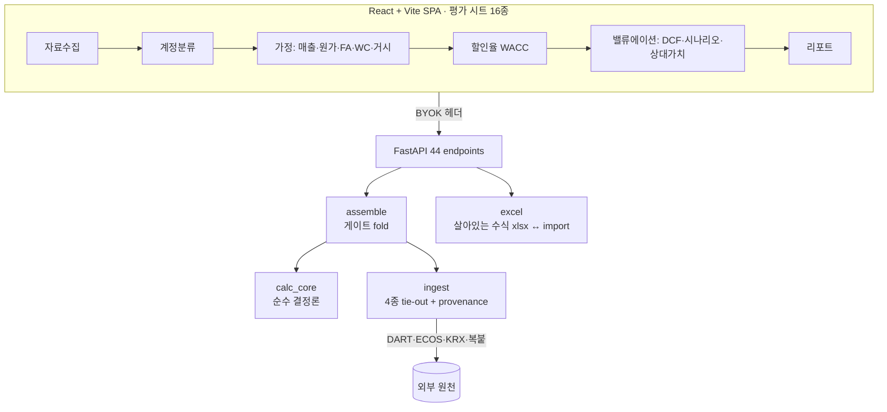
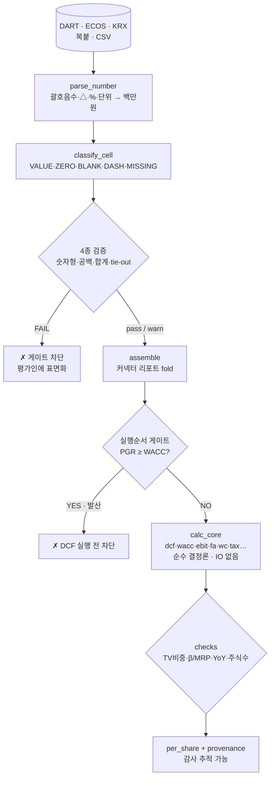

# val.studio — 한국형 DCF 기업가치평가 자동화

_Claude Skill (Excel) · 순수 결정론 DCF 엔진 · [Anthropic 공식 금융 스킬](https://github.com/anthropics/financial-services) 원문 감사·개선 · 실무모델 셀 단위 재현(rel_tol 1e-9)_

> **판단은 사람, 계산·검증은 결정론 코드.** LLM이 숫자를 지어내지 않도록, 모든 값은 출처(provenance)를 달고 검증 게이트를 통과해야 모델에 들어간다.

실무 DCF 모델(엑셀)을 **셀 단위로 재현**하는 결정론 엔진을 코어로, 앞단(공시 수집·주석 추출·가정 도출)을 자동화하고 뒤단(살아있는 수식 xlsx·평가의견서)까지 잇는 밸류에이션 워크벤치.

| 규모 | |
|---|---|
| 결정론 엔진 | `calc_core` 20모듈 (순수 stdlib) |
| 인제스트·검증 | `ingest` 14모듈 (4종 tie-out + provenance) |
| API | FastAPI 44 엔드포인트 |
| 웹 UI | React+Vite, 평가 시트 16종 |
| Claude 스킬 | 실행 도구 17 + 지식문서 31 (자기완결 vendoring) |
| 테스트 | **600 테스트 함수 / 69 파일** (골든 재현 포함) |

---

## 왜 만들었나 — 공식 금융 스킬을 원문 감사하고 내린 결론

Anthropic은 이미 좋은 금융 스킬을 공개해 두었다 — [financial-services](https://github.com/anthropics/financial-services)의 **`dcf-model`(1,263줄)·`audit-xls`(156)·`comps-analysis`(661)·`lbo`(274)** + 회계결산 `finance` 플러그인 8종. 시작 전에 **이 원문들을 전부 감사**했고, 결론은 두 가지였다.

1. 규약의 상당수는 **그대로 채택할 만큼 좋다** — 일부는 우리보다 엄격해서 우리 기준을 고쳤다.
2. 그런데 **한국 실무 평가서에는 그대로 쓸 수 없다** — 규제·회계기준·데이터 원천이 다르고, 무엇보다 *"계산이 맞다"를 증명하는 층*이 없다.

### ① 채택한 것 — 그들이 옳았던 규약

| 공식 스킬의 규약 | 이 프로젝트 반영 |
|---|---|
| **단계별 유저 확인 강제** (데이터→매출→FCF→WACC→TV, end-to-end 금지) | W0~W9 워크플로우에 명문화 — 각 단계 게이트 통과 후에만 진행 |
| **민감도 홀수 그리드 + 중심셀 = base 실제값**(내장 sanity check) | 결정론 검증으로 **승격** — 워크북 중심셀 == 엔진 중심 == base 자동 대조 |
| 하드코딩은 3종만 허용(과거실적·가정·시장데이터) + 셀마다 **출처 코멘트** | xlsx export 동일 철학 + provenance 계층으로 강화(아래 ③) |
| `audit-xls`: **"BS 안 맞으면 그것부터"**, **하드코딩 오버라이드가 조용한 버그 1위** | 모델 감사 체크·`workbook_diff`(수식→값 덮어쓰기 감지)로 이식 |
| `audit-xls` **DCF 버그 5종**(mid-year 오적용·TV 미할인·장부가 WACC·FCF에 이자 포함·tax shield 이중계상) | `diagnose_dcf_gap` — 주장값과 괴리 시 각 버그를 가정해 재계산하고 **어느 가설과 맞는지 지목** |
| TV 비중 **>75% 경고** (우리가 90%로 느슨했다) | 기준을 **75%로 하향** — 그들이 더 엄격했던 케이스 |
| `comps` **"5-10 Rule"**, median 우선, Cross-Reference(중복입력 금지) | peer 4-step 퍼널 게이트에 반영 |
| `variance-analysis` **서사 규격**(Driver/Outlook/Action, "higher than expected" 순환설명 금지) | 리포트 **표현 린트**로 구현 |

### ② 델타 — 한국 규제·실무 정합

공식 `dcf-model`은 미국 시장을 전제한다. 한국 평가 실무는 다른 관행과 기준서를 따른다.

| 항목 | 공식 `dcf-model` | 이 프로젝트 (한국 실무) |
|---|---|---|
| 할인율 | 자사 β 직접(5Y monthly), ERP 5~6% | **peer 무부채화/재부채화(Hamada)** + **MRP 한공회 가이던스** + **size premium(Kroll decile)** + CRP, **β/MRP 시장 정합 검사** |
| 법인세 | 단일 세율 | **계단식 구간세율** + 실적세액/유효세율 주입 3단 우선순위 |
| 리스 | 미반영 | **K-IFRS 1116** — 리스료→이자·원금 분리 + ROU 정액상각(D&A·순차입부채·금융비용 3분기) |
| 연결 브리지 | EV − 순부채 | EV +비영업자산 −순차입부채 **−비지배지분(NCI)** = **지배주주 귀속** 지분가치 |
| 원천 데이터 | 유저가 제공 | **DART OpenAPI**(재무제표·직원현황·공시)·**ECOS**(거시·환율)·**KRX**(β·시총) 커넥터 + **주석 성격별 추출** |
| 계정 체계 | 영문 GAAP | **한국어 계정과목 사전** + NOA/IBD 결정론 분류(순서 규칙) |
| 단위 | USD | **백만원 정규화**(원/천원/억원, 괄호음수 `(1,234)`, `△` 음수 표기) |

### ③ 델타 — "지시문"이 아니라 "실행되는 검증"

이게 가장 큰 구조적 차이다. 공식 스킬은 **지시문 중심**이다 — SKILL.md가 Claude에게 *엑셀에서 모델을 어떻게 만들지* 알려주고, 정확성은 모델이 지시를 잘 따르는지에 달려 있다.

이 프로젝트는 **계산을 LLM에서 분리**했다.

- **순수 엔진**(`calc_core`, stdlib only, 네트워크·IO 없음)이 계산을 전담하고, **실무 엑셀 모델을 셀 단위로 재현**하는 골든 테스트(주당 8,413.38원, rel_tol 1e-9)로 검증된다.
- 스킬은 산술을 하지 않고 **엔진을 호출한다** — SKILL.md에 *"암산·추정 금지, 숫자는 반드시 `scripts/`로"*를 규약으로 박았다.
- 검증이 **텍스트 경고가 아니라 실행을 막는다**: PGR ≥ WACC면 Gordon이 발산하므로 어셈블리가 **DCF를 실행하기 전에 차단**한다.
- 출처가 **코멘트 문자열이 아니라 타입드 span**이다: `source[char_start:char_end] == raw_text` 불변식을 테스트가 강제해서 "이 급여 12,340은 주석24의 118~124번째 글자"라고 답할 수 있다.

> 한 줄로: 공식 스킬이 **좋은 모델을 만드는 법**을 가르친다면, 이 프로젝트는 거기에 더해 **그 모델이 맞다는 걸 기계가 증명**하게 한다. 실무 평가서는 감사·심사를 받으므로, 숫자마다 *어디서 왔고 어떤 게이트를 통과했는지*가 남아야 한다.

---

## Phase 1 — 한국형 DCF 스킬 (완료)

먼저 **Claude 스킬**로 만들었다. 엑셀 워크북 위에서 평가 워크플로우를 수행·검증하는 자기완결 패키지다.

### 워크플로우 W0~W9


각 단계는 **결정론 게이트**를 통과해야 다음으로 간다 — 통과 못 하면 멈추고 평가인에게 표면화한다. 빈 시트에서 시작하면 수식이 살아있는 템플릿을 찍고, 단계마다 시트를 더해 풀모델로 키운다.

### 설계에서 고집한 3가지

**① 역할 3분할 — 제안(Claude) → 판단(평가인) → 검증(코드)**

순서를 절대 섞지 않는다. 계정 분류·드라이버 선택·가정값은 전부 평가인 몫이고, Claude는 후보 제시와 근거 리서치만 한다. 숫자는 반드시 `scripts/` 결정론 도구로 — **암산·추정 금지**.

**② 과립도는 원천자료가 지지하는 만큼만**

W2.5 계정세분화가 대표적이다. 손익 한 줄을 성격별로 쪼개야 W4에서 P×Q·변동/고정을 걸 수 있는데, 근거 없이 쪼개면 정밀해 *보이지만* 틀린 모델이 된다. 그래서 `footnote_costs.py`가 **주석 표에서만** 성격을 뽑는다 — 없는 성격을 만들어낼 방법이 구조적으로 없다. 자료가 없으면 총액 유지 + `[성격별 미확보]` 표면화.

```bash
# ① 주석 추출 → ② 세분 검증 사슬
python scripts/footnote_costs.py in.json \
  | python -c "import json,sys;print(json.dumps(json.load(sys.stdin)['disagg_payload'],ensure_ascii=False))" \
  | python scripts/fs_disagg.py
```

**③ 애매하면 확정하지 않는다**

감가상각비는 제조원가/판관비 배분이 애매하다. 아무 쪽이나 찍으면 그럴듯하지만 틀린 세분화가 되므로 `uncertain`으로 두고 **롤업에서 제외**한다 → tie-out이 "미확정 때문에 불완전"이라고 경고한다. 자동으로 예쁘게 맞추는 대신 **불완전함을 드러내는** 쪽을 택했다.

### 자기완결 vendoring

스킬은 레포 없이도 동작해야 한다. `build_excel_skill.py`가 엔진·지식을 `scripts/vendor/`로 복사하고 해시 매니페스트를 남긴다. 드리프트 검사가 **해시뿐 아니라 파일 집합(added/removed)까지 대조**하는데, 이 설계가 실제로 사고를 막았다 — 새 모듈이 vendoring 안 된 채 기존 모듈이 그걸 import해서 런타임에 죽을 상황을 빌드 시점에 잡았다.

```bash
python scripts/build_excel_skill.py --check   # 드리프트만 검사(CI 게이트)
python scripts/build_excel_skill.py           # vendoring + zip 패키징
```

---

## Phase 2 — 로컬 웹 플랫폼 (진행 중)

스킬은 강력하지만 **엑셀/CLI 안에 갇혀 있다.** 평가 실무는 여러 자료를 오가며 가정을 반복 조정하는 작업이라 상태를 들고 있는 UI가 필요했다. 그래서 같은 엔진 위에 로컬 웹을 올렸다.



**BYOK(Bring Your Own Key)**: DART·Gemini·ECOS 키는 localStorage에 두고 **호출별 헤더로만** 전달한다. 서버는 저장하지 않는다.

**로컬 우선**: 프로젝트 상태는 로컬 JSON. 클라우드(Supabase/Vercel)는 로드맵이지 전제가 아니다.

---

## 아키텍처 — 3계층 + 게이트

값 하나가 원천에서 결과까지 지나는 길 — **게이트가 통과 못 하면 다음 단계를 아예 실행하지 않는다**(무의미한 결과를 만들어 나중에 경고하지 않음).



**모듈 책임 트리:**

```
ingest/          원천 → 값                    "이 숫자는 어디서 왔나"
  ├ 커넥터        DART·ECOS·KRX·Damodaran·복붙/CSV
  ├ parsers/      BaseParser 백본 — 추출→정규화→검증→provenance 자동
  ├ validators    ① 숫자형 ② 공백유무 ③ 합계 ④ 정합성(tie-out)
  └ provenance    {source, locator, char_span, method, confidence}
        ↓ 게이트 통과분만
assemble/        원천값 → 검증된 엔진입력       "쓸 수 있는 가정인가"
  └ 커넥터 리포트를 하나로 fold + 실행순서 게이트
        ↓
calc_core/       순수 계산 (stdlib only, 네트워크·IO 없음)
  └ dcf·wacc·ebit·fa·wc·tax·revenue·cost_build·lease·multiples·sotp·
    merger·convertible·three_statement·checks(가정 타당성 게이트)
```

### 왜 이렇게 나눴나

**`calc_core`는 순수하다.** 네트워크도 파일IO도 없어서 골든 테스트가 완전히 결정론적이고, 스킬로 vendoring해도 그대로 돈다.

**검증이 두 종류로 나뉜다.** `ingest/validators`는 *데이터가 원본과 맞나*(tie-out), `calc_core/checks`는 *가정이 말이 되나*(PGR≤GDP, TV비중, β/MRP 시장 정합). 같은 `ValidationReport` 인프라를 쓰되 관심사를 분리했다.

**게이트는 실행 순서를 안다.** PGR ≥ WACC면 Gordon이 발산하므로 `assemble`이 **DCF를 실행하기 전에** 차단한다. 무의미한 결과를 만들어놓고 나중에 경고하지 않는다.

### provenance — 감사 추적의 최소 원자

```python
ProvenancedValue(
    value=Decimal("12340"),                    # 정규화된 값(백만원)
    provenance=Provenance(
        source_kind=SourceKind.FOOTNOTE,
        method=ExtractMethod.REGEX,
        locator=Locator(note_no=24),
        char_start=118, char_end=124,          # 원문 불변 참조
        raw_text="12,340", confidence=0.85))
```

불변식: `source[char_start:char_end] == raw_text`. 테스트가 이걸 강제해서 "이 급여 12,340은 주석24의 118~124번째 글자"라고 답할 수 있다.

---

## 데이터가 들어오는 순간 — "사람 눈에만 숫자"인 재무제표

밸류에이션의 첫 관문은 계산이 아니라 **수집**이다. 재무제표를 프로그램으로 읽으면 사람에겐 같은 숫자가 기계에겐 제각각이라, 그냥 `float()` 하면 **조용히 틀린다.**

| 원본 셀 | 실제 의미 | 순진한 `float()` |
|---|---|---|
| `(1,234)` | −1,234 (괄호 = 회계 음수 관행) | ✗ 예외 |
| `△56` | −56 (K-회계 음수 표기) | ✗ 예외 |
| `1,330`원 vs `1,330`백만원 | 스케일 10⁶ 차이 | 1330 — 스케일 소실 |
| `-` (대시) | 0인가 미해당인가 | ✗ 예외 |
| `""` 빈 셀 | **진짜 0인가 결측인가** | 0 — 결측이 0으로 숨음 |
| `12.5%` | 0.125 | ✗ 예외 |

마지막 둘이 감사에서 치명적이다. **빈 셀을 0으로 뭉개면 합계검증이 그냥 통과해버려서 "빠진 값"이 숨는다** — 감사에선 "진짜 0"과 "모름"이 완전히 다른 의미다. 그래서 인제스트 게이트가 두 함수로 이걸 못박는다:

- **`classify_cell`** — 모든 셀을 **VALUE / ZERO / BLANK / DASH / MISSING 5종**으로 분리. 빈 셀·대시·결측을 절대 0으로 뭉개지 않는다.
- **`parse_number`** — 괄호음수 `(1,234)→−1234`, `△/▲` 음수, `%`, 내장 단위(원·천원·백만원·억·조) 접미사, 콤마·공백을 정규화해 **전부 백만원 기준 `Decimal`**. 비숫자는 `fail`로 **게이트를 막는다**(다음 단계로 못 넘어감).

그 위에 **합계검증**(소계 = 구성요소 합, 결측이 있으면 "합계 불완전" warn — 조용히 맞추지 않고 불완전함을 드러냄)과 **교차 tie-out**(주석 감가상각 = CF의 D&A, 주석 급여총액 = DART 직원현황 급여 — **두 독립 출처가 어긋나면 FAIL**)이 얹힌다.

> **설계 핵심**: 검증을 "이전 추출과 얼마나 비슷한가"가 아니라 **재구성 일치(라운드트립)**로 한다. 그래서 **LLM이 값을 변형·추출해도 이 게이트를 반드시 통과**해야 한다 — LLM 출력조차 결정론 검증의 대상이다(감린이 clean-truth 오라클에서 이식한 철학).

---

## 검증 체계

| 층 | 무엇을 보증 |
|---|---|
| **골든 재현** | 실무 엑셀 모델을 셀 단위 재현 — 주당가치 **8,413.38원** (rel_tol 1e-9). 2차 사례로 EBIT 스파인 Δ0 교차검증 |
| **4종 tie-out** | 숫자형(단위·괄호음수·%)·공백유무(진짜 0 vs 결측)·합계·정합성(주석↔FS 교차) |
| **가정 게이트** | PGR≥WACC=FAIL · PGR>GDP=WARN · TV비중>75% · β/MRP 시장 혼용 · 운전자본 흑자도산 · YoY 급변 |
| **왕복(roundtrip)** | 엔진 → xlsx(수식 유지) → 재계산 → 엔진값 일치. 승격 tie-out(하드넘버→상류참조 교체 시 per_share 불변) |
| **구조버그 진단** | 주장 주당가치와 괴리 시 흔한 구조 오류(mid-year 미적용·TV 미할인·비영업자산 누락 등)를 각각 가정해 재계산 → 어느 가설과 맞는지 지목 |
| **표현 린트** | 리포트 서사의 근거 없는 단정·순환설명·허위정밀 반올림 검출 |

---

## 트러블슈팅 — 실제로 잡은 결함들

포트폴리오로서 가장 할 말이 많은 부분. **"통과했는데 틀린" 케이스**가 대부분이었다.

### 1. 지식엔 있는데 엔진엔 없던 갭 — 터미널 운전자본 과대계상

교육 정본은 *"터미널 ΔWC = 추정말매출 × g × WC비율"*이고, 말기 WC 투자액에 (1+g)를 곱하는 건 틀렸다고 명시한다(TV 21% 왜곡 예시까지). 그런데 엔진은 **터미널 ΔWC를 0으로** 두고 있었다 — g>0인데 운전자본 투자를 안 빼니 FCFF가 부풀고 TV가 과대계상됐다.

더 나쁜 건 **경고는 하고 있었다**는 점이다. 게이트가 "재투자 미반영 → TV 과대계상 위험"이라고 WARN을 띄우면서도 실제로는 과대계상된 값을 그대로 내놓았다. 감사인이 제일 싫어하는 형태(문제를 알면서 방치).

> **교훈**: 로직은 **지식·게이트·엔진 세 층에 다 있어야** 반영된 것이다. 지식만 있으면 문서고, 게이트만 있으면 잔소리다.

정본 공식을 1급 입력(`terminal_wc_ratio`)으로 승격하고, 반영되면 게이트가 WARN→PASS로 올라가도록 배선했다.

### 2. 단위 스케일 버그 — 환율 1,330원이 13.3원으로

거시 커넥터가 모든 지표를 `/100`으로 나눴다. 물가상승률·금리는 %라서 맞지만 **환율은 레벨 값**이라 1,330 → 13.3이 됐다. `_LEVEL_INDICATORS` 집합으로 비율 지표와 레벨 지표를 갈랐다.

> **교훈**: "단위 정규화"는 지표별 성격을 알아야 한다. 일괄 규칙이 가장 위험하다.

### 3. 조용한 드롭 — 못 읽은 행이 사라짐

주석 추출기가 값 토큰이 없는 행(OCR 실패·빈칸)을 **말없이 건너뛰었다.** 성격 하나가 통째로 빠졌는데 결과는 멀쩡해 보인다. 이제 성격 라벨로 보이는데 값이 없으면 WARN으로 표면화하고, 빠진 만큼 합이 안 맞으니 **tie-out이 잡는다**(clean-truth 오라클).

### 4. 용어 오류 — 소수주주지분 vs 비지배지분

EV→지분 브리지를 구현하며 구 K-GAAP 용어(소수주주지분/minority interest)를 썼다. K-IFRS 정식 용어는 **비지배지분(NCI)**. 참고한 영문 모델이 "Minority Interest"라 적혀 있어 그대로 받은 게 원인이었다.

> **교훈**: 도메인 용어는 코드 리뷰가 아니라 **도메인 전문가**가 잡는다. 실측 모델을 SSOT로 삼되 용어는 기준서를 따라야 한다.

### 5. "있는 척"하는 기능 — 미실행인데 "통과"로 표시

peer 선정 퍼널이 특정 단계에 도달조차 못 했는데 화면엔 "돌렸고 탈락 0"으로 표시됐다. **미실행과 통과가 같은 화면**이 되는 건 검증 도구로서 치명적이다. 미도달을 명시적 상태로 분리했다.

### 6. 가드가 오타로 전 경로 무력화

look-ahead 방지 가드(평가기준일 이후 데이터 차단)가 잘못된 속성명을 참조해 **모든 경로에서 조용히 통과**하고 있었다.

> **교훈**: 게이트를 만들면 **게이트가 실제로 막는지** 테스트해야 한다. "정상 입력이 통과한다"만 테스트하면 무력화된 가드를 못 잡는다.

### 7. vendor 드리프트 — 새 모듈 미복사로 스킬 import 실패

스킬이 쓰는 모듈이 추가됐는데 vendoring 목록에 없어, 기존 모듈이 그걸 import하다 죽을 상황이었다. 해시만 비교했으면 "기존 파일 전부 동일 → 통과"로 넘어갔을 것이다. **파일 집합까지 대조**하는 설계가 잡아냈다.

### 8. LLM 자동분류의 함정 — 결정론 규칙으로 못박은 계정 매핑

EV→지분 브리지의 정확도는 **계정을 영업/비영업·이자부부채로 정확히 가르는 데** 달려 있다 — 순차입금·비영업자산 한 줄이 밀리면 지분가치가 흔들린다. 타사는 이 분류를 LLM 자동분류로 처리하다 **"Sales 오분류"를 자인**했다("매출원가"가 "매출"로 빨려 들어가는 식의 조용한 오류).

우리는 이걸 **순서 있는 결정론 규칙**으로 코드에 못박았다(`fs_mapper.py`):

- **특이 계정 먼저, 첫 매칭 승리** — `매출원가`(COGS) 규칙이 `매출`(Sales)보다, `사채`가 `매입채무`보다 앞선다. 포함관계 함정을 **순서**로 차단.
- **2단 구조** — OpenDART 표준 요소명(`ifrs-full_Revenue`, 회사가 못 바꿈)으로 먼저 판정 → 무매칭이면 계정명 키워드 폴백. "매출액 / 영업수익 / 수익(매출액)" 같은 **표기 흔들림에 면역**.
- **애매하면 확정 금지** — 무매칭은 `uncertain`(유저 분류 필요), 판단 계정(초과현금·리스부채 순차입 포함 여부 등)은 `judgment=True`로 **제안만 하고 승인 대기**.

> **교훈**: LLM 자동분류는 편하지만 **어디서 왜 틀렸는지 재현·설명이 안 된다.** 감사받는 산출물에선 "왜 이 계정이 비영업인가"에 규칙으로 답할 수 있어야 한다.

### 9. 같은 회사인데 주식수가 둘 — 발행 vs 유통 (D7 게이트)

주당가치 = 지분가치 ÷ 주식수인데, **"주식수"가 하나가 아니다.** 발행주식수와 유통주식수(발행 − 자기주식)가 다르고, 어느 쪽을 분모로 쓰느냐로 주당가치가 갈린다(실측 사례: 발행 12.385M vs 유통 11.214M → **주당 10% 괴리**).

- `/api/dart/shares`가 **발행·유통을 함께** 반환해 분모 선택을 명시적 결정으로 만든다(자기주식을 조용히 무시하지 않음).
- 더 위험한 건 **교차검증**이다. DCF 주당가치와 상대가치(peer 배수) 주당가치를 나란히 놓고 비교할 때, **브리지 구성요소(순차입금·비영업자산·NCI)와 주식수가 서로 다르면** 두 값의 차이가 *관점 차이인지 정의 차이인지 분간이 안 된다.* `check_cross_method_bridge`가 비교 **전에** 양쪽 분모·브리지가 같은지 검사한다(모델러스 D3 규율 이식).

> **교훈**: 분모의 정의를 고정하지 않으면 정밀한 계산도 무의미하다. "숫자가 다르다"를 논하기 전에 **같은 것을 비교하고 있는지**부터 게이트로 막는다.

### 10. 플랫폼 특유 함정

- **cp949 인코딩**: Windows 셸에서 한글 JSON·URL이 깨져 API 검증이 실패. UTF-8 명시 스크립트로 우회.
- **`lst[-0:]`**: 음수 인덱스 슬라이스가 `0`일 때 **전체 리스트**를 반환 — 최근 N개를 뽑으려던 코드가 전량을 반환.
- **외부 API 봉쇄**: 일부 데이터 소스가 로그인·유료 전환 → 복붙/CSV 업로드를 **1급 경로**로 승격(자동/수동 무관 동일 검증 게이트 통과).

---

## 로드맵

| Phase | 상태 | 내용 |
|---|---|---|
| **1. 한국형 DCF 스킬** | ✅ | W0~W9 워크플로우 · 결정론 도구 17 · 지식 31문서 · 자기완결 vendoring · 골든 재현 |
| **2. 로컬 웹 플랫폼** | 🔄 진행 | 평가 시트 16 · API 44 · 커넥터(DART·ECOS·KRX) · 살아있는 xlsx 왕복 · BYOK |
| **3. 평가방법 확장** | ⬜ | NAV 순자산법(자본시장법 종합평가 완성) · PPA/WARA 배분 · 손상검사(VIU/CGU, K-IFRS 1036) |
| **4. 감사인 트랙 심화** | ⬜ | 외부평가의견서 파싱 → 유의적 가정 자동 대조 · 독립적 점/범위 추정 · ISA 540 대응 |
| **5. 지식 RAG 고도화** | ⬜ | 온톨로지 기반 검색 + 인용 검증(미지원 인용 제거) → 가정마다 근거 문단 링크 |
| **6. 클라우드** | ⬜ | Supabase(Postgres+Auth+Storage) · Vercel/Railway 배포 · 멀티유저 |

---

## 실행

```bash
# 백엔드 (Python 3.12+)
pip install fastapi uvicorn openpyxl
python -m uvicorn backend.api.main:app --port 8000

# 프론트
cd frontend && npm install && npm run dev

# 테스트 (pytest 불요 — 각 파일 stdlib 러너 내장)
python tests/golden/test_viol_spine.py           # 골든 재현
PYTHONPATH=backend python tests/test_checks.py   # 가정 게이트

# 스킬 패키징
python scripts/build_excel_skill.py
```

---

## 레포 구조

```
backend/
  calc_core/    순수 결정론 엔진 (20모듈, stdlib only)
  ingest/       커넥터 + 4종 검증 + provenance (14모듈)
  assemble/     커넥터→검증된 엔진입력 (게이트 fold)
  excel/        살아있는 수식 xlsx 생성·import·diff
  api/          FastAPI (44 엔드포인트, BYOK)
frontend/       React + Vite SPA (평가 시트 16)
.claude/skills/ Claude 스킬 (도구 17 + 지식 31 + vendor)
tests/          600 테스트 함수 / 69 파일 (golden·skill·unit)
docs/           방법론 지식 코퍼스 · 설계 문서 · 검증 리포트
scripts/        스킬 빌드·골든 픽스처 추출·재계산 게이트
```

주요 문서: `docs/engine_spec.md`(임의 회사 DCF 재현 명세) · `docs/plan.md`(전체 설계).

---

## 고지

- **이 공개 레포는 코드(엔진·API·웹·스킬 도구)와 테스트만 담는다.** 방법론 지식 코퍼스(`docs/reference/` 31문서)와 원본 자료(엑셀·PDF)는 저작권상 **포함하지 않는다** — 지식이 없어도 엔진·도구는 그대로 동작하도록 설계했다.
- 방법론 근거는 **공개 인용이 가능한 표준 출처**(Damodaran·Kroll·Bloomberg·한국공인회계사회 가이던스·DART·ECOS·KRX)로 표기한다 — 근거를 밝히지 않으면 감사 방어와 재현성이 성립하지 않기 때문.
- 실측 검증에 쓴 회사는 **상장사 공개 재무정보** 기반이며 교육 목적의 재현 검증이다. 투자 권유가 아니다.
