# val.studio — Claude 스킬 + 밸류에이션 자동화 프로토타입

_Claude 스킬 3종(DCF 수행 · 가정 감사 · Excel 워크플로우) + DART 공시 Excel 애드인 + 결정론 검증 엔진._
_"AI 시대에 기업가치평가 실무는 어디까지 자동화되고, 어디부터 사람이 판단해야 하는가"를 실제로 돌려보며 확인하는 프로토타입이다._

> **판단은 사람, 제안은 Claude, 계산·검증은 결정론 코드.**
> LLM이 숫자를 지어내지 않도록 — 숫자는 공시 원자료와 `scripts/` 결정론 도구에서만 나오고,
> 애매한 것은 감추지 않고 `?`로 표면화한다.

---

## 기획 의도

기존에는 두 관점을 목표로 기획했다.

- **평가인 관점 (MVP)** — 모델을 *만드는* 쪽. 공시 수집·정합성 검사·계정분류·가정 도출까지,
  평가 한 바퀴의 반복 노동을 자동화하고 판단만 사람에게 남긴다.
- **감사인 관점** — 남이 만든 모델을 *테스트·재계산*하는 쪽. 감사 실무에서 평가전문가의
  산출물을 검토하듯, 수식·집계를 결정론 코드로 재현해 같은 숫자가 나오는지 기계가 증명하고,
  가정이 산업 분포와 자기 서술에 비추어 말이 되는지 대조한다.

둘은 다른 제품이 아니라 **같은 엔진의 두 방향**이다 — 모델을 만들 때 계산을 맡는 결정론
엔진이, 방향을 뒤집으면 남의 모델을 채점하는 재계산기가 된다. 만들기는
`excel-valuation-workbook`·`valuation-analysis` 스킬이, 감사는 `assumption-audit` 스킬이
맡고, tie-out·정합성 게이트는 두 관점의 공용 인프라다.

형태의 원칙도 하나 있었다: **엑셀에서 올인원으로 끝낸다.** 공시 수집(애드인) → 분류·추정
제안(Claude 스킬) → 계산·검증(결정론 게이트) → 판단 기록(`Claude Log`·`_VS_STATE`)까지 전부
워크북 안에서 완결되고, 산출물도 살아있는 수식의 엑셀 모델 그 자체다. 실무가 엑셀을 떠나지
않는다는 관찰이 이 원칙의 근거고, 로컬 웹 기획을 접은 이유이기도 하다(아래 [여정](#제품-형태의-여정--로컬-웹에서-excel로) 참조).

여기에 이번 회전에서 확인하고 싶었던 질문이 얹혔다: **AI 시대에 밸류에이션 실무는 어디까지
자동화되고, 어디부터 사람이 판단해야 하는가.** 그 답을 문서가 아니라 실제 회사 1건(리노공업)으로
확인한 기록이 아래 시연이다.

---

## 현재 상태

**무엇이 작동하고 무엇이 계획인지**를 먼저 밝힌다.

| 구성요소 | 상태 | 한 줄 요약 |
|---|---|---|
| **Claude 커스텀 스킬** | ✅ 작동 — 실전 1회전(리노공업 DCF) | **이 레포의 중심.** 판단 보조 + 결정론 도구 호출 |
| **Excel 애드인** | 🔶 **공시자료 수집·적재까지 구현** | 검색→재무제표→주석→공시원문→주식수. 그 이후(추정·계산)는 애드인이 아니라 스킬의 몫 |
| **검증 엔진 (calc_core)** | ✅ 골든 재현 | 실무 DCF 모델 셀 단위 재현. 스킬의 계산 백엔드 |
| **DCF 외 평가기법** | 📋 **미완성** | 상대가치·손상(VIU)·복합금융 등 일부 백엔드 모듈이 존재하나 **실전 테스트 미실시, 개발중** |
| **외부 데이터 API** | 🔶 OpenDART 하나 | 현재 실제 연결된 API는 OpenDART(BYOK)뿐. ECOS·KRX는 로드맵 |
| **웹 스튜디오** | 🔶 과정의 산물 | 처음엔 로컬 웹으로 기획했다가 Excel 중심으로 전환 — [여정](#제품-형태의-여정--로컬-웹에서-excel로) 참조 |

---

## 시연 — 리노공업(058470) DCF 한 바퀴

실제 화면이다. 데모용 목업이 아니라, **기존 DCF 빈 템플릿을 열어둔 상태에서 실행**한 기록.

### ① 애드인에서 회사를 찾는다

Task Pane에서 "리노공업"을 검색하면 DART 고유번호가 확정되고, 이후 이 프로젝트의 모든 조회가
이 회사로 고정된다. 비상장사도 검색된다(동명 법인 분리 안내 포함).

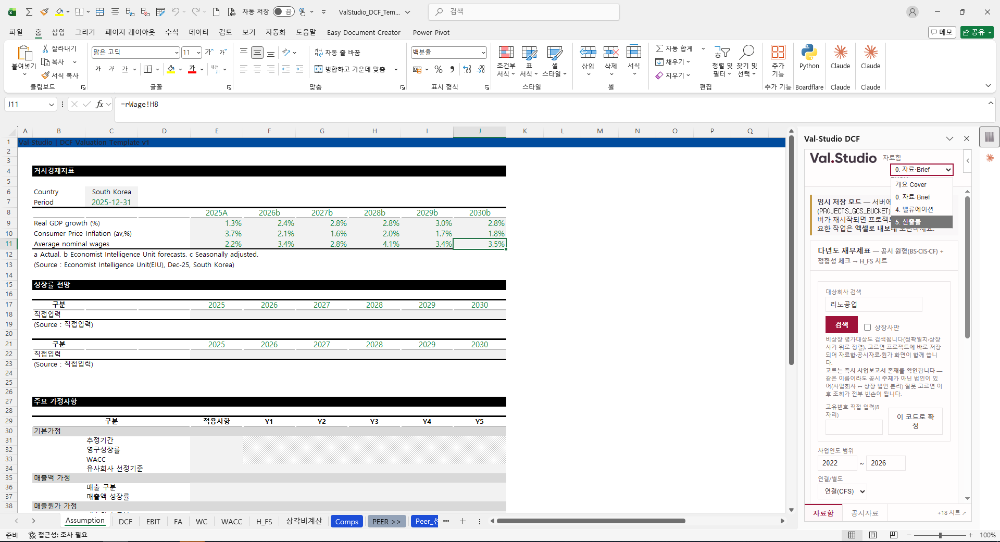

### ② 다년도 재무제표를 한 번에 — 적재가 아니라 "검사받은 적재"

2021~2025 5개년 × 재무상태표·손익·포괄손익·현금흐름을 API 5콜로 가져온다. 각 보고서가
당기·전기·전전기를 함께 실어오므로 **겹치는 해가 서로 대조되어 전기 재작성·재분류가 자동으로
드러난다.** 이 시연에서는 정합성 검사 50건 중 FAIL 0 / WARN 10, 전기 재작성·재분류 의심 6건.

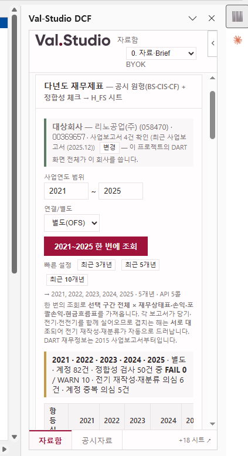

### ③ 원자료는 원자료대로 — `rFS` 시트 (key-in 금지)

공시 원문 숫자는 `rFS`에 그대로 쌓이고, 사람이 만지는 시트는 전부 이 시트를 **참조**한다.
접수번호·출처가 행 단위로 남아 어떤 숫자든 공시로 되짚을 수 있다(provenance).

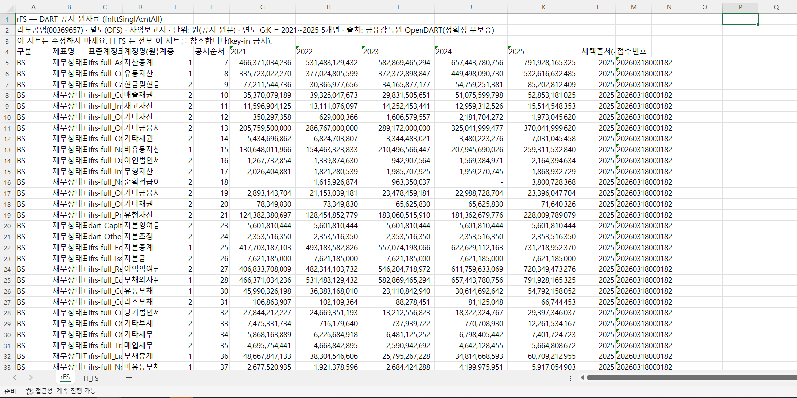

### ④ 계정분류 — 모르는 것은 `?`로 남긴다

`H_FS`가 32개 BS 계정을 밸류에이션 버킷(NOA/OA/FA/WC/OL/IBD)으로 태깅한다.
**애매한 계정(주로 기타채권·기타채무)은 단정하지 않고 `?`로 표시**되고, 잔여 합계가 0이 될 때까지
표면에 남는다. `?`의 해소는 Claude가 **주석과 매핑해 근거를 달아 추천**하고, 확정은 평가인이 한다.

태깅은 LLM이 아니라 **결정론 2단 규칙**([`fs_mapper`](backend/ingest/fs_mapper.py))이다:

1. **1단 — DART XBRL 표준계정(taxonomy) 앵커.** OpenDART는 계정마다 회사가 지어낸 한글명과
   표준 요소명(`account_id`, 예 `ifrs-full_Revenue`)을 함께 주는데, 이름은 "매출액/영업수익/
   수익(매출액)"처럼 흔들려도 **요소명은 회사가 못 바꾼다.** 금감원 배포 택사노미를 로컬
   사전([`taxonomy_store`](backend/ingest/taxonomy_store.py))으로 빌드해 요소명이 있는 행을 먼저
   분류한다. 단, **택사노미는 회계분류의 권위이지 평가목적 재분류의 권위가 아니다** — 표준
   트리의 상위 노드 상당수는 표시목적 묶음이라(예: "매입채무및기타유동채무" 밑에는 WC인
   매입채무와 IBD인 유동 차입금·리스부채가 함께 들어 있다), 후손까지 동질적임이 확인된
   앵커(유형자산·자본 등)만 서브트리로 쓰고 묶음 노드는 앵커로 쓰지 않는다.
2. **2단 폴백 — 계정명 키워드 첫 매칭.** 요소명이 없는 행(`-표준계정코드 미사용-`)은 순서 있는
   키워드 규칙으로 — 특이 계정을 먼저 둔다(매출원가가 매출보다, 사채가 매입채무보다 앞).
   매칭마다 confidence와 근거 키워드가 남는다.

그리고 두 단 모두에서 **무매칭은 임의 추측 대신 `?`(uncertain)로, 회계분류는 알아도 평가목적
판단이 필요한 계정(미지급비용의 영업/금융성·리스부채의 순차입금 포함 여부·초과현금)은
`judgment` 플래그로 표면화**되어 유저 승인 큐로 올라간다. 자동분류가 "Sales를 오분류했다"고
자인하는 타사 사례를 보고, 그 함정을 순서 있는 결정론 규칙으로 코드에 못박은 것이다.

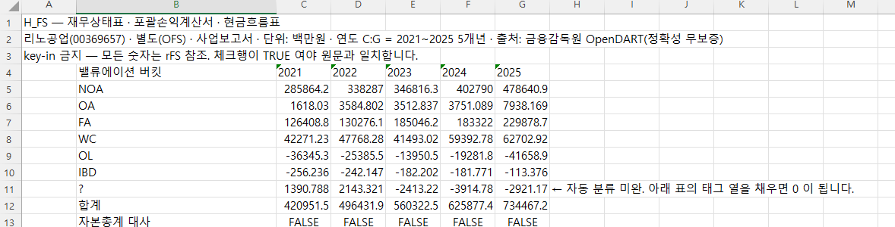

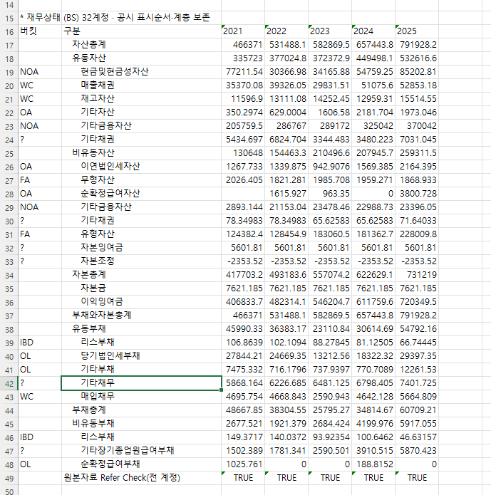

손익(CIS)도 같은 방식이다 — 공시 표시순서·계층을 보존한 채 20계정을 태깅하고, 전 계정에
원본자료 Refer Check(`TRUE`)가 붙는다.

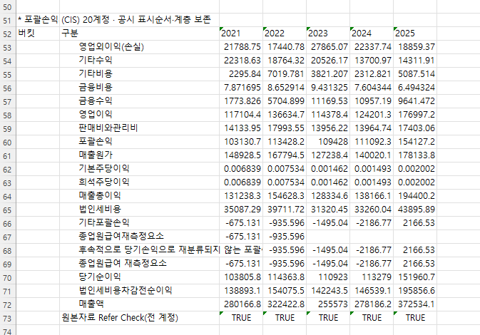

### ⑤ 주석도 원자료로 — `rNotes`

사업보고서 주석에서 판관비 성격별 명세·비용의 성격별 분류·매출 구성·기타채권/채무 구성을
표로 가져온다. 각 블록에 `CHECK: Σ = 공시 값` 검산 행이 붙는다 — 파싱이 틀리면 여기서 걸린다.

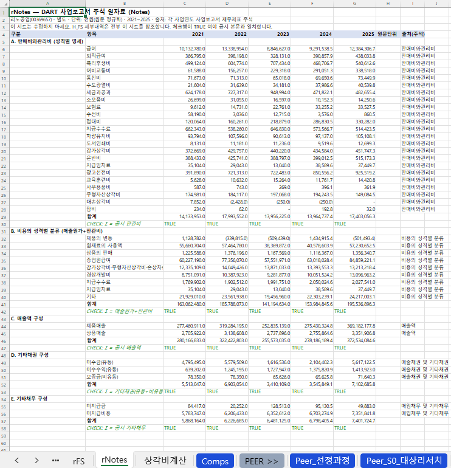

### ⑥ 게이트가 잡는 것 — 같은 회사의 주식수가 둘

발행주식수 15,242,370주 vs 유통주식수 15,179,120주(자기주식 등 괴리 0.4%). 어느 쪽을 주당가치
분모로 쓰느냐로 결과가 달라진다. 애드인은 괴리를 계산해 보여주고 **유통주식수를 DCF 입력에
반영할지 사용자에게 묻는다** — 조용히 골라주지 않는다.

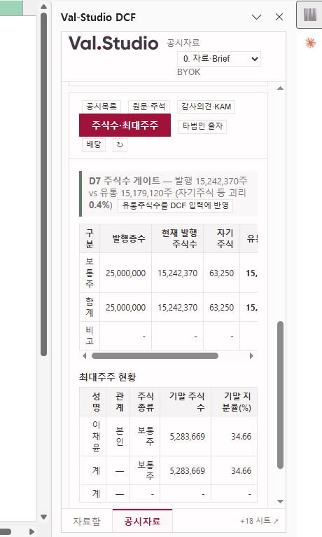

### ⑦ 공시목록·원문·기업개황까지 — 여기까지가 애드인의 완성 범위

정기공시 목록 조회, 원문 zip·파싱, 기업개황의 셀 기입(TSV)까지. **애드인의 역할은 여기서 끝난다** —
"공시자료를 검증된 상태로 워크북에 넣는 것"이 애드인의 전부이고, 그 이후는 스킬이 이어받는다.

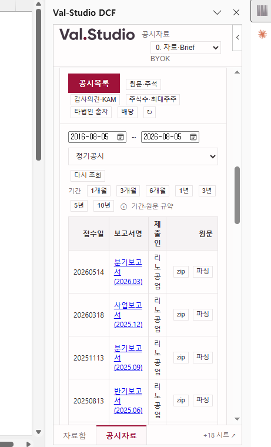

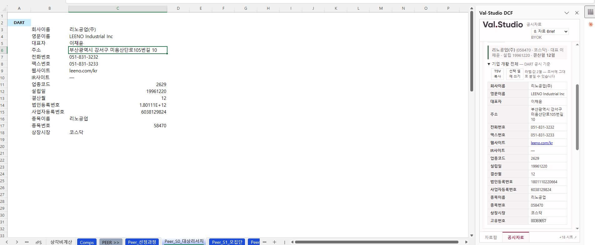

공시목록에서 원문으로 바로 들어가 확인한 사례 — 신규시설투자 공시(공장신설 971.8억원,
2024-11-11~2026-11-10). **CAPEX 추정에서는 이런 외부공시가 회사 내부자료보다 신뢰할 수 있는
근거가 되기도 한다**(감사·방어 관점). 애드인은 이 원문까지의 경로를 한 화면에서 잇는다.

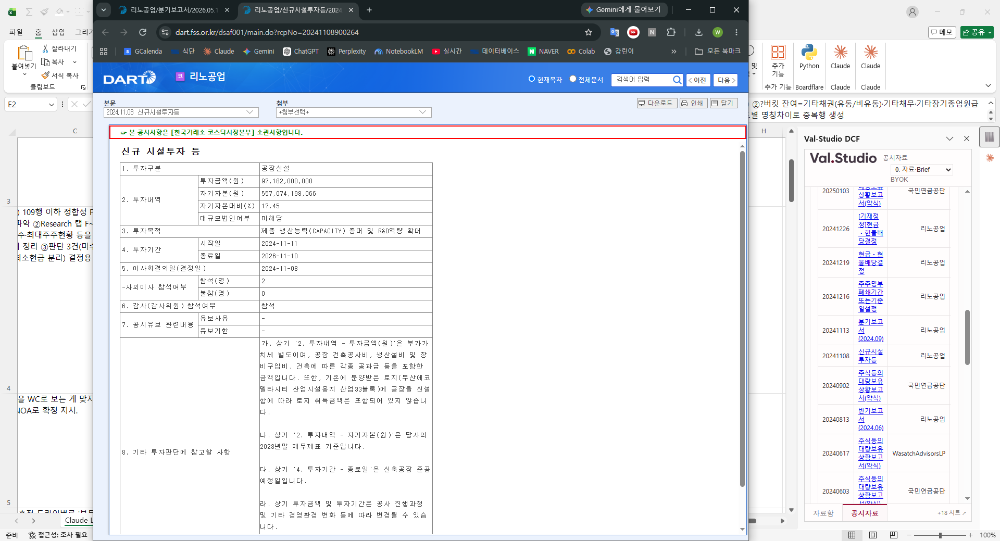

### ⑧ Claude 스킬이 이어받는 지점

Claude for Excel 패널에서 스킬이 구동된 실제 스텝: 주석·사업개요 추출 → **`?` 버킷 계정을 주석
근거로 분류 확정** → H_FS 버킷요약을 BS·IS로 이관 → 매출원가·판관비 세부내역 tie-out →
Research 시트에 기업리서치 정리. 각 스텝의 산출물을 보여주고 확인받은 뒤 다음으로 간다.

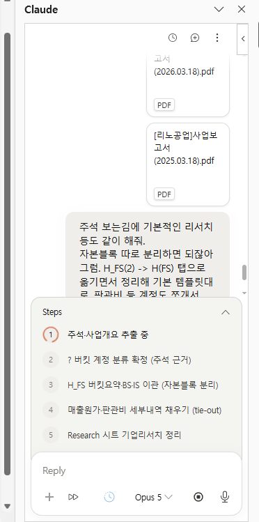

판단 과정은 워크북 안 `Claude Log` 시트에 남는다 — 어떤 계정을 왜 그렇게 분류했는지("기타채권을
WC로 볼지" → "NOA로 확정 지시"), 어떤 공시 원문(분기보고서 건설중인자산·설비 신설 계획)을
근거로 봤는지가 셀에 기록되어, 나중에 모델을 여는 사람이 추론을 재추적할 수 있다.

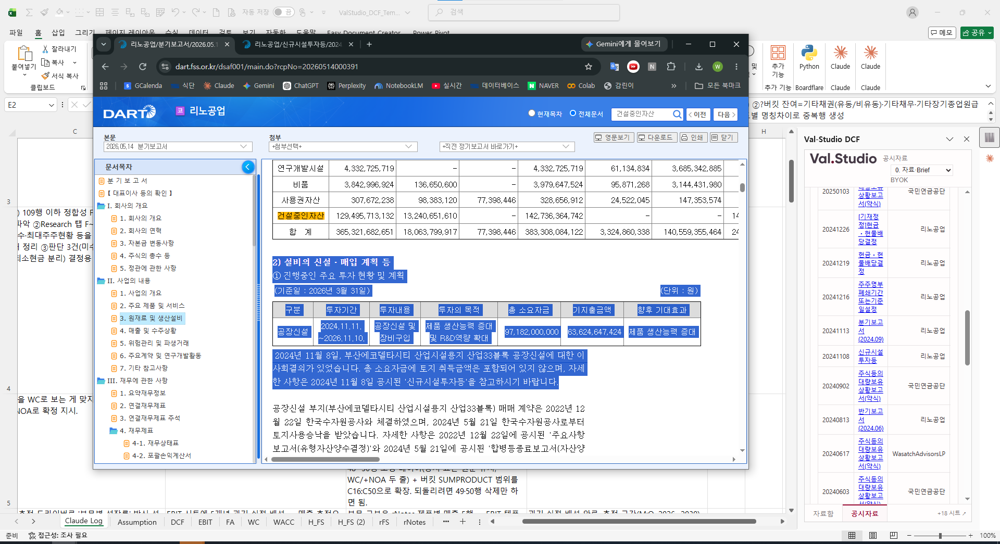

### ⑨ 그래서 모델은 — DCF 본체

완성된 DCF 시트다. 좋은 것과 나쁜 것이 한 화면에 같이 있다: 터미널 정상 상각비율(4.5%)에는
산출 근거가 셀 주석으로 달려 있고, WACC 13.1% 옆에는 **"베타 조회 불가로 과대계상 예상됨.
실제론 7~8% 추정"이라는 메모가 그대로 붙어 있다.** 주당가치 25,701원(시장가 60,300원 대비
−59%)은 이 과대 할인율의 산물이고, 모델은 그 사실을 숨기지 않고 [대안 시나리오] 블록으로
국내 실측 베타 반영 시의 경로를 남겨뒀다.

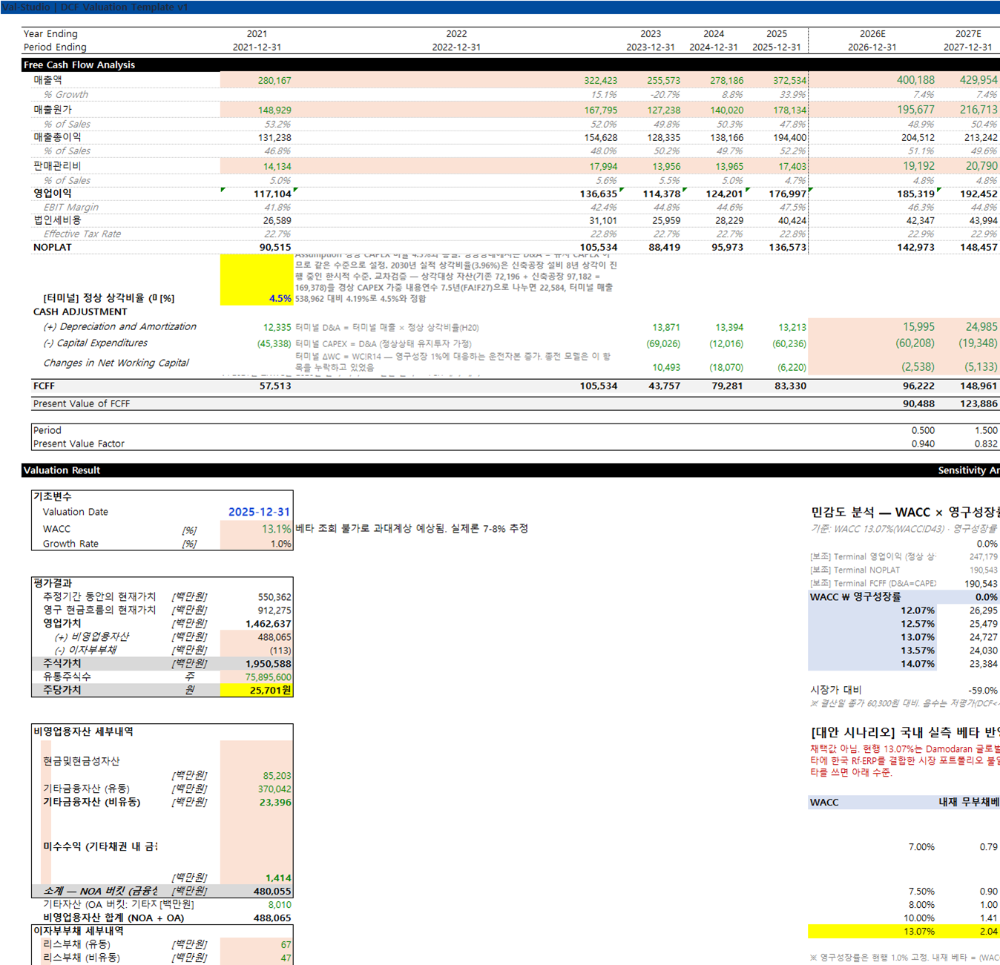

EBIT 시트의 매출 세분에는 `CHECK: Σ부문 = 공시 매출액` 검산 행이 5개년 TRUE로 붙어 있다.
그리고 그 아래 **판매량×판매단가(P×Q) 블록은 비어 있다** — 이번 회전에서 못 해본 것을 빈칸
그대로 남겼다. 채운 척하지 않는 것도 이 프로젝트의 규약이다.

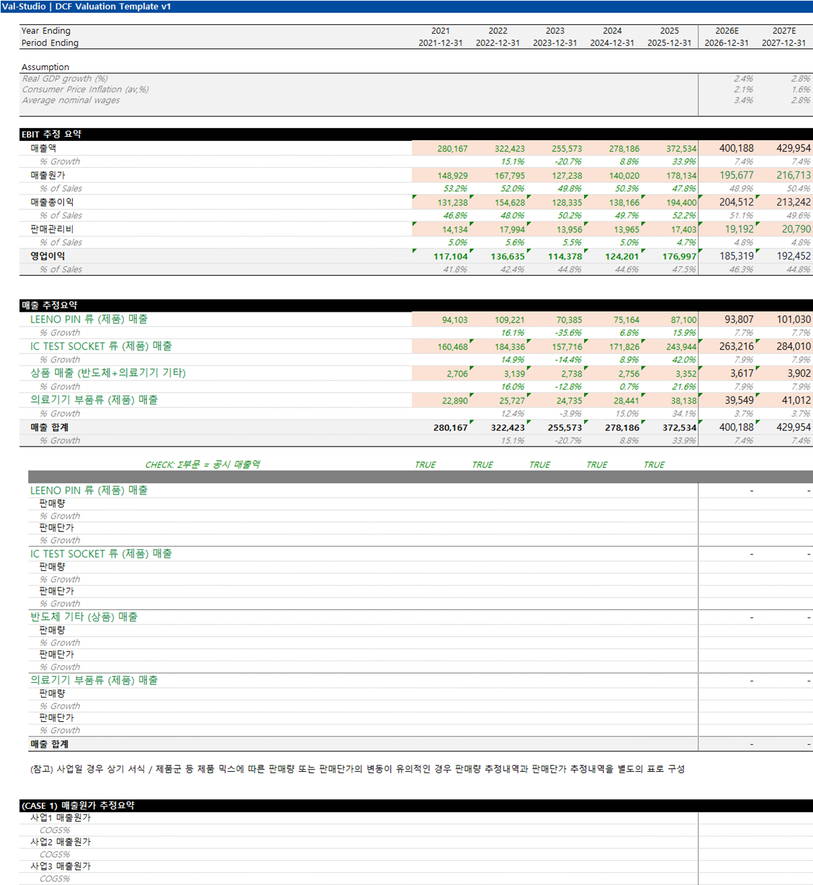

### ⑩ 세션이 실제로 잡아낸 것 (Claude for Excel 로그 기준)

리노공업 세션 원본 로그에서 추린, 사람이 놓치기 쉬웠던 발견들:

- **5:1 액면분할(2025-04-14 효력)** — Research에 복붙된 주식수 15,179,120주는 분할 전 수치였다.
  그대로 썼으면 **주당가치가 5배 과대**됐다. 발행 76,211,850 / 유통 75,895,600주로 정정.
- **자본 계정의 자산 블록 오분류** — 자동매핑이 자본잉여금·자본조정을 비유동자산 계층에 넣어
  `?` 버킷으로 흘렀는데, `?` 잔차(3,248백만)와 자본총계 대사 오차가 정확히 같은 금액임을 짚어 원인 확정.
- **CF 체크 FALSE 2건 = 데이터가 아니라 체크식 오류** — 환율효과가 반대 변에 붙은 식 정의 문제.
  원자료는 정상임을 검산으로 증명.
- **FY2022 원문의 유동/비유동 라벨 오기** — BS 롤포워드(+81,007 vs 취득 724,827 − 처분 645,019 =
  +79,808)로 후속 보고서의 정정값이 옳음을 검증.
- **유사회사 퍼널의 업종분류 함정** — 가장 직접적인 유사회사 ISC(095340)가 "기계장비 도매업"으로
  분류되어 업종 필터만 돌리면 빠진다. 모집단 2,585사 전체 키워드 스캔을 병행해 회수.
- **신규시설투자 공시로 CAPEX 재모델링** — 신축공장 총액 971.8억·준공 2026-11이 확정되자
  "2026년 준공·20년 뭉뚱그림"을 버리고 잔여 지출·2개월분 상각으로 재배선.

그리고 **Claude 자신의 실수와 자기정정도 로그에 남아 있다** — "출처 메모를 붙였다"고 말했으나
실제로 반영되지 않아 정정한 건, 재확인 과정에서 Peer 시트 결함 3건(`#NAME?` 수식 오해석·날짜
일련번호 표시·종목코드 앞자리 0 유실)을 스스로 발견한 건, WACC 템플릿 행 매핑을 어긋나게 잡아
원래 수식을 지웠다가 복원한 건. **쓰기 후 재확인(re-read) 게이트가 없었으면 그대로 굳었을 오류들이다.**

---

## Claude 스킬 3종 — 이 레포의 중심

| 스킬 | 하는 일 | 핵심 설계 |
|---|---|---|
| [`excel-valuation-workbook`](.claude/skills/excel-valuation-workbook/SKILL.md) | Excel 워크북 위에서 DCF 한 바퀴 (템플릿 인식·FS 이관·재분류·추정·WACC·DCF·리포트) | **제안(Claude) → 판단(평가인) → 검증(결정론 코드)** 3분할. 백지면 수식 살아있는 스파인을 스캐폴딩 |
| [`valuation-analysis`](.claude/skills/valuation-analysis/SKILL.md) | DCF 수행·검증·해석 (Claude Code / claude.ai) | 단계↔도구↔**지식 사전 바인딩** — 매출추정 아키타입 A~K, 마진 M, CAPEX X, 운전자본 W, 산업 프로파일 대조 |
| [`assumption-audit`](.claude/skills/assumption-audit/SKILL.md) | **남이 만든** 모델·리포트의 가정 감사 | 가정 원장화 → 산문 논리가 자기 숫자를 재현하는지 검산 → 산업 분포 이상치 → EV→주당 브리지 누락 체크 |

셋이 공유하는 규약:

- **숫자는 결정론 도구만.** 스킬의 `scripts/`는 전부 순수 stdlib — 암산·추정 금지, API 키 불필요.
  도구 실행이 불가능한 환경에서는 지시문 폴백으로 동작하되 산출물에 **"결정론 미검증"** 라벨을 남긴다.
- **단계별 확인 게이트.** end-to-end로 한 번에 다 만들지 않는다 — 인제스트·매출추정·FCF·WACC·브리지
  각 단계 산출물을 평가인이 확인한 뒤에만 다음 단계로. 뒤에서 발견된 앞 단계 오류는 전부 재작업이기 때문.
- **가정 선택의 근거를 로그로.** 어떤 드라이버를 왜 추천했는지, 어떤 지식 문서를 참조했는지 남긴다.
- **산업별 추정 방법론 지식 탑재.** 매출추정 논리·운전자본·CAPEX 등 주요 드라이버의 산업별 추정
  논리(학회·증권사 리서치에서 귀납한 타이폴로지 문서 ~50편)를 스킬이 참조해 추천한다.
  이 지식 코퍼스는 **저작권상 레포에 넣지 않는다** — 스킬 zip에 vendoring되어 로컬에서만 동작하고,
  레포에는 지식이 없어도 돌아가는 도구·코드만 둔다.

---

## 워크플로우 지도 — 세 창구의 분업과 (예정) 에이전트 이식 지점

한 바퀴의 전체 동선이다. 실선은 구현되어 시연까지 마친 흐름, 점선의 **(예정)** 노드는
[에이전트 이식 설계](docs/plan/agent_transplant_walkthrough.md)에서 판정한 이식 지점이다 —
기준은 "**키가 필요하고 + 결정론 게이트가 이미 붙어 있고 + 그 사이에 판단이 낀 자리**"만
에이전트로 흡수한다는 것. 판단 자체가 본체인 자리(W4 추정)는 의도적으로 사람 몫으로 남긴다.

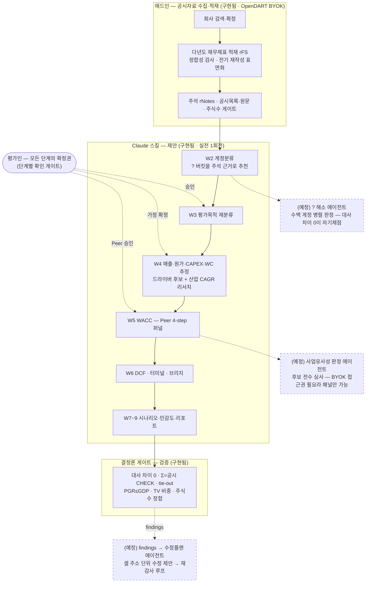
```mermaid
flowchart TD
    subgraph ADDIN["애드인 — 공시자료 수집·적재 (구현됨 · OpenDART BYOK)"]
        A["회사 검색·확정"] --> B["다년도 재무제표 적재 rFS<br/>정합성 검사 · 전기 재작성 표면화"]
        B --> C["주석 rNotes · 공시목록·원문 · 주식수 게이트"]
    end
    subgraph SKILL["Claude 스킬 — 제안 (구현됨 · 실전 1회전)"]
        W2["W2 계정분류<br/>? 버킷을 주석 근거로 추천"] --> W3["W3 평가목적 재분류"]
        W3 --> W4["W4 매출·원가·CAPEX·WC 추정<br/>드라이버 후보 + 산업 CAGR 리서치"]
        W4 --> W5["W5 WACC — Peer 4-step 퍼널"]
        W5 --> W6["W6 DCF · 터미널 · 브리지"]
        W6 --> W9["W7~9 시나리오·민감도·리포트"]
    end
    subgraph GATE["결정론 게이트 — 검증 (구현됨)"]
        V["대사 차이 0 · Σ=공시 CHECK · tie-out<br/>PGR≤GDP · TV 비중 · 주식수 정합"]
    end
    C --> W2
    W9 --> V
    HUMAN(["평가인 — 모든 단계의 확정권<br/>(단계별 확인 게이트)"])
    HUMAN -.승인.-> W3
    HUMAN -.가정 확정.-> W4
    HUMAN -.Peer 승인.-> W5
    W2 -.-> AG1["(예정) ? 해소 에이전트<br/>수백 계정 병렬 판정 — 대사 차이 0이 자기채점"]
    W5 -.-> AG2["(예정) 사업유사성 판정 에이전트<br/>후보 전수 심사 — BYOK 접근권 필요라 패널만 가능"]
    V -.findings.-> AG3["(예정) findings → 수정플랜 에이전트<br/>셀 주소 단위 수정 제안 → 재감사 루프"]
    style AG1 stroke-dasharray: 5 5
    style AG2 stroke-dasharray: 5 5
    style AG3 stroke-dasharray: 5 5
```

이식 설계의 결론: **멀티에이전트(MAS)는 필요 없다.** 어떤 MAS도 결국 blackboard로
퇴화하는데, 이 시스템에는 워크북(`_VS_STATE`)이라는 blackboard가 이미 있고, 검증이 싼
도메인(결정론 게이트가 즉시·공짜로 채점)에서는 에이전트 fan-out보다 게이트 1개가 이긴다.

---

## 실전 리뷰 — 리노공업 1회전에서 확인한 것

프로토타입을 미화하지 않기 위해, 실제로 한 바퀴 돌린 뒤의 관찰을 그대로 적는다.

### 잘 된 것

- **산업별 추정 논리 참고·추천** — 스킬이 지식 문서를 근거로 드라이버 후보를 제시하는 흐름 자체는 작동
- **정합성 체크** — 다년도 대조·주식수 게이트·주석 합계 검산이 실제로 이상을 표면화
- **가정 선택 근거의 로그화** — 왜 이 가정인지가 대화·시트에 남음
- **유사회사 선정 로직** — 후보 추출·선정 절차가 구체적으로 제시됨

### 아직 안 되는 것 (전부 실제 관찰)

- **베타를 실측하지 못해 할인율이 과대** — Bloomberg·한공회 베타를 넣을 수 없는 환경이라
  3안(주가 회귀 / Damodaran / 보류) 중 Damodaran 글로벌 산업 무부채베타로 대용했고, WACC가
  13.07%로 나왔다(셀 메모에 과대계상 경고를 남김). 국내 Peer 실측 베타면 7~8% 추정 —
  7%를 넣으면 주당 약 45,000원 수준(평가기준일 주가 60,300원). 배선 전까지 산출 가치는 참고치도 못 된다.
- **"쪼개서 쌓기"를 잘 못한다** — 재료비율 같은 드라이버를 세부 추정→합산 구조로 만들지 않고
  다른 시트 값을 그럴듯하게 참조해온다. 어느 탭 어느 데이터를 참조할지 **명시적 규약**을 줘야 한다.
  EBIT 세부 추정내역의 드라이버 열이 비는 것도 같은 뿌리다.
- **유형자산 상각비를 주석 기준으로 분해하지 않는다** — 내용연수를 일괄 적용. 신축공장은 공시로
  재모델링했지만 자산구성비(건물 45%/설비 55%)는 미공시 추정으로 남았다. 대체로 "분해"가 약하다.
- **터미널 구간의 상각비 처리가 미확정** — 명시 5년 이후 D&A·CAPEX 수렴을 정상 상각비율
  가정으로 뭉쳤는데(4.5%, 근거 주석은 남김), 컨벤션으로 확정된 규약이 아직 없다.
- **리서치 단계가 부족** — 유사회사의 재무구조(B/S) 파악·증적, 평가목적 계정재분류 단계를 스스로
  제시하지 않는다. P×Q 산업별 분석도 이번 회전에서는 못 해봤다.
- **영구성장률 방어 로직** — 0~1% 관행을 벗어날 때 하드하게 막는 로직이 더 필요하다.
- **애드인 UX** — 최초 지정 회사가 아닌 다른 회사의 공시 검색 시 오류. 별도 검색 경로가 필요하다.
- **양식 이탈** — 간혹 템플릿 규약에서 살짝 벗어난다(요청하면 정리되지만, 벗어나지 않아야 한다).
- **외부공시 우선순위** — CAPEX 같은 항목은 회사 내부자료보다 신규시설투자 공시가 더 신뢰할 수
  있는 경우가 있다(감사·방어 관점). 소스 우선순위 지식이 더 필요하다.

### 그리고 자동화의 역설

너무 자동화하면 **오히려 모델을 구체적으로 안 보게 된다.** 이 프로토타입이 단계별 확인 게이트를
고집하는 이유가 이것이다 — 자동화의 목적은 판단을 대신하는 게 아니라, 판단할 것만 남기는 것이다.

---

## 제품 형태의 여정 — 로컬 웹에서 Excel로

처음에는 로컬 웹앱(BYOK)으로 기획했다. 공시 수집→정합성 검사→계정분류→가정→할인율→밸류에이션을
웹 화면으로 만들었고, 지금도 돌아간다:

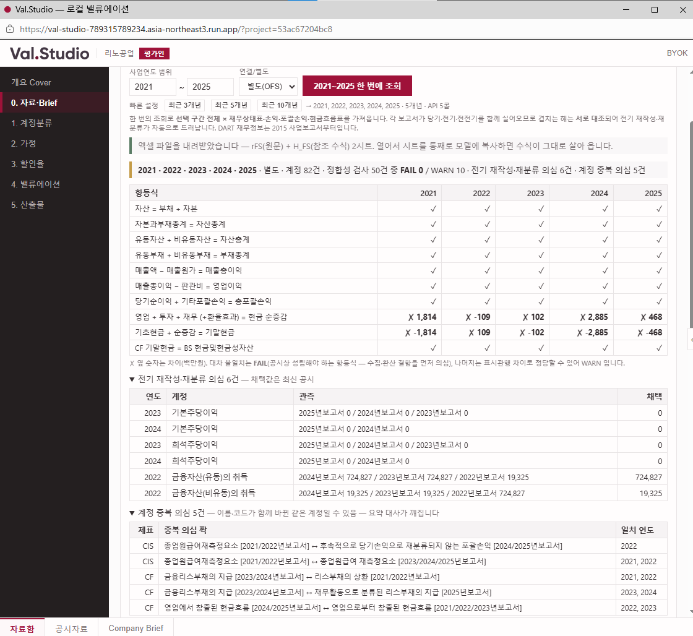

그런데 실무를 다시 보니 **밸류에이션은 엑셀을 떠나지 않는다.** 모델 작성·리뷰·아카이브가 전부
엑셀이고, "웹으로 옮겨라"는 도구는 채택되지 않는다. 그래서 방향을 바꿨다 — 워크북을 정본으로 두고,
**공시자료는 애드인이 시트로 넣고, 판단 보조는 Claude 스킬이 셀 옆에서** 한다. 웹 화면은 같은
엔진의 다른 창구로 남아 있지만(정합성 검사 로직은 애드인과 동일), 유지보수 우선순위는 내렸다.
이 전환 때문에 **애드인은 공시자료 적재까지만 구현된 상태**다 — 그 이후 단계를 애드인 UI로 만들
계획이었다가, 스킬이 그 역할을 더 잘한다는 걸 확인하고 스킬로 옮겼다.

---

## 앞으로 — 구현 계획

먼저 개선의 방법론 자체에 대한 결론: **평가를 여러 번 돌려볼수록 스킬이 좋아진다.**
이번 1회전에서 약했던 것들은 대부분 "지식이 없어서"가 아니라 **"워크플로우가 덜 쪼개져
있어서"**다. 예컨대 유사회사 재무구조 파악이 안 된 것도, 대상회사에서 이미 검증된 계정 매핑
절차(rFS 적재→H_FS 버킷 태깅)를 **"Peer에도 이대로"라고 지시할 수 있을 만큼** 단계를 잘게
쪼개 스킬 규약으로 박으면 해결되는 문제다. 실전 1회전 → 약점 관찰 → 워크플로우 세분화·규약
승격 → 다음 회전 — 이 루프가 아래 백로그의 실행 방식이다.

우선순위 순서다. 위 "안 되는 것"이 곧 백로그다.

1. **데이터 배선 — ECOS·KRX를 스킬에 내장** — 현재 실제 연결된 API는 OpenDART 하나다.
   로컬(Claude Code) 실행에서는 스킬 `scripts/`가 네트워크를 쓸 수 있으므로 **ECOS(Rf·금리)·
   KRX(주가·시총·베타 회귀)를 BYOK 키로 직접 조회**하도록 내장한다. Claude for Excel
   샌드박스는 네트워크가 없어 그 환경에선 애드인·붙여넣기 경유가 유지된다.
   베타 실측(주가 회귀)·Rf·회사채 금리 최신화·법정한계세율 지식 갱신까지 — 대용치 제거가 1순위.
2. **세부 추정 참조 규약** — 드라이버 산식의 참조 원천(탭·열)을 스킬 규약으로 명문화, 상각비 주석 분해와
   터미널 D&A 컨벤션 확정 포함.
3. **애드인 UX** — 프로젝트 고정 회사 외 임의 회사 공시 검색 경로 분리.
4. **유사회사 워크플로우** — 상장 유사회사 후보군 스크리닝 도구로 모집단을 추린 뒤 접근(업종분류
   함정 회피), 재무구조 증적(B/S) 시트화.
5. **PGR 하드 가드** — 0~1% 이탈 시 근거 요구·차단 로직 강화.
6. **에이전트 이식 3건** — 위 워크플로우 지도의 (예정) 노드: `?` 해소 · 사업유사성 판정 ·
   findings→수정플랜. 전부 결정론 게이트가 자기채점하는 자리만.
7. **DCF 외 평가기법** — 상대가치·손상(VIU)·복합금융 등은 **실전 테스트 미실시, 개발중.**
   DCF와 같은 방식(실제 회사 1회전 → 리뷰 → 정련)으로 하나씩 완성해 올린다.

---

## 회계법인에서 실제로 쓰이려면 — 구상 단계의 고민

여기부터는 구현이 아니라 고민이다. 개인 프로토타입과 법인에서 실제로 쓰이는 도구 사이에는
기능을 더 붙인다고 메워지지 않는 간극이 있어서, 미리 생각해둔 것을 적어둔다.
상세 설계는 [지식 flywheel 문서](docs/plan/firm_scale_knowledge_flywheel.md)에 있다.

### 팔리는 것은 생산성이 아니라 품질관리다

주니어의 작업을 빠르게 해주는 도구와, 리뷰어가 모델을 믿을 수 있게 해주는 도구는 다른
물건이다. 법인에서 예산을 쥔 쪽이 사는 것은 후자다. "쓰면 빨라진다"보다 "안 쓰면 리스크"가
팔리는 문장이다.

그래서 첫 관문은 거창한 시스템 도입이 아니라고 본다. 이 툴이 만든 검증 리포트 한 장이 기존
조서에 첨부되고, 그 조서가 심리를 무사히 통과하면 된다. 리노공업 회전에서 판단 근거를
`Claude Log`와 `_VS_STATE`에 남기게 한 것도 이 때문이다 — 조서에서 중요한 것은 결과가
아니라, 나중에 근거를 되짚을 수 있느냐다.

### 지식 환류보다 조서 불변성이 먼저다

조직 확장은 개인(L0, 현재) → 팀(L1) → 법인(L2) → 방법론 자산화(L3) 순서로 그려뒀다.
팀 단계에서는 제출→검토→승인 이력이 붙고, 법인 단계에서는 검증 규칙(룰팩)의 버전 관리가 붙는다.

여기서 지켜야 할 순서가 하나 있다. 평가 결과를 법인 지식으로 되돌리는 환류는 매력적이지만,
**조서가 먼저 불변으로 봉인되어야 한다.** 오염된 조서에서 뽑은 지식은 자산이 아니라 오류
증폭기다. 그래서 법인 단계의 합격 기준을 하나로 정해뒀다: 3년 전 조서를 그때의 규칙 버전으로
다시 돌려 같은 결과가 나오는가.

### 저장소는 셋으로 쪼갠다

조서, 지식, 규칙은 보존기간도 접근 권한도 기밀 등급도 다르다. 하나의 DB에 넣으면 요구가
충돌한다 — 조서는 고쳐지면 안 되고, 벤치마크는 계속 갱신되어야 한다.

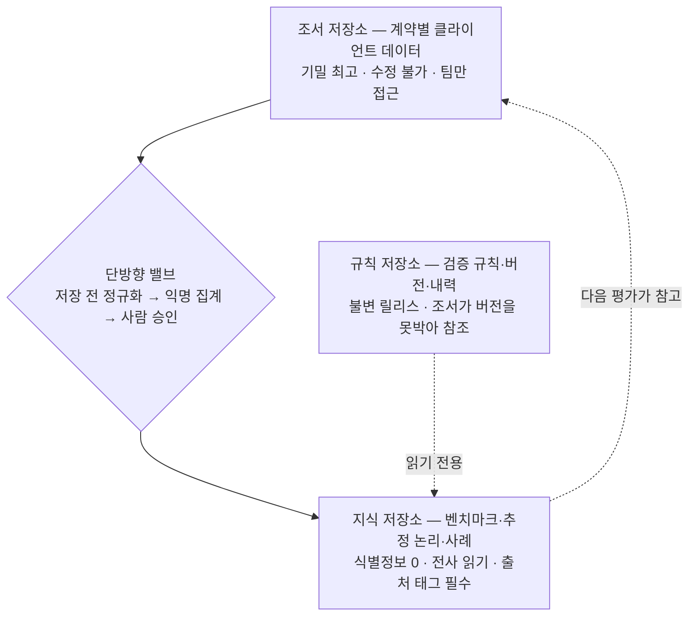
```mermaid
flowchart TB
  ENG["조서 저장소 — 계약별 클라이언트 데이터<br/>기밀 최고 · 수정 불가 · 팀만 접근"]
  VALVE{"단방향 밸브<br/>저장 전 정규화 → 익명 집계 → 사람 승인"}
  KNW["지식 저장소 — 벤치마크·추정 논리·사례<br/>식별정보 0 · 전사 읽기 · 출처 태그 필수"]
  RUL["규칙 저장소 — 검증 규칙·버전·내력<br/>불변 릴리스 · 조서가 버전을 못박아 참조"]
  ENG --> VALVE --> KNW
  KNW -. 다음 평가가 참고 .-> ENG
  RUL -. 읽기 전용 .-> KNW
```

조서에서 지식으로는 한 방향으로만, 밸브를 거쳐서만 흐른다. 비밀유지의무 때문이고, 클라이언트
간 정보 차단 때문이고, 자기가 평가한 값으로 자기가 감사하는 회사를 재는 순환을 막기 위해서다.

익명화는 저장한 뒤에 지우는 방식으로는 항상 진다. **저장하기 전에 바꿔야 한다.** 매출
1조 2,340억 대신 "성장률 12%, 업종 내 규모 상위 40%"만 남기면 누구인지 알아볼 표면이
대부분 사라진다. 그리고 밸류에이션에서 다시 쓸 가치가 있는 것은 어차피 비율과 순위지 절대
금액이 아니라서, 이 손실은 사실상 공짜다. 실제로 학회 리포트 코퍼스에서 개별 기업 숫자를
하나도 남기지 않고 매출 추정 논리만 뽑아낸 적이 있으니, 같은 공정에 원료만 바꾸면 된다.

### 온프레미스는 기밀은 풀어도 재현성은 못 푼다

기밀 등급이 오르면 배포는 안쪽으로 들어온다. 지금은 로컬 BYOK, 다음은 법인 클라우드 테넌트,
끝은 사내망 온프레미스다. 엔진이 표준 라이브러리만 쓰고 외부 의존이 없어서 어디서 돌려도
같은 답이 나오니, 이 전환 자체는 싸다.

다만 착각하기 쉬운 것이 있다. 서버가 사내에 있어도 LLM이 숫자를 만들면 3년 뒤 감리에서
재현이 안 된다. 재현성을 지키는 것은 배포 위치가 아니라 **"LLM은 계산하지 않는다"는 제약**이고,
이것은 어느 배포 단계에서도 바뀌지 않는다.

### 종착지 — 방법론이 문서가 아니라 코드가 된다

지금 법인의 방법론은 PDF다. 심리실이 개정하고, 교육으로 배포하고, 사람이 기억해야 적용된다.
종착지는 규칙 배포다 — 새 릴리스가 나가면 전사 모델이 즉시 새 기준으로 검사되고, 적용했는지가
진술이 아니라 로그로 증명된다.

질적으로 달라지는 순간은 자체 벤치마크가 감사 증거가 될 때다. "이 회사의 추정 영업이익률은
우리가 검증한 동종 N건의 상위 25% 위에 있다" — 이것은 PDF 체크리스트로는 만들 수 없는
문장이다. 그리고 위에서 쓴 개선 루프(돌려보고, 약점을 찾고, 규약으로 승격)가 바로 이 구조의
개인 버전이다. 개인에서 검증한 절차가 법인 버전의 원형이 된다.

마지막으로 냉정한 것 하나. 엔진과 게이트 코드는 잘하는 팀이면 따라 만든다. 따라 만들 수
없는 것은 쌓인 평가 코퍼스와, 규칙마다 달린 내력이다 — 이 규칙이 어느 심리 지적, 어느 실패
사례에서 나왔는지. **코드는 복사되지만 내력은 복사되지 않는다.** 그래서 조심할 것도 내력
쪽에 있다: 자기 평가에서 나온 기준은 경고까지만 쓰고 차단 사유로 승격하지 않을 것, 새 규칙은
한동안 관찰만 할 것, 출처 표시 없는 집계는 나중에 되돌릴 수 없으니 처음부터 태그를 달 것.

---

## 사용 방법

두 창구는 독립적이다 — 하나만 써도 동작하고, 서로 통신하지 않고 워크북(`_VS_STATE`)으로 상태를 공유한다.

### ① Claude 스킬 — Claude for Excel에 zip 업로드

```bash
python scripts/build_excel_skill.py
# → .claude/skills/excel-valuation-workbook/dist/excel-valuation-workbook.zip
```

zip은 자기완결이다(엔진·검증기·지식이 vendoring). Claude 설정 → Skills → zip 업로드 →
Excel에서 Claude 패널을 열고 호출. 스킬 샌드박스에는 네트워크가 없다 — 외부 데이터는
붙여넣기·MCP 커넥터·애드인 중 하나로 들어온다. **스킬 자체는 API 키가 필요 없다.**

### ② Excel 애드인 — manifest 등록 (본체는 웹 페이지)

- **웹 Excel**: 홈 탭 → 추가 기능 → "내 추가 기능 업로드" → `add-in/manifest.xml`
- **데스크톱 Excel**: 레지스트리 sideload — 상세 절차·트러블슈팅은 [`add-in/README.md`](add-in/README.md)

DART 조회는 **BYOK**(사용자의 OpenDART API 키)다. 키는 서버에 저장되지 않는다.

### ③ 개발 실행

```bash
pip install fastapi uvicorn openpyxl
python -m uvicorn backend.api.main:app --port 8000   # 백엔드 (Python 3.12+)
cd frontend && npm install && npm run dev             # 웹 창구 (선택)
python -m pytest -q                                   # 테스트 (800+)
```

---

## 레포 구조

```
.claude/skills/  Claude 스킬 3종 (excel-valuation-workbook · valuation-analysis · assumption-audit)
add-in/          Excel Task Pane manifest (웹·데스크톱)
backend/
  calc_core/     순수 결정론 엔진 (stdlib only) — DCF·게이트·다중기법 모듈
  ingest/        공시 커넥터 + 4종 검증 + provenance
  excel/         살아있는 수식 xlsx (export·import·diff·정적감사)
  api/           FastAPI (BYOK)
frontend/        웹 창구 (React+Vite) — 과정의 산물, 유지보수 하향
tests/           golden·skill·unit
scripts/         스킬 빌드 · 가정 검산(assumption_check) · 감사 스캔(audit_scan)
docs/            설계 문서 (방법론 지식 코퍼스는 비공개 — 아래 고지)
```

---

## 고지

- **이 공개 레포는 코드(스킬 도구·엔진·애드인·API)와 테스트만 담는다.** 방법론 지식 코퍼스
  (`docs/reference/` — 학회·증권사 리서치에서 귀납한 타이폴로지·벤치마크)와 원본 자료(엑셀·PDF)는
  저작권상 포함하지 않는다. 지식이 없어도 도구는 그대로 동작하도록 설계했다.
- 정본 엑셀 템플릿(`ValStudio_DCF_Template.xlsx`)은 실무 서식 파생물이라 레포에 없다 —
  파생 절차는 `scripts/build_template.py`에 코드로 남아 있고, 실제 화면은 위 스크린샷으로 시연한다.
- 실측 검증에 쓴 회사(리노공업 등)는 **상장사 공개 재무정보** 기반의 교육 목적 재현 검증이다.
  베타 등 미배선 데이터가 있어 **산출 가치는 어떤 의미로도 투자 판단의 근거가 아니다.**
