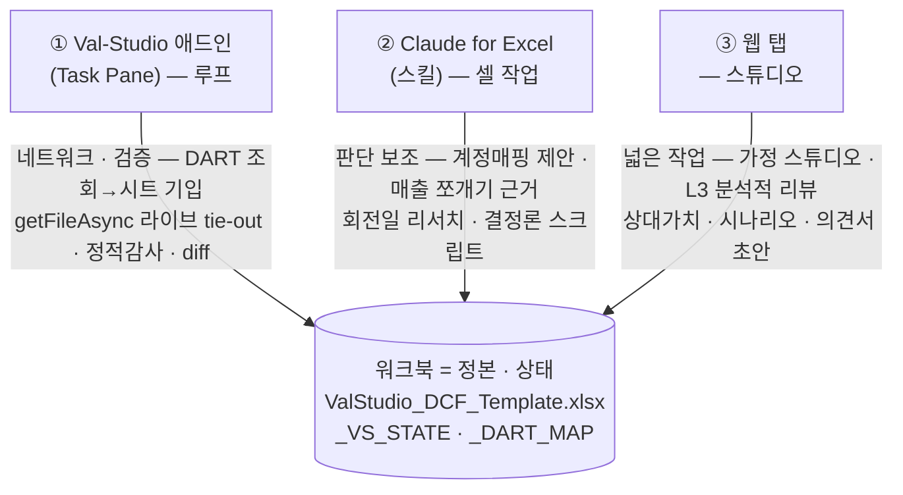
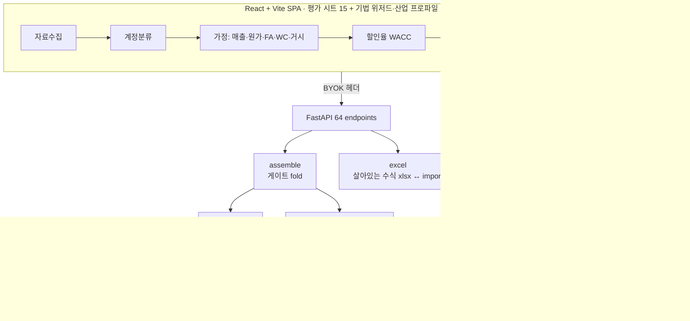
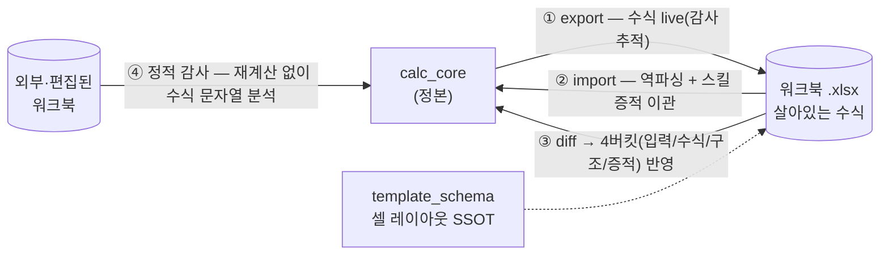
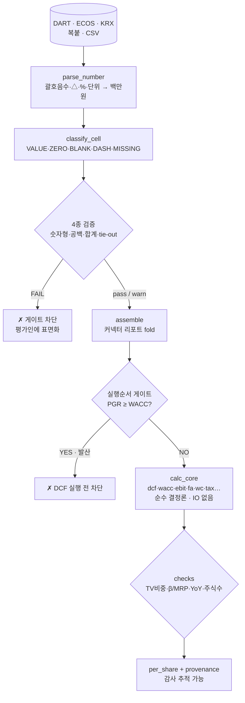
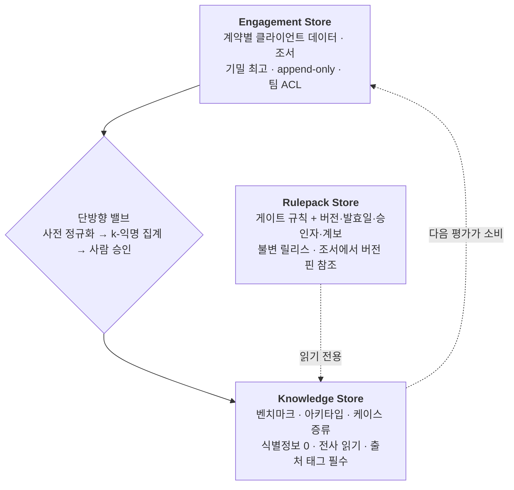

# val.studio — 한국형 기업가치평가 검증 워크벤치 (DCF + 다중 평가기법)

_Excel 애드인 + Claude 스킬 · 순수 결정론 평가 엔진 · [Anthropic 공식 금융 스킬](https://github.com/anthropics/financial-services) 원문 감사·개선 · 실무모델 셀 단위 재현(rel_tol 1e-9)_

> **판단은 사람, 계산·검증은 결정론 코드.** LLM이 숫자를 지어내지 않도록, 모든 값은 출처(provenance)를 달고 검증 게이트를 통과해야 모델에 들어간다.

**엑셀 워크북이 정본이고, 결정론 엔진이 그것을 채점한다.** 실무 DCF 모델(엑셀)을 **셀 단위로 재현**하는 엔진을 코어로, 앞단(공시 수집·주석 추출·가정 도출)을 자동화하고 뒤단(살아있는 수식 xlsx·평가의견서)까지 잇는다. 사용자는 엑셀을 떠나지 않는다 — 애드인 패널이 열려 있는 워크북을 그대로 검증하고, Claude 스킬이 셀 옆에서 판단을 돕는다. DCF에서 시작해 **상대가치·손상(VIU)·공정가치 역산·전환증권·SOTP·합병**까지 자본시장법/K-IFRS 실무가 요구하는 평가기법을 같은 검증 인프라 위에 얹었다.

| 규모 | |
|---|---|
| 결정론 엔진 | `calc_core` 26모듈 (순수 stdlib) |
| 평가기법 | DCF · 상대가치(PSR/PER/PBR) · VIU 손상(K-IFRS 1036) · 공정가치 backsolve(OPM 워터폴) · 전환증권(CB/RCPS) · SOTP · 합병 · 3표 완전연결 |
| 인제스트·검증 | `ingest` 16모듈 (4종 tie-out + provenance) |
| **정본 워크북** | **풀모델 26시트** `ValStudio_DCF_Template.xlsx` — 상향 배선(EBIT/FA/WC→DCF, WACC 빌드업) · 순환 0 · 서버 tie-out 왕복 |
| **엑셀 통합** | 살아있는 수식 xlsx **4방향**(export⇄import⇄diff⇄정적감사) + **Excel Task Pane 애드인**(현재 워크북 직접 검증) |
| Claude 스킬 | 실행 도구 17 + 지식문서 50 (자기완결 vendoring) |
| 웹 스튜디오 | React+Vite, 평가인 21시트 + 감사인 9시트 (기법추천 위저드·산업 프로파일 대조) — 애드인 Task Pane과 **같은 앱** |
| API | FastAPI 64 엔드포인트 |
| 테스트 | **839 통과 / 98 파일** (골든 재현 3종 포함) |

---

## 무엇을 푸는가 — 문제 정의

밸류에이션 실무의 병목은 모델을 **만드는** 데 있지 않다. **검토받는** 데 있다.

| 현업 페인포인트 | 이 프로젝트의 대응 |
|---|---|
| **리뷰가 병목** — 가장 비싼 인력이 셀 추적·합계 대사에 묶이고, 커버리지는 사실상 표본 검사 | 정적 감사·게이트가 기계적 검사를 전수로 대신 |
| **같은 결함의 재발** — 참조 밀림·하드코딩·TV 과대·주식수 혼용이 프로젝트마다 반복 | 결함 유형을 **실행 가능한 게이트**로 승격(아래 카탈로그) |
| **지식의 사장** — 검증 노하우가 개인 엑셀·PDF 체크리스트에만 존재 | 체크리스트 → 코드 + 근거 문서 태깅 |
| **AI 신뢰 공백** — LLM이 숫자를 만들면 검증·재현이 불가능 | 숫자는 결정론 엔진만, LLM은 제안·서사 전용 |

**근본 진단 한 줄**: 엑셀은 훌륭한 계산 엔진이지만 **검증 엔진이 아니고**, 법인·개인이 축적한
검증 지식은 문서로만 존재해 **실행되지 않는다.** 문제는 AI가 없어서가 아니라 **검증 지식이
코드가 아니어서**다. 그래서 이 프로젝트의 목표는 "모델을 만들어주는 AI"가 아니라
**"모델이 맞다는 걸 기계가 증명하게 만드는 것"**이다.

> 대차와 합계가 맞아도 틀린 모델이 있다. 아래 검출 결함은 **전부 tie-out이 통과한 상태에서** 나왔다.

### 실제로 잡은 결함 — 게이트의 근거 (실측)

| 결함 | 실측 영향 | 잡는 게이트 |
|---|---|---|
| 성장률 급단절(페이드 미적용) | TV 비중 **84.6% → 57.8%**, 주당 약 **9% 과대** | TV비중·페이드 스테이지 |
| 발행주식수 vs 유통주식수 혼용 | 주당 **10.4% 괴리** | 교차 브리지·주식수 정합 |
| 민감도 표 미갱신(stale) | 중심셀 **8,634.7 vs 본계산 8,413.4** | 중심셀 검산 |
| 수식 내 하드코딩 | 리터럴 `*32` → **+2,435백만원** | 하드코딩 스캔 |
| 운전자본 참조 5년 밀림 | 매출 +33.5%인데 ΔNWC ≈ 0 | 시계열 연속성(L3) |
| 원가율 접합부 계단 | 실적말→추정첫해 **+6.6%p** 점프 | 접합부 seam 검사 |
| 인당 인건비 급변 | **+40% YoY**, 근거 없음 | 파생지표 연속성 |
| 왕복 시 기간구조 소실 | 주당 **−23.1% 조용한 회귀** | 왕복 등가 테스트 |

---

## 제품 형태 — 워크북이 정본, 3창구 분업

**결론부터: 웹 UI로 엑셀을 대체하지 않는다.** 실무는 엑셀을 떠나지 않는다 — 모델 작성·리뷰(EQCR)·
아카이브가 전부 엑셀이고, 데이터조차 셀 함수(`=CIQ()`·`=BDP()`)로 들어온다. "웹으로 옮겨라"는
도구는 시니어 단계에서 채택이 죽는다. 그래서 **워크북을 유일 정본**으로 두고, 세 창구가 같은
워크북에 접속한다. 서버 프로젝트는 정본이 아니라 **검증 캐시 + diff 기준선**이다.


```mermaid
flowchart TB
  WB[("워크북 = 정본 · 상태<br/>ValStudio_DCF_Template.xlsx<br/>_VS_STATE · _DART_MAP")]
  AD["① Val-Studio 애드인<br/>(Task Pane) — 루프"]
  CE["② Claude for Excel<br/>(스킬) — 셀 작업"]
  WEB["③ 웹 탭<br/>— 스튜디오"]
  AD -- "네트워크 · 검증 — DART 조회→시트 기입<br/>getFileAsync 라이브 tie-out · 정적감사 · diff" --> WB
  CE -- "판단 보조 — 계정매핑 제안 · 매출 쪼개기 근거<br/>회전일 리서치 · 결정론 스크립트" --> WB
  WEB -- "넓은 작업 — 가정 스튜디오 · L3 분석적 리뷰<br/>상대가치 · 시나리오 · 의견서 초안" --> WB
```

| 창구 | 역할 | 왜 이 창구인가 |
|---|---|---|
| **① 애드인 패널** | 검증 루프·데이터 수급 — **루프의 매듭** | Task Pane은 우리 웹앱이 엑셀 안에 뜨는 것이라 **네트워크가 된다**. `getFileAsync`로 열려 있는 워크북을 저장 없이 검증 API로 보낸다 |
| **② Claude for Excel** | 셀 작업·대화형 판단 보조 | 워크북 맥락을 직접 읽는다. 단 **샌드박스에 네트워크가 없어** 외부 조회는 붙여넣기·MCP·애드인 경로 |
| **③ 웹 탭** | 넓은 화면이 필요한 작업 | 21시트 가정 스튜디오·분석적 리뷰는 Task Pane 폭(~350px)에 안 들어간다. 같은 오리진이라 패널과 **프로젝트를 공유** |

**왜 셋인가 — 실행 환경 제약이 다르다.** ①과 ②는 같은 엑셀 안에 있어도 애드인끼리 직접 통신할
수 없다. 그래서 **워크북 자체(`_VS_STATE` 숨김 시트)가 프로토콜**이 된다 — 에이전트가 기록한
가정 대장·로그를 애드인·웹이 파싱해 증적으로 잇는다.

> **법인 스케일의 종착 형태**는 한 물건이 아니라 넷이다 — ①**엑셀 함수 애드인**
> (`=VS.BENCHMARK("의약품","OPM","p75")`) ②**검증 게이트웨이**(제출 → 게이트 → 증적 조서화)
> ③**MCP 서버**(지식 조회 정본) ④**승인된 에이전트**(판단 보조). **결정론은 셀 함수로 흡수되고
> 대화형 판단은 밖에 남으며**, 웹 UI는 관리 대시보드로 축소된다. → [로드맵](#로드맵--개인l0에서-법인l3까지) ·
> [addin_two_panel_ux.md](docs/plan/addin_two_panel_ux.md) §10

### 지금 조준하는 MVP

> **임의 상장사 하나를 정해, DART에서 재무제표를 엑셀로 직접 불러오고, 계정매핑·매출 세분화·
> 운전자본 추정을 AI 보조로 확정한 뒤, 엑셀을 떠나지 않고 평가를 마무리한다.**

| 단계 | 필요한 것 | 상태 |
|---|---|---|
| ① 회사 선정 | `/api/dart/corp-search` | ✅ |
| ② 재무제표 → 엑셀 | `/api/dart/financials` → `rFS` 기입 | 🔄 API·UI 있음, 실기 파일럿 미완 |
| ③ 계정매핑 | `/api/fs/classify`(uncertain 표면화) + `H_FS` NOA/IBD 구분 | ✅ |
| ④ 매출 쪼개기 | `Research` 제품표 → `EBIT` 사업1~4 배선 + `fs_disagg` 합보존 | ✅ |
| ⑤ 운전자본 추정 | `WC` 회전기간 구조 + 드라이버 SUMIF | ✅ |
| ⑥ WACC | 빌드업 9칸 입력 → `DCF!H37` + `peer.py` 퍼널 검증 | ✅ |
| ⑦ 마무리·검증 | 주당가치 자동 산출 + **워크북↔엔진 tie-out** | ✅ |

**남은 것은 코드가 아니라 배포·검증이다** — 애드인 sideload(manifest 등록), 스킬 zip 조직 업로드,
그리고 실제 회사 1건 드라이런. 파일럿에서 걸리는 지점이 곧 다음 작업 목록이 된다.
설치 절차는 아래 [사용방법](#사용방법--엑셀에-붙이기).

---

## 왜 만들었나 — 공식 금융 스킬을 원문 감사하고 내린 결론

Anthropic은 이미 좋은 금융 스킬을 공개해 두었다 — [financial-services](https://github.com/anthropics/financial-services)의 **`dcf-model`(1,263줄)·`audit-xls`(156)·`comps-analysis`(661)·`lbo`(274)** + 회계결산 `finance` 플러그인 8종. 시작 전에 **이 원문들을 전부 감사**했고, 결론은 두 가지였다.

1. 규약의 상당수는 **그대로 채택할 만큼 좋다** — 일부는 우리보다 엄격해서 우리 기준을 고쳤다.
2. 그런데 **한국 실무 평가서에는 그대로 쓸 수 없다** — 규제·회계기준·데이터 원천이 다르고, 무엇보다 *"계산이 맞다"를 증명하는 층*이 없다.

### ① 채택한 것 — 그들이 옳았던 규약

| 공식 스킬의 규약 | 이 프로젝트 반영 |
|---|---|
| **단계별 유저 확인 강제** (데이터→매출→FCF→WACC→TV, end-to-end 금지) | W0~W9 워크플로우에 명문화 — 각 단계 게이트 통과 후에만 진행 |
| **민감도 홀수 그리드 + 중심셀 = base 실제값**(내장 sanity check) | 결정론 검증으로 **승격** — 워크북 중심셀 == 엔진 중심 == base 자동 대조 |
| 하드코딩은 3종만 허용(과거실적·가정·시장데이터) + 셀마다 **출처 코멘트** | xlsx export 동일 철학 + provenance 계층으로 강화(아래 ③) |
| `audit-xls`: **"BS 안 맞으면 그것부터"**, **하드코딩 오버라이드가 조용한 버그 1위** | 모델 감사 체크·`workbook_diff`(수식→값 덮어쓰기 감지)로 이식 |
| `audit-xls` **DCF 버그 5종**(mid-year 오적용·TV 미할인·장부가 WACC·FCF에 이자 포함·tax shield 이중계상) | `diagnose_dcf_gap` — 주장값과 괴리 시 각 버그를 가정해 재계산하고 **어느 가설과 맞는지 지목** |
| TV 비중 **>75% 경고** (우리가 90%로 느슨했다) | 기준을 **75%로 하향** — 그들이 더 엄격했던 케이스 |
| `comps` **"5-10 Rule"**, median 우선, Cross-Reference(중복입력 금지) | peer 4-step 퍼널 게이트에 반영 |
| `variance-analysis` **서사 규격**(Driver/Outlook/Action, "higher than expected" 순환설명 금지) | 리포트 **표현 린트**로 구현 |

### ② 델타 — 한국 규제·실무 정합

공식 `dcf-model`은 미국 시장을 전제한다. 한국 평가 실무는 다른 관행과 기준서를 따른다.

| 항목 | 공식 `dcf-model` | 이 프로젝트 (한국 실무) |
|---|---|---|
| 할인율 | 자사 β 직접(5Y monthly), ERP 5~6% | **peer 무부채화/재부채화(Hamada)** + **MRP 한공회 가이던스** + **size premium(Kroll decile)** + CRP, **β/MRP 시장 정합 검사** |
| 법인세 | 단일 세율 | **계단식 구간세율** + 실적세액/유효세율 주입 3단 우선순위 |
| 리스 | 미반영 | **K-IFRS 1116** — 리스료→이자·원금 분리 + ROU 정액상각(D&A·순차입부채·금융비용 3분기) |
| 연결 브리지 | EV − 순부채 | EV +비영업자산 −순차입부채 **−비지배지분(NCI)** = **지배주주 귀속** 지분가치 |
| 원천 데이터 | 유저가 제공 | **DART OpenAPI**(재무제표·직원현황·공시)·**ECOS**(거시·환율)·**KRX**(β·시총) 커넥터 + **주석 성격별 추출** |
| 계정 체계 | 영문 GAAP | **한국어 계정과목 사전** + NOA/IBD 결정론 분류(순서 규칙) |
| 단위 | USD | **백만원 정규화**(원/천원/억원, 괄호음수 `(1,234)`, `△` 음수 표기) |

### ③ 델타 — "지시문"이 아니라 "실행되는 검증"

이게 가장 큰 구조적 차이다. 공식 스킬은 **지시문 중심**이다 — SKILL.md가 Claude에게 *엑셀에서 모델을 어떻게 만들지* 알려주고, 정확성은 모델이 지시를 잘 따르는지에 달려 있다.

이 프로젝트는 **계산을 LLM에서 분리**했다.

- **순수 엔진**(`calc_core`, stdlib only, 네트워크·IO 없음)이 계산을 전담하고, **실무 엑셀 모델을 셀 단위로 재현**하는 골든 테스트(주당 8,413.38원, rel_tol 1e-9)로 검증된다.
- 스킬은 산술을 하지 않고 **엔진을 호출한다** — SKILL.md에 *"암산·추정 금지, 숫자는 반드시 `scripts/`로"*를 규약으로 박았다.
- 검증이 **텍스트 경고가 아니라 실행을 막는다**: PGR ≥ WACC면 Gordon이 발산하므로 어셈블리가 **DCF를 실행하기 전에 차단**한다.
- 출처가 **코멘트 문자열이 아니라 타입드 span**이다: `source[char_start:char_end] == raw_text` 불변식을 테스트가 강제해서 "이 급여 12,340은 주석24의 118~124번째 글자"라고 답할 수 있다.

> 한 줄로: 공식 스킬이 **좋은 모델을 만드는 법**을 가르친다면, 이 프로젝트는 거기에 더해 **그 모델이 맞다는 걸 기계가 증명**하게 한다. 실무 평가서는 감사·심사를 받으므로, 숫자마다 *어디서 왔고 어떤 게이트를 통과했는지*가 남아야 한다.

---

## Phase 1 — 한국형 DCF 스킬 (완료)

먼저 **Claude 스킬**로 만들었다. 엑셀 워크북 위에서 평가 워크플로우를 수행·검증하는 자기완결 패키지다.

### 워크플로우 W0~W9


```mermaid
flowchart LR
  W0[W0 모드판별<br/>스캐폴딩] --> W1[W1 리서치<br/>Company Brief]
  W1 --> W2[W2 과거FS<br/>정합성·이관]
  W2 --> W25[W2.5 계정세분화<br/>주석추출→합보존]
  W25 --> W3[W3 재분류<br/>평가유형 태깅]
  W3 --> W4[W4 추정<br/>매출·원가 드라이버]
  W4 --> W5[W5 WACC<br/>peer 4-step]
  W5 --> W6[W6 DCF<br/>승격 tie-out]
  W6 --> W7[W7 시나리오] --> W8[W8 민감도] --> W9[W9 리포트]
```

각 단계는 **결정론 게이트**를 통과해야 다음으로 간다 — 통과 못 하면 멈추고 평가인에게 표면화한다. 빈 시트에서 시작하면 수식이 살아있는 템플릿을 찍고, 단계마다 시트를 더해 풀모델로 키운다.

### 설계에서 고집한 3가지

**① 역할 3분할 — 제안(Claude) → 판단(평가인) → 검증(코드)**

순서를 절대 섞지 않는다. 계정 분류·드라이버 선택·가정값은 전부 평가인 몫이고, Claude는 후보 제시와 근거 리서치만 한다. 숫자는 반드시 `scripts/` 결정론 도구로 — **암산·추정 금지**.

**② 과립도는 원천자료가 지지하는 만큼만**

W2.5 계정세분화가 대표적이다. 손익 한 줄을 성격별로 쪼개야 W4에서 P×Q·변동/고정을 걸 수 있는데, 근거 없이 쪼개면 정밀해 *보이지만* 틀린 모델이 된다. 그래서 `footnote_costs.py`가 **주석 표에서만** 성격을 뽑는다 — 없는 성격을 만들어낼 방법이 구조적으로 없다. 자료가 없으면 총액 유지 + `[성격별 미확보]` 표면화.

```bash
# ① 주석 추출 → ② 세분 검증 사슬
python scripts/footnote_costs.py in.json \
  | python -c "import json,sys;print(json.dumps(json.load(sys.stdin)['disagg_payload'],ensure_ascii=False))" \
  | python scripts/fs_disagg.py
```

**③ 애매하면 확정하지 않는다**

감가상각비는 제조원가/판관비 배분이 애매하다. 아무 쪽이나 찍으면 그럴듯하지만 틀린 세분화가 되므로 `uncertain`으로 두고 **롤업에서 제외**한다 → tie-out이 "미확정 때문에 불완전"이라고 경고한다. 자동으로 예쁘게 맞추는 대신 **불완전함을 드러내는** 쪽을 택했다.

### 자기완결 vendoring

스킬은 레포 없이도 동작해야 한다. `build_excel_skill.py`가 엔진·지식을 `scripts/vendor/`로 복사하고 해시 매니페스트를 남긴다. 드리프트 검사가 **해시뿐 아니라 파일 집합(added/removed)까지 대조**하는데, 이 설계가 실제로 사고를 막았다 — 새 모듈이 vendoring 안 된 채 기존 모듈이 그걸 import해서 런타임에 죽을 상황을 빌드 시점에 잡았다.

```bash
python scripts/build_excel_skill.py --check   # 드리프트만 검사(CI 게이트)
python scripts/build_excel_skill.py           # vendoring + zip 패키징
```

---

## Phase 2 — 웹 플랫폼: 종착지가 아니라 스튜디오

스킬은 강력하지만 **엑셀/CLI 안에 갇혀 있다.** 평가 실무는 여러 자료를 오가며 가정을 반복 조정하는 작업이라 상태를 들고 있는 UI가 필요했다. 그래서 같은 엔진 위에 웹을 올렸다.

> **다만 웹은 정본이 아니다.** 21시트 가정 스튜디오·L3 분석적 리뷰처럼 **넓은 화면이 필요한
> 작업**을 맡고, 검증 루프의 매듭은 언제나 엑셀 안의 애드인 패널이다(위 [제품 형태](#제품-형태--워크북이-정본-3창구-분업)).
> 이 웹앱은 **그 자체가 애드인의 본체**이기도 하다 — Task Pane은 같은 앱을 `?embed=1`로
> 띄우므로, 여기 만든 시트가 곧 패널 화면이 된다. 웹을 키운 것이 애드인을 키운 것이다.


```mermaid
flowchart TB
  subgraph FE[React + Vite SPA · 평가 시트 15 + 기법 위저드·산업 프로파일]
    M[자료수집] --> MAP[계정분류] --> A[가정: 매출·원가·FA·WC·거시]
    A --> D[할인율 WACC] --> V[밸류에이션: DCF·상대가치·VIU·전환증권·SOTP] --> R[리포트]
  end
  FE -->|BYOK 헤더| API[FastAPI 64 endpoints]
  API --> ASM[assemble<br/>게이트 fold]
  ASM --> CC[calc_core<br/>순수 결정론]
  ASM --> ING[ingest<br/>4종 tie-out + provenance]
  ING -->|DART·ECOS·KRX·복붙| EXT[(외부 원천)]
  API --> XL[excel<br/>살아있는 수식 xlsx ↔ import]
```

**BYOK(Bring Your Own Key)**: DART·Gemini·ECOS 키는 localStorage에 두고 **호출별 헤더로만** 전달한다. 서버는 저장하지 않는다.

**두 트랙**: 평가인(작성) 21시트 / 감사인(검증) 9시트. 모드는 프로젝트 생성 시 확정하고 바꿀 수 없으며, 데이터 키도 분리한다 — **감사인 독립성**을 UI 구조로 강제.

---

## 엑셀과의 통합 — 워크북이 정본, 엔진이 심판

**정본은 워크북이고 엔진은 그것을 검증한다.** 계산 로직의 SSOT는 `calc_core`지만, 사용자가
편집하고 전달하고 아카이브하는 실물은 워크북이다 — 그래서 엔진은 워크북을 **대체하지 않고
채점**한다. 4방향 배관이 그 심판을 성립시킨다.


```mermaid
flowchart LR
  CC["calc_core<br/>(정본)"]
  WB[("워크북 .xlsx<br/>살아있는 수식")]
  EXT[("외부·편집된<br/>워크북")]
  CC -- "① export — 수식 live(감사 추적)" --> WB
  WB -- "② import — 역파싱 + 스킬 증적 이관" --> CC
  WB -- "③ diff → 4버킷(입력/수식/구조/증적) 반영" --> CC
  EXT -- "④ 정적 감사 — 재계산 없이 수식 문자열 분석" --> CC
  SSOT["template_schema<br/>셀 레이아웃 SSOT"] -.-> WB
```

- **왕복 무손실**: export→import 후 재계산이 원값과 일치해야 통과(골든 3종으로 회귀 고정).
  기간구조 파라미터가 왕복에서 소실돼 주당가치가 23% 되돌아가는 결함을 이 테스트가 잡았다.
- **정적 감사는 재계산이 필요 없다** — 수식 문자열만 분석해 패턴 이탈·하드코딩·중심셀 불일치를
  찾으므로, **우리 템플릿이 아닌 외부 모델에도** 그대로 쓸 수 있다.
- **Excel Task Pane 애드인**: 같은 웹 앱을 엑셀 안에서 띄운다(`?embed=1`). 열려 있는 워크북을
  **다운로드 없이** 검증 API로 보내므로(`getFileAsync`), 수정→검증 루프가 엑셀을 떠나지 않는다.
  manifest 하나로 웹/데스크톱/Mac/iPad가 동일 동작.
- **Claude for Excel 공존**: 애드인끼리는 직접 통신할 수 없으므로 **워크북 자체(`_VS_STATE`
  숨김 시트)를 프로토콜**로 쓴다 — 에이전트가 기록한 가정 대장·로그를 웹이 파싱해 증적으로 잇는다.
- **풀모델 정본 템플릿** `ValStudio_DCF_Template.xlsx`(26시트, **레포 미포함** — 아래 고지): 실무 검증 시트 구성
  (Assumption·DCF·EBIT·FA·WC·WACC)에 Comps(Trading Comps)·Peer 퍼널·Research(조사 백데이터
  10섹션)·원자료 시트(rFS·rGDP·rInflation·rWage·rTrading)를 증설했다. **상향 배선 완비** —
  세부(P×Q·회전기간·상각 스케줄)→요약→DCF 스파인→주당가치가 살아있는 수식으로 흐르고(수식
  3,600+, 셀 단위 순환 0 검증), WACC는 CAPM 빌드업(Hamada 재레버) 9칸 입력으로 `DCF!H37`에
  자동 반영된다. `_DART_MAP` 시트가 "어느 셀이 어느 DART 원천에서 오는가"를 선언한다.
- **레이아웃 2원 체제**: 되읽기 좌표 SSOT가 둘이다 — 엔진 export 왕복은 `template_schema`
  (스파인), 풀모델 템플릿은 `fullmodel_layout`(`valstudio-full-v1`). `/api/xlsx/import`와 스킬
  `roundtrip.py`가 `_VS_STATE.layout` 키(폴백: 라벨 지문)로 자동 판별해 라우팅하고, 풀모델은
  **워크북 주장값(DCF!H49) vs 엔진 재계산 tie-out**을 응답에 동봉한다 — 사용자가 수식을 실수로
  덮어써도 주당가치 불일치로 즉시 발각된다.

---

## 평가기법 — DCF에서 다중기법으로

자본시장법 종합평가와 K-IFRS 실무는 한 가지 방법으로 끝나지 않는다. 같은 결정론·게이트 인프라 위에 평가기법을 넓혔다 — **각 기법은 고유의 검증 게이트를 갖는다.**

| 기법 | 모듈 | 근거 · 게이트 |
|---|---|---|
| **DCF** | `dcf`·`wacc`·`fa`·`wc`·`tax` | 페이드 스테이지·터미널 정규화·PGR 앵커링, TV비중·β/MRP·운전자본 게이트 |
| **상대가치** | `multiples`·`relative` | PSR/PER/PBR, peer 4-step 퍼널(자기제외·중복입력 금지), 교차 브리지 대조 |
| **VIU 손상** | `viu` | K-IFRS 1036 사용가치 — 제약모드(성장 CAPEX 배제)·CGU 게이트 3종 |
| **공정가치 역산** | `backsolve` | OPM(옵션가격모형) 워터폴 역산 — 우선주/보통주 가치 배분 |
| **전환증권** | `convertible` | CB/RCPS — 홀더 선택(전환 vs 상환) 최적화, 노드 변동 격자 |
| **SOTP · 합병** | `sotp`·`merger` | 부분합·합병비율, DART 세그먼트 자동배분 |
| **3표 완전연결** | `three_statement` | 손익·재무상태·현금흐름 순환참조 해법(고정점 반복) + 대차 스파인 대사 |

**기법 선택도 결정론이다.** `method_selector`가 사업 성격(현금흐름 예측가능성 × 자산 성격)으로 기법을 추천하고 웹의 **기법추천 위저드**가 이를 소비한다 — 단 추천은 참고일 뿐, 판단은 평가인 몫(법제 트랙과 상보).

**산업 프로파일 대조.** 가정값(OPM·DSO·DIO·CAPEX/매출)을 **산업별 지표 분포**(비공개 레퍼런스 코퍼스에서 집계한 p25/p50/p75/min/max) 대비 이상치로 판정한다. 엔진 게이트(`check_metric_vs_industry`)와 웹 카드가 **하나의 로더·매칭 규칙**을 공유해 두 표면이 어긋나지 않는다.

---

## 아키텍처 — 3계층 + 게이트

값 하나가 원천에서 결과까지 지나는 길 — **게이트가 통과 못 하면 다음 단계를 아예 실행하지 않는다**(무의미한 결과를 만들어 나중에 경고하지 않음).


```mermaid
flowchart TB
  SRC[("DART · ECOS · KRX<br/>복붙 · CSV")] --> PN["parse_number<br/>괄호음수·△·%·단위 → 백만원"]
  PN --> CL["classify_cell<br/>VALUE·ZERO·BLANK·DASH·MISSING"]
  CL --> G1{"4종 검증<br/>숫자형·공백·합계·tie-out"}
  G1 -->|FAIL| X1["✗ 게이트 차단<br/>평가인에 표면화"]
  G1 -->|"pass / warn"| ASM["assemble<br/>커넥터 리포트 fold"]
  ASM --> G2{"실행순서 게이트<br/>PGR ≥ WACC?"}
  G2 -->|"YES · 발산"| X2["✗ DCF 실행 전 차단"]
  G2 -->|NO| CORE["calc_core<br/>dcf·wacc·ebit·fa·wc·tax…<br/>순수 결정론 · IO 없음"]
  CORE --> G3{"checks<br/>TV비중·β/MRP·YoY·주식수"}
  G3 --> OUT["per_share + provenance<br/>감사 추적 가능"]
```

**모듈 책임 트리:**

```
ingest/          원천 → 값                    "이 숫자는 어디서 왔나"
  ├ 커넥터        DART·ECOS·KRX·Damodaran·복붙/CSV
  ├ parsers/      BaseParser 백본 — 추출→정규화→검증→provenance 자동
  ├ validators    ① 숫자형 ② 공백유무 ③ 합계 ④ 정합성(tie-out)
  └ provenance    {source, locator, char_span, method, confidence}
        ↓ 게이트 통과분만
assemble/        원천값 → 검증된 엔진입력       "쓸 수 있는 가정인가"
  └ 커넥터 리포트를 하나로 fold + 실행순서 게이트
        ↓
calc_core/       순수 계산 (stdlib only, 네트워크·IO 없음) — 26모듈
  ├ 코어 DCF     dcf·wacc·ebit·fa·wc·tax·revenue·cost_build·lease
  ├ 다중기법     multiples·relative(상대가치)·viu(손상)·backsolve(공정가치 OPM)·
  │              convertible(CB/RCPS)·sotp·merger·backlog(수주산업)
  ├ 재무제표     three_statement(3표 완전연결·순환참조 해법)·model·models
  ├ 기법선택     method_selector(사업성격→기법 추천)
  └ 검증         checks(가정 타당성 게이트)
```

### 왜 이렇게 나눴나

**`calc_core`는 순수하다.** 네트워크도 파일IO도 없어서 골든 테스트가 완전히 결정론적이고, 스킬로 vendoring해도 그대로 돈다.

**검증이 두 종류로 나뉜다.** `ingest/validators`는 *데이터가 원본과 맞나*(tie-out), `calc_core/checks`는 *가정이 말이 되나*(PGR≤GDP, TV비중, β/MRP 시장 정합). 같은 `ValidationReport` 인프라를 쓰되 관심사를 분리했다.

**게이트는 실행 순서를 안다.** PGR ≥ WACC면 Gordon이 발산하므로 `assemble`이 **DCF를 실행하기 전에** 차단한다. 무의미한 결과를 만들어놓고 나중에 경고하지 않는다.

### provenance — 감사 추적의 최소 원자

```python
ProvenancedValue(
    value=Decimal("12340"),                    # 정규화된 값(백만원)
    provenance=Provenance(
        source_kind=SourceKind.FOOTNOTE,
        method=ExtractMethod.REGEX,
        locator=Locator(note_no=24),
        char_start=118, char_end=124,          # 원문 불변 참조
        raw_text="12,340", confidence=0.85))
```

불변식: `source[char_start:char_end] == raw_text`. 테스트가 이걸 강제해서 "이 급여 12,340은 주석24의 118~124번째 글자"라고 답할 수 있다.

---

## 데이터가 들어오는 순간 — "사람 눈에만 숫자"인 재무제표

밸류에이션의 첫 관문은 계산이 아니라 **수집**이다. 재무제표를 프로그램으로 읽으면 사람에겐 같은 숫자가 기계에겐 제각각이라, 그냥 `float()` 하면 **조용히 틀린다.**

| 원본 셀 | 실제 의미 | 순진한 `float()` |
|---|---|---|
| `(1,234)` | −1,234 (괄호 = 회계 음수 관행) | ✗ 예외 |
| `△56` | −56 (K-회계 음수 표기) | ✗ 예외 |
| `1,330`원 vs `1,330`백만원 | 스케일 10⁶ 차이 | 1330 — 스케일 소실 |
| `-` (대시) | 0인가 미해당인가 | ✗ 예외 |
| `""` 빈 셀 | **진짜 0인가 결측인가** | 0 — 결측이 0으로 숨음 |
| `12.5%` | 0.125 | ✗ 예외 |

마지막 둘이 감사에서 치명적이다. **빈 셀을 0으로 뭉개면 합계검증이 그냥 통과해버려서 "빠진 값"이 숨는다** — 감사에선 "진짜 0"과 "모름"이 완전히 다른 의미다. 그래서 인제스트 게이트가 두 함수로 이걸 못박는다:

- **`classify_cell`** — 모든 셀을 **VALUE / ZERO / BLANK / DASH / MISSING 5종**으로 분리. 빈 셀·대시·결측을 절대 0으로 뭉개지 않는다.
- **`parse_number`** — 괄호음수 `(1,234)→−1234`, `△/▲` 음수, `%`, 내장 단위(원·천원·백만원·억·조) 접미사, 콤마·공백을 정규화해 **전부 백만원 기준 `Decimal`**. 비숫자는 `fail`로 **게이트를 막는다**(다음 단계로 못 넘어감).

그 위에 **합계검증**(소계 = 구성요소 합, 결측이 있으면 "합계 불완전" warn — 조용히 맞추지 않고 불완전함을 드러냄)과 **교차 tie-out**(주석 감가상각 = CF의 D&A, 주석 급여총액 = DART 직원현황 급여 — **두 독립 출처가 어긋나면 FAIL**)이 얹힌다.

> **설계 핵심**: 검증을 "이전 추출과 얼마나 비슷한가"가 아니라 **재구성 일치(라운드트립)**로 한다. 그래서 **LLM이 값을 변형·추출해도 이 게이트를 반드시 통과**해야 한다 — LLM 출력조차 결정론 검증의 대상이다(감린이 clean-truth 오라클에서 이식한 철학).

---

## 검증 체계

| 층 | 무엇을 보증 |
|---|---|
| **골든 재현** | 실무 엑셀 모델을 셀 단위 재현 — 주당가치 **8,413.38원** (rel_tol 1e-9). 2차 사례로 EBIT 스파인 Δ0 교차검증 |
| **4종 tie-out** | 숫자형(단위·괄호음수·%)·공백유무(진짜 0 vs 결측)·합계·정합성(주석↔FS 교차) |
| **가정 게이트** | PGR≥WACC=FAIL · PGR>GDP=WARN · TV비중>75% · β/MRP 시장 혼용 · 운전자본 흑자도산 · YoY 급변 |
| **왕복(roundtrip)** | 엔진 → xlsx(수식 유지) → 재계산 → 엔진값 일치. 승격 tie-out(하드넘버→상류참조 교체 시 per_share 불변) |
| **구조버그 진단** | 주장 주당가치와 괴리 시 흔한 구조 오류(mid-year 미적용·TV 미할인·비영업자산 누락 등)를 각각 가정해 재계산 → 어느 가설과 맞는지 지목 |
| **표현 린트** | 리포트 서사의 근거 없는 단정·순환설명·허위정밀 반올림 검출 |

---

## 트러블슈팅 — 실제로 잡은 결함들

포트폴리오로서 가장 할 말이 많은 부분. **"통과했는데 틀린" 케이스**가 대부분이었다.

### 1. 지식엔 있는데 엔진엔 없던 갭 — 터미널 운전자본 과대계상

교육 정본은 *"터미널 ΔWC = 추정말매출 × g × WC비율"*이고, 말기 WC 투자액에 (1+g)를 곱하는 건 틀렸다고 명시한다(TV 21% 왜곡 예시까지). 그런데 엔진은 **터미널 ΔWC를 0으로** 두고 있었다 — g>0인데 운전자본 투자를 안 빼니 FCFF가 부풀고 TV가 과대계상됐다.

더 나쁜 건 **경고는 하고 있었다**는 점이다. 게이트가 "재투자 미반영 → TV 과대계상 위험"이라고 WARN을 띄우면서도 실제로는 과대계상된 값을 그대로 내놓았다. 감사인이 제일 싫어하는 형태(문제를 알면서 방치).

> **교훈**: 로직은 **지식·게이트·엔진 세 층에 다 있어야** 반영된 것이다. 지식만 있으면 문서고, 게이트만 있으면 잔소리다.

정본 공식을 1급 입력(`terminal_wc_ratio`)으로 승격하고, 반영되면 게이트가 WARN→PASS로 올라가도록 배선했다.

### 2. 단위 스케일 버그 — 환율 1,330원이 13.3원으로

거시 커넥터가 모든 지표를 `/100`으로 나눴다. 물가상승률·금리는 %라서 맞지만 **환율은 레벨 값**이라 1,330 → 13.3이 됐다. `_LEVEL_INDICATORS` 집합으로 비율 지표와 레벨 지표를 갈랐다.

> **교훈**: "단위 정규화"는 지표별 성격을 알아야 한다. 일괄 규칙이 가장 위험하다.

### 3. 조용한 드롭 — 못 읽은 행이 사라짐

주석 추출기가 값 토큰이 없는 행(OCR 실패·빈칸)을 **말없이 건너뛰었다.** 성격 하나가 통째로 빠졌는데 결과는 멀쩡해 보인다. 이제 성격 라벨로 보이는데 값이 없으면 WARN으로 표면화하고, 빠진 만큼 합이 안 맞으니 **tie-out이 잡는다**(clean-truth 오라클).

### 4. 용어 오류 — 소수주주지분 vs 비지배지분

EV→지분 브리지를 구현하며 구 K-GAAP 용어(소수주주지분/minority interest)를 썼다. K-IFRS 정식 용어는 **비지배지분(NCI)**. 참고한 영문 모델이 "Minority Interest"라 적혀 있어 그대로 받은 게 원인이었다.

> **교훈**: 도메인 용어는 코드 리뷰가 아니라 **도메인 전문가**가 잡는다. 실측 모델을 SSOT로 삼되 용어는 기준서를 따라야 한다.

### 5. "있는 척"하는 기능 — 미실행인데 "통과"로 표시

peer 선정 퍼널이 특정 단계에 도달조차 못 했는데 화면엔 "돌렸고 탈락 0"으로 표시됐다. **미실행과 통과가 같은 화면**이 되는 건 검증 도구로서 치명적이다. 미도달을 명시적 상태로 분리했다.

### 6. 가드가 오타로 전 경로 무력화

look-ahead 방지 가드(평가기준일 이후 데이터 차단)가 잘못된 속성명을 참조해 **모든 경로에서 조용히 통과**하고 있었다.

> **교훈**: 게이트를 만들면 **게이트가 실제로 막는지** 테스트해야 한다. "정상 입력이 통과한다"만 테스트하면 무력화된 가드를 못 잡는다.

### 7. vendor 드리프트 — 새 모듈 미복사로 스킬 import 실패

스킬이 쓰는 모듈이 추가됐는데 vendoring 목록에 없어, 기존 모듈이 그걸 import하다 죽을 상황이었다. 해시만 비교했으면 "기존 파일 전부 동일 → 통과"로 넘어갔을 것이다. **파일 집합까지 대조**하는 설계가 잡아냈다.

### 8. LLM 자동분류의 함정 — 결정론 규칙으로 못박은 계정 매핑

EV→지분 브리지의 정확도는 **계정을 영업/비영업·이자부부채로 정확히 가르는 데** 달려 있다 — 순차입금·비영업자산 한 줄이 밀리면 지분가치가 흔들린다. 타사는 이 분류를 LLM 자동분류로 처리하다 **"Sales 오분류"를 자인**했다("매출원가"가 "매출"로 빨려 들어가는 식의 조용한 오류).

우리는 이걸 **순서 있는 결정론 규칙**으로 코드에 못박았다(`fs_mapper.py`):

- **특이 계정 먼저, 첫 매칭 승리** — `매출원가`(COGS) 규칙이 `매출`(Sales)보다, `사채`가 `매입채무`보다 앞선다. 포함관계 함정을 **순서**로 차단.
- **2단 구조** — OpenDART 표준 요소명(`ifrs-full_Revenue`, 회사가 못 바꿈)으로 먼저 판정 → 무매칭이면 계정명 키워드 폴백. "매출액 / 영업수익 / 수익(매출액)" 같은 **표기 흔들림에 면역**.
- **애매하면 확정 금지** — 무매칭은 `uncertain`(유저 분류 필요), 판단 계정(초과현금·리스부채 순차입 포함 여부 등)은 `judgment=True`로 **제안만 하고 승인 대기**.

> **교훈**: LLM 자동분류는 편하지만 **어디서 왜 틀렸는지 재현·설명이 안 된다.** 감사받는 산출물에선 "왜 이 계정이 비영업인가"에 규칙으로 답할 수 있어야 한다.

### 9. 같은 회사인데 주식수가 둘 — 발행 vs 유통 (D7 게이트)

주당가치 = 지분가치 ÷ 주식수인데, **"주식수"가 하나가 아니다.** 발행주식수와 유통주식수(발행 − 자기주식)가 다르고, 어느 쪽을 분모로 쓰느냐로 주당가치가 갈린다(실측 사례: 발행 12.385M vs 유통 11.214M → **주당 10% 괴리**).

- `/api/dart/shares`가 **발행·유통을 함께** 반환해 분모 선택을 명시적 결정으로 만든다(자기주식을 조용히 무시하지 않음).
- 더 위험한 건 **교차검증**이다. DCF 주당가치와 상대가치(peer 배수) 주당가치를 나란히 놓고 비교할 때, **브리지 구성요소(순차입금·비영업자산·NCI)와 주식수가 서로 다르면** 두 값의 차이가 *관점 차이인지 정의 차이인지 분간이 안 된다.* `check_cross_method_bridge`가 비교 **전에** 양쪽 분모·브리지가 같은지 검사한다(모델러스 D3 규율 이식).

> **교훈**: 분모의 정의를 고정하지 않으면 정밀한 계산도 무의미하다. "숫자가 다르다"를 논하기 전에 **같은 것을 비교하고 있는지**부터 게이트로 막는다.

### 10. 왕복에서 조용히 사라진 기간구조 — 주당 −23.1%

3단 기간구조(명시→페이드→영구)를 엔진에 넣은 뒤, 그 모델을 xlsx로 내보내고 **되읽으면 페이드가 사라졌다.** 주당가치가 10,946원 → 8,413원으로 **23.1% 되돌아가는데 경고 한 줄 없었다.** 원인은 두 겹이었다.

- **왕복 스키마가 안 자랐다** — 오버라이드(세금·터미널)는 왕복 셀이 있었지만, 뒤에 추가된 페이드는 워크북에 어떤 흔적도 남기지 않아 import가 복원할 단서 자체가 없었다.
- **더 나쁜 것**: export한 워크북 자체가 깨져 있었다. 수식은 명시 5열만 합산하는데 캐시값은 확장 8년 기준이라(203,834 vs 127,002), **엑셀에서 열어 재계산하는 순간 숫자가 바뀌는** 파일이었다 — "살아있는 수식 = 캐시와 일치"라는 불변식 위반.

수정은 엔진의 입력확장 로직을 export가 그대로 재사용해 **페이드 열을 실체화**하고(참고 모델도 명시5+페이드5를 10열로 표현한다), 파라미터를 메타 셀에 기록해 import가 3단 형태로 되돌리게 했다.

> **교훈**: **입력 스키마가 자라면 왕복 스키마도 같이 자라야 한다.** 이 계약은 사람이 기억할 게 아니라 테스트가 강제해야 한다 — 결함을 먼저 characterization 테스트로 고정하고, 수정 후 그 테스트를 정상 단언으로 뒤집었다.

### 11. 플랫폼 특유 함정

- **cp949 인코딩**: Windows 셸에서 한글 JSON·URL이 깨져 API 검증이 실패. UTF-8 명시 스크립트로 우회.
- **`lst[-0:]`**: 음수 인덱스 슬라이스가 `0`일 때 **전체 리스트**를 반환 — 최근 N개를 뽑으려던 코드가 전량을 반환.
- **외부 API 봉쇄**: 일부 데이터 소스가 로그인·유료 전환 → 복붙/CSV 업로드를 **1급 경로**로 승격(자동/수동 무관 동일 검증 게이트 통과).

### 12. 세 표면이 같은 규칙을 세 곳에서 — 산업 프로파일 대조

산업 프로파일 카드를 코드리뷰하다 **"작동하는 것처럼 보이는데 절반이 죽어 있던"** 결함을 잡았다.

- **死지표**: 카드가 DSO·DIO를 `wc_built.dso`/`.dio`에서 읽는데, WC 빌드 출력은 그 키를 만든 적이 없다(회전율 기반이라 회전일을 노출 안 함). 4개 지표 중 2개가 **항상 `—`인데 카드는 멀쩡해 보였다.** 엔진이 이미 내부에서 계산하던 `turnover_days()`를 출력에 노출해 해소.
- **세 표면 drift**: 같은 벤치마크 판정 규칙이 엔진 게이트·API·웹 카드 **세 곳에 각각 구현**돼 있었다. 부분일치가 dict 순회 첫 겹침이라 **JSON 키 순서에 따라 다른 산업과 대조**되고(비결정적), 캐시는 영구라 벤치마크를 재생성해도 장수 서버가 stale을 서빙했다 → 단일 로더(mtime 무효화) + 결정론 매칭으로 통합.
- **계약 위반**: 기법추천 엔드포인트가 생략된 플래그를 `None→False`로 뭉개 함수 기본값(`True`)을 덮어썼다 — 직접 호출과 API가 같은 입력에 다른 답을 냈다.

> **교훈**: 리뷰가 지적한 10건 중 실제 버그는 3건, 나머지는 과장·오탐이었다. **공격적 멀티앵글 리뷰는 오탐 ~30%가 정상**이고 — 적용 전 ground truth 대조가 안전장치다. 그리고 여러 지적이 한 뿌리(규칙이 세 곳에 분산)에서 나오면 **뿌리를 고쳐 한꺼번에 은퇴**시킨다.

---

## 로드맵 — 개인(L0)에서 법인(L3)까지

Phase 1~6이 **기능 축**이라면, L0~L3은 **조직 스케일 축**이다. 상세는
[docs/plan/firm_scale_knowledge_flywheel.md](docs/plan/firm_scale_knowledge_flywheel.md).

### 기능 축

| Phase | 상태 | 내용 |
|---|---|---|
| **1. 한국형 DCF 스킬** | ✅ | W0~W9 워크플로우 · 결정론 도구 17 · 지식 31문서 · 자기완결 vendoring · 골든 재현 |
| **2. 웹 플랫폼 + 엑셀 통합** | 🔄 진행 | 평가인 21시트·감사인 9시트 · API 64 · 커넥터(DART·ECOS·KRX) · xlsx 4방향 왕복 · **Task Pane 애드인** · **풀모델 정본 템플릿 + 레이아웃 2원 라우팅** · BYOK · 산업 프로파일 대조 |
| **3. 다중 평가기법** | 🔄 대부분 완료 | ✅ 상대가치(PSR/PER/PBR) · VIU 손상(K-IFRS 1036) · 공정가치 backsolve(OPM) · 전환증권(CB/RCPS) · SOTP · 합병 · 3표 완전연결 &nbsp;/&nbsp; ⬜ NAV 순자산법 · PPA/WARA 배분 |
| **4. 감사인 트랙 심화** | ⬜ | 외부평가의견서 파싱 → 유의적 가정 자동 대조 · 독립적 점/범위 추정 · ISA 540 대응 |
| **5. 지식 RAG 고도화** | ⬜ | 온톨로지 기반 검색 + 인용 검증(미지원 인용 제거) → 가정마다 근거 문단 링크 |
| **6. 클라우드** | ⬜ | Postgres+Auth+Storage · 멀티유저 |
| **7. 커스텀 함수 애드인** | ⬜ | `=VS.DART(...)`·`=VS.WACC(...)`·`=VS.BENCHMARK(...)` — Office.js custom functions. **작성자 접점**이 패널에서 셀로 내려옴(CIQ·Bloomberg가 증명한 형태) |
| **8. 모델 검증 게이트웨이** | ⬜ | 워크북 제출 → 게이트 검사 → 감사 리포트 + 승인 워크플로("모델의 CI/CD"). **리뷰어 접점** — 현 `audit`·`diff`·tie-out이 코어 |

**7·8은 왜 나뉘나 — 구매 결정자가 다르다.** 함수 애드인은 작성자(주니어)가 쓰지만 예산은
리뷰어(매니저)가 쥔다. 그들이 사는 것은 8번이다 — 생산성이 아니라 품질관리 도구라 *"안 쓰면
리스크"*로 팔린다. 그리고 둘이 **같은 정본**을 보려면 지식 조회 층(아래 MCP 서버)이 먼저 있어야
한다. 근거: [addin_two_panel_ux.md](docs/plan/addin_two_panel_ux.md) §10-2 형태별 채택 승률.

### 조직 스케일 축

| 레벨 | 상태 | 핵심 추가 | 완료 판정 |
|---|---|---|---|
| **L0 개인** | 🔄 현재 | 워크북 정본 + 3창구 분업 · GCS 영속화 · 환류 배관 4개 | 봉인된 케이스가 pre-commit 체인을 타고 벤치마크에 반영 |
| **L1 팀** | ⬜ | 인증·RBAC · **조서 버전 체인** · 제출→검토→승인 상태기계 | 두 사람이 같은 모델을 놓고 지적·해소 이력이 남는다 |
| **L2 법인** | ⬜ | 룰팩 분리·버전 핀 · 3-store + 단방향 밸브 · 감사추적 · ISQM 조서 출력 | **3년 전 조서를 그때 룰팩으로 재현 성공** |
| **L3 방법론 자산화** | ⬜ | 벤치마크 임계질량 · ISA 540 연계 · 외부 앵커 상시 검증 | 게이트가 "우리 47건 대비"로 판정한다 |

**순서 규율**: L1과 L2 사이에 강한 선후가 있다 — **조서 불변성과 인증이 지식 환류보다 먼저**다.
오염된 조서에서 나온 지식은 flywheel이 아니라 오류 증폭기다.

### 배포 토폴로지 축 (조직 축과 직교)

기밀 등급이 올라갈수록 **엔진과 데이터가 안쪽으로** 들어온다. 조직 레벨과 독립이라 L1에서도
온프레미스일 수 있고 L3인데 테넌트 클라우드일 수 있다.

| 형태 | 엔진 | LLM·임베딩 | 상태 |
|---|---|---|---|
| **T0 로컬 BYOK** | 개인 PC / Cloud Run | 외부 API, 키는 localStorage·헤더 전달 | 🔄 현재 |
| **T1 테넌트 클라우드** | 법인 구독 내(Azure 등) | 테넌트 내 Azure OpenAI · Entra ID SSO + OBO 위임 | ⬜ |
| **T2 온프레미스** | 사내망 | 로컬 LLM + 로컬 임베딩(`bge-m3`·`multilingual-e5-large` 계열) | ⬜ |

**T2가 필요한 이유는 성능이 아니라 컴플라이언스다** — M&A 미공개 중요정보(MNPI)·감사 데이터의
외부 클라우드 반출을 원천 차단하는 법인이 많다. 다행히 이 전환의 비용은 낮게 설계돼 있다:
`calc_core`가 **stdlib-only·IO 0**이라 어디서 돌든 같은 답을 내고, `backend/rag/`가 415줄뿐이라
**임베딩 백엔드 교체 + ACL 필터 추가**면 된다. 서버 시크릿 0·BYOK 설계도 그대로 승격된다.

> ⚠️ **온프레미스는 기밀 문제를 풀지 재현성 문제를 풀지 않는다.** 서버가 사내에 있어도 LLM이
> 숫자를 만들면 3년 뒤 감리에서 재현이 안 된다. 재현성의 방어선은 배포 위치가 아니라
> **"LLM은 계산하지 않는다"**는 아키텍처 제약이고, 그것이 T0부터 T2까지 불변이다.

### 최종 형태는 한 물건이 아니라 넷 — "결정론은 흡수되고, 대화는 남는다"

접점이 애드인으로 수렴하지만 **AI가 애드인 안으로 흡수되는 것은 아니다.** 판정 기준은 하나다 —
**결정론이면 셀 함수로 흡수되고, 왕복 대화면 밖에 남는다.**

| | 물건 | 접점 | 애드인 흡수 |
|---|---|---|---|
| ① | 함수 애드인 `=VS.*` · 리본 검증 | 작성자(엑셀 안) | ✅ 계산·게이트는 결정론이라 함수가 된다 |
| ② | 검증 게이트웨이(제출→검사→조서화) | 리뷰어(서버) | ❌ 워크플로라 서버에 남는다 |
| ③ | MCP 서버 1본(벤치마크·아키타입·룰팩) | ①②④가 공유 | ✅ 조회는 버전 핀 API로 흡수 |
| ④ | 승인된 에이전트(Claude for Excel 등) | 판단 보조(엑셀 안, 별도 앱) | ❌ **대화는 함수가 될 수 없다** |

④가 남는 이유: *"이 계정을 비영업으로 볼까요"*·*"매출을 P×Q로 쪼갤 근거가 주석 어디 있나요"*는
**왕복**이고, 셀 함수에는 왕복이 없다. `=VS.판단(...)`은 성립하지 않는다. 역할 3분할로 다시 쓰면
— **검증만 애드인이 먹고, 제안은 에이전트에, 판단은 사람에 남는다.**

### 창구 수렴점 — MCP 서버 1본

지금은 창구 3개가 각자 다른 방식으로 엔진에 붙는다(애드인=HTTP, 스킬=vendored 스크립트,
CLI=직접 import). 법인 스케일에서는 **MCP 서버 1본**으로 법인 자산(벤치마크·아키타입·룰팩)을
도구화해 Claude for Excel·스킬·CLI·애드인이 **동일 인터페이스**로 접근한다. 그래야
`=VS.BENCHMARK(...)` 함수와 검증 게이트웨이가 **같은 정본**을 본다.

**단 성격별로 연결 기술을 나눈다** — 서술 지식(방법론·사례)은 RAG, **정량 지식(벤치마크 분위수)은
버전 핀 API**, 규칙은 룰팩 레지스트리. 이 분기를 틀리는 것이 기업 RAG 실패의 전형이다.
벤치마크를 벡터 검색으로 가져오면 같은 질의가 다른 답을 낼 수 있고, 그 순간 재현성이 무너진다 —
**RAG는 출처를 보여주므로 재현 불가능한데도 근거가 있어 보인다.** 같은 이유로 법인 코퍼스
**파인튜닝은 정량·규칙 층에 쓰지 않는다.**

---

## 회계법인 스케일 — 지식 flywheel

`docs/plan/firm_scale_knowledge_flywheel.md`의 요약. **설계 구상 단계**이며 대부분 미구현이다.

### 이미 도는 절반, 끊어진 절반

현재 구조는 **지식 → 규칙 → 평가**(하강)가 완성되어 있다 — 방법론 코퍼스가 `checks.py` 게이트로
승격되고, 매출 아키타입 11종이 라우터로 코드화되고, pre-commit이 벤치마크를 자동 재생성한다.

**없는 것은 상승 방향 하나뿐이다.** 평가가 끝나도 그 산출물(가정 원장·게이트 결과·오버라이드
판단)은 프로젝트 JSON에 잠들 뿐 코퍼스로 돌아오지 않는다. 과업은 새 아키텍처 도입이 아니라
**끊어진 반쪽 배관의 연결**이다.

### 법인 워크플로우 — "DB 하나"가 아니라 저장소 셋

보존기간·접근주체·기밀등급이 전혀 다른 셋을 하나로 뭉치면 어느 한쪽의 요구가 다른 쪽을
파괴한다(조서는 불변이어야 하는데 벤치마크는 갱신되어야 한다).


```mermaid
flowchart TB
  ENG["<b>Engagement Store</b><br/>계약별 클라이언트 데이터 · 조서<br/>기밀 최고 · append-only · 팀 ACL"]
  VALVE{"단방향 밸브<br/>사전 정규화 → k-익명 집계 → 사람 승인"}
  KNW["<b>Knowledge Store</b><br/>벤치마크 · 아키타입 · 케이스 증류<br/>식별정보 0 · 전사 읽기 · 출처 태그 필수"]
  RUL["<b>Rulepack Store</b><br/>게이트 규칙 + 버전·발효일·승인자·계보<br/>불변 릴리스 · 조서에서 버전 핀 참조"]
  ENG --> VALVE --> KNW
  RUL -. "읽기 전용" .-> KNW
  KNW -. "다음 평가가 소비" .-> ENG
```

**절대 규칙**: Engagement → Knowledge 방향으로만, 그것도 밸브를 통해서만 흐른다. 근거 셋 —
①공인회계사법상 비밀유지의무 ②클라이언트 간 정보 차단 ③감사 독립성(자기가 평가한 값이 자기가
감사하는 회사의 벤치마크가 되면 self-review threat).

### 무엇이 익명화를 견디는가

| 계층 | 예 | 마스킹 내성 | 처리 |
|---|---|---|---|
| **1. 구조** | 이 산업의 Q를 무엇으로 두는가(조선=수주잔고 소진 / 제약=처방건수×약가 / 게임=DAU×ARPU), 반복 결함 유형 | **손실 0** — 오히려 지워야 일반화 | 즉시 자산화 |
| **2. 분포** | OPM·회전기일·CAPEX/매출의 p25/p50/p75 | k-익명 집계로 보존 | k 게이트 후 개방 |
| **3. 개별 사례** | "A사는 이런 이유로 이렇게 추정했다" | **위험** — 재식별 표면 최대 | 봉인 또는 계층 1로 추상화 |

**이 공정은 이미 한 번 완주됐다** — 학회리포트 ~150편에서 개별 기업 숫자를 한 톨도 남기지 않고
매출 아키타입 11종("모든 매출 = P×Q, Q를 뭘로 두느냐")을 도출한 것이 "마스킹 → 재포장 →
자산화"의 실증이다. 법인 버전은 원료만 바뀐다.

**핵심 원칙 — 사후 삭제가 아니라 사전 정규화.** 마스킹을 저장 후 처리로 두면 항상 진다. 매출액
1조 2,340억 대신 "성장률 12.3%, 업종 내 규모 p60"만 기록하면 재식별 표면 대부분이 사라지고,
밸류에이션에서는 공짜다 — 재사용 가치가 있는 것은 비율과 순위지 절대 규모가 아니다.

### 종착지 — 방법론이 문서가 아니라 코드

| | 현재 | 종착지 |
|---|---|---|
| 방법론 개정 | 심리실이 PDF를 개정 → 교육 배포 | **룰팩 릴리스** |
| 적용 | 사람이 읽고 기억해야 적용 | 배포 즉시 전사 모델이 새 기준으로 검사됨 |
| 증명 | 적용했다는 진술 | 적용 여부가 **로그로 증명** |

**질적 전환이 일어나는 지점**은 벤치마크가 감사 증거가 될 때다. ISA 540에서 감사인은 경영자
가정에 대한 독립적 기대치를 형성해야 하는데, 외부 컨센서스에 의존하던 자리를 법인 자체 코퍼스가
대체한다 — *"이 회사의 추정 영업이익률 18%는 우리가 검증한 동종 47건의 p75를 상회한다."*
PDF 체크리스트로는 만들 수 없는 감사 증거다.

**냉정한 관점**: 엔진 코드와 게이트는 유능한 팀이면 복제한다. 복제 불가능한 것은 누적된
engagement 코퍼스와 **각 규칙에 달린 계보**(이 규칙은 어느 심리 지적, 어느 실패 사례에서
나왔는가)다. **코드는 카피되지만 계보는 카피되지 않는다.**

### 함정 3 — 방어책과 함께

| 함정 | 기전 | 방어 |
|---|---|---|
| **자기참조 순환** | 우리가 평가한 값이 벤치마크가 되고 그걸로 다시 평가 → 코퍼스가 시장과 무관하게 표류 | 외부 앵커 상시 대조 + **자체 유래 prior는 영원히 WARN까지만**(FAIL 승격 금지) |
| **경고 피로의 규모 확대** | 규칙 200종 × 오탐 5% = 모델마다 무의미한 경고 10개 | 등급 인플레이션 금지를 전사 SLA로 · 신규 규칙 관찰 모드 의무 |
| **지식의 출처 오염** | 출처 태그 없이 집계하면 소급 제거 불가(집계는 원본을 지워도 남는다) | 출처 태그(감사/비감사·동의 여부·편입 시점) 필수 — 설계 시점에만 해결 가능 |

---

## 사용방법 — 엑셀에 붙이기

> **⚠️ 정본 템플릿은 이 레포에 포함되지 않는다.**
> 본 프로젝트는 **포트폴리오용 MVP**이며, 표준 Val-Studio 양식 엑셀 시트
> (`ValStudio_DCF_Template.xlsx`, 26시트) 위에서 최적으로 동작하도록 설계됐다. 이 워크북은
> 실무 서식 파생물이라 `.gitignore` 대상이므로 clone에는 없다 — **엔진·API·스킬·애드인은
> 템플릿 없이도 그대로 동작**하고(좌표 SSOT는 `backend/excel/fullmodel_layout.py`,
> 파생 절차는 `scripts/build_template.py`에 코드로 남아 있다), 템플릿 위에서 돌아가는
> 실제 화면은 **스크린샷으로 별도 시연**한다.
> 임의 워크북은 정적 감사(`/api/xlsx/audit`)가 레이아웃 무관하게 처리하고, 백지에서
> 시작하려면 스킬 W0 스캐폴딩(`scaffold.py`)이 수식 살아있는 스파인을 찍는다.

두 창구를 각각 엑셀에 설치한다. **둘은 독립적이라 하나만 써도 동작한다** — 애드인은 네트워크·검증,
스킬은 대화형 판단 보조를 맡고, 서로 통신하지 않고 **워크북(`_VS_STATE`)을 통해 상태를 공유**한다.

### ① Claude 스킬 — Claude for Excel에 zip 업로드

```bash
python scripts/build_excel_skill.py
# → .claude/skills/excel-valuation-workbook/dist/excel-valuation-workbook.zip (약 477KB)
```

이 zip은 **자기완결**이다 — 엔진(`calc_core`)·검증기·지식문서가 `vendor/`로 함께 packaging되므로
레포 없이도 동작한다. 빌드가 해시 매니페스트를 남기고 드리프트(파일 추가·삭제 포함)를 검사한다.

1. Claude 설정 → **Capabilities/Skills** → 스킬 업로드 → 위 zip 선택
2. Excel에서 Claude for Excel 패널을 열고 `/excel-valuation-workbook` 호출
3. 백지 워크북이면 W0 스캐폴딩, 정본 템플릿이면 `_VS_STATE`를 읽어 **중단 지점부터 재개**

> ⚠️ 스킬 샌드박스에는 **네트워크가 없다.** DART 조회 같은 외부 데이터는 ①붙여넣기 ②MCP 커넥터
> ③애드인(아래) 중 하나로 들어온다. 스킬은 **API 키가 필요 없다** — `scripts/`가 전부 stdlib 결정론이다.

### ② Task Pane 애드인 — 엑셀 추가 기능에 manifest 등록

애드인 본체는 별도 바이너리가 아니라 **웹 페이지**다. manifest는 "이 URL을 Task Pane으로 띄워라"는
등록표일 뿐이라, 설치가 곧 URL 등록이다.

| manifest | Task Pane URL | 용도 |
|---|---|---|
| `add-in/manifest.xml` | Cloud Run (HTTPS) | **웹 Excel·데스크톱 공용 — 여기서 시작** |
| `add-in/manifest.dev.xml` | `http://localhost:8000` | 로컬 개발 (데스크톱 전용, 별도 GUID) |

**A. 웹 Excel — 관리자 불요, 최속**

1. [office.com](https://office.com) → Excel → **새 통합 문서 생성** (시작 화면이 아니라 편집 화면이어야 리본에 버튼이 있다)
2. **홈 탭 → 오른쪽 끝 "추가 기능"**(퍼즐 아이콘) → 패널 하단 **"더 많은 설정"**
3. **"내 추가 기능 업로드"** → `add-in/manifest.xml` 선택
4. 작업창에 "Val-Studio DCF"가 뜨면 성공

> 경로가 **삽입 탭이 아니라 홈 탭**이다(구 UI에서 개편됨). sideload는 브라우저 localStorage에
> 저장되므로 캐시 삭제·브라우저 변경 시 재업로드가 필요하다.

**B. 데스크톱 Excel — 레지스트리 등록이 가장 간단** (공유 폴더·인증서 불요)

```powershell
$dev = "HKCU:\Software\Microsoft\Office\16.0\WEF\Developer"
if (-not (Test-Path $dev)) { New-Item -Path $dev -Force | Out-Null }
New-ItemProperty -Path $dev -Name "ValStudioDcf" `
  -Value "D:\valuation-platform\add-in\manifest.xml" -PropertyType String -Force
```

→ **Excel 완전 종료 후 재실행** → 삽입 → 내 추가 기능 → **개발자** 탭에서 선택.
해제는 같은 키에서 `Remove-ItemProperty`. 요건은 **M365 구독 데스크톱**(Task Pane이 WebView2 기반).

로컬 서버로 붙이려면 `manifest.dev.xml`을 등록한다 — 데스크톱 sideload에는 localhost 예외가
적용되어 **HTTPS 인증서 작업이 불필요**하다(웹 Excel은 https 필수라 Cloud Run manifest를 써야 한다).

상세 런북(3경로·트러블슈팅·CORS·DoD): [`add-in/README.md`](add-in/README.md)

### ③ 평가 한 바퀴

정본 템플릿 `ValStudio_DCF_Template.xlsx`를 열고:

```
rFS·rTrading·r*  원자료 붙여넣기 (또는 애드인으로 DART 조회→기입)
      ↓
Research         회사개요·제품별 매출 정리          ← Claude 제안, 평가인 확정
      ↓
H_FS             계정매핑 (NOA/OA/FA/WC/OL/IBD)    ← uncertain은 확정 금지
      ↓
EBIT             매출 세분(P×Q)·원가 드라이버       ← Research 부문명이 라벨로 자동 반영
FA · WC          상각 스케줄 · 회전기간
      ↓
WACC             빌드업 9칸 입력(무부채β·D/E·세율·Rf·MRP·프리미엄·Kd)
      ↓
DCF!H49          주당가치 자동 산출                 ← 상향 배선이 전부 수식
      ↓
애드인 "검증"     워크북 vs 엔진 tie-out · 정적 감사 · findings
```

파랑=직접 입력, 검정=시트 내 계산, 초록=타 시트 참조 — 규약은 워크북의 `Format` 시트에 있다.
**초록·검정 셀은 덮어쓰지 않는다**(덮어쓰면 tie-out이 주당가치 불일치로 잡아낸다).

---

## 실행 (개발)

```bash
# 백엔드 (Python 3.12+)
pip install fastapi uvicorn openpyxl
python -m uvicorn backend.api.main:app --port 8000

# 프론트
cd frontend && npm install && npm run dev

# 테스트
python -m pytest -q                              # 전체 839
python tests/golden/test_viol_spine.py           # 골든 재현(stdlib 러너)

# 스킬 패키징
python scripts/build_excel_skill.py --check      # 드리프트만 검사(CI 게이트)
python scripts/build_excel_skill.py              # vendoring + zip

# 정본 템플릿 재생성 (원본 서식 필요 — 산출물은 gitignore)
python scripts/build_template.py                 # 빌드 + 검증(배선·순환·판별)
python scripts/build_template.py --verify-only   # 기존 산출물만 재검증
```

`build_template.py`는 워크북을 손으로 그리지 않고 **원본 서식 + 코드에서 파생**시킨다 —
브랜딩 제거 → 죽은 시트 정리 → 퍼널·Comps 이관 → Research·RAW 신설 → **상향 배선 135건**
→ WACC 빌드업 → 메타 시트. 산출물은 gitignore지만 **절차가 코드로 남아** 원본이 갱신돼도
같은 템플릿을 재생성할 수 있고, 빌드 끝에 배선·순환(셀 단위 DFS)·레이아웃 판별을 자동 검증한다.

---

## 레포 구조

```
backend/
  calc_core/    순수 결정론 엔진 (26모듈, stdlib only) — DCF + 다중 평가기법 + 게이트
  ingest/       커넥터 + 4종 검증 + provenance (16모듈)
  assemble/     커넥터→검증된 엔진입력 (게이트 fold·실행순서 강제)
  excel/        살아있는 수식 xlsx 4방향 (export·import·diff·정적감사)
  api/          FastAPI (64 엔드포인트, BYOK)
frontend/       React + Vite SPA (평가인 21시트 / 감사인 9시트, Task Pane embed 지원)
add-in/         Excel Task Pane manifest (웹·데스크톱 공통, dev/staging/prod)
.claude/skills/ Claude 스킬 (도구 17 + 지식 50 + vendor)
tests/          839 통과 / 98 파일 (golden·skill·unit)
docs/           방법론 지식 코퍼스 · 설계 문서 · 검증 리포트
scripts/        스킬 빌드·골든 픽스처 추출·재계산 게이트
(ValStudio_DCF_Template.xlsx)  풀모델 정본 템플릿 (26시트, valstudio-full-v1) — gitignore, 레포 미포함
```

주요 문서: `docs/architecture_map.md`(전 계층 지도 — 여기서 시작) · `docs/engine_spec.md`(임의 회사 DCF 재현 명세) · `docs/plan.md`(전체 설계) · `docs/plan/addin_two_panel_ux.md`(엑셀 통합 UX 분석) · [`docs/plan/firm_scale_knowledge_flywheel.md`](docs/plan/firm_scale_knowledge_flywheel.md)(법인 스케일 지식 환류 — L0~L3 로드맵·3-store·익명화 3계층).

---

## 고지

- **이 공개 레포는 코드(엔진·API·웹·스킬 도구)와 테스트만 담는다.** 방법론 지식 코퍼스(`docs/reference/`)와 원본 자료(엑셀·PDF)는 저작권상 **포함하지 않는다** — 지식이 없어도 엔진·도구는 그대로 동작하도록 설계했다.
- **포트폴리오용 MVP다.** 표준 Val-Studio 양식 엑셀 시트(`ValStudio_DCF_Template.xlsx`) 위에서 최적으로 동작하도록 만들었으나, 이 워크북은 실무 서식 파생물이라 위 원칙에 따라 레포에 포함하지 않는다. **템플릿 위에서 돌아가는 실제 화면은 스크린샷으로 시연**하며, 셀 좌표 계약은 `backend/excel/fullmodel_layout.py`에 코드로 공개되어 있어 검증 로직 자체는 그대로 읽고 재현할 수 있다.
- 방법론 근거는 **공개 인용이 가능한 표준 출처**(Damodaran·Kroll·Bloomberg·한국공인회계사회 가이던스·DART·ECOS·KRX)로 표기한다 — 근거를 밝히지 않으면 감사 방어와 재현성이 성립하지 않기 때문.
- 실측 검증에 쓴 회사는 **상장사 공개 재무정보** 기반이며 교육 목적의 재현 검증이다. 투자 권유가 아니다.
