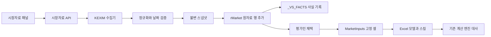

# 수출입은행 시장자료 상세 구현 계획

버전: 설계 v0.2 / 작성·상세화: 2026-10-04 (Asia/Seoul)

상태: **설계 기준선 — 2026-10-05 1차 구현 진행**. 선행 문서 [강화 방향·공식 API·가이드북 검토](kexim_market_data_integration.md)를 구현 단위로 구체화한다. 아래 내용은 원래 설계 범위이며 전부 구현 완료한 것은 아니다. 현재 구현 파일·테스트·설계 변경·남은 조건은 [1차 구현·검증 기록](kexim_market_data_mvp_status.md)을 따른다. 인증 데이터 API 실호출 및 실제 Excel 통합 검수는 아직 하지 않았다.

공식 API와 가이드북의 확인 내용은 선행 문서 §3·§7·§10을 출처 정본으로 둔다. 기업분석·채용 글은 범위에서 제외한다. 원문 코퍼스를 공개하지 않고, 구현 규칙과 출처를 공개 가능한 지식으로 정리한다.

## 1. 목표, 범위와 설계 결정

### 1.1 첫 완료 단위

평가인이 Excel에서 **평가기준일 환율 조회 → 날짜·단위 확인 → 원자료 기록 → 입력 셀 연결 → 같은 값으로 재계산**을 수행할 수 있게 한다. 숫자와 출처가 워크북을 전달한 뒤에도 이어져야 한다.

| 구분 | 첫 MVP | 이후 단계 |
|---|---|---|
| 데이터 | USD·JPY·EUR, 한 날짜 또는 최대 7일의 이전 관측 탐색 | 다른 통화, 기간 평균·시계열 |
| API | 3종의 데이터 의미 확인, 환율의 사용자 기능 완성 | 고정기준금리·국제금리 비교와 차입 조건 연결 |
| Excel | `rMarket`, `_VS_FACTS`, `MarketInputs`, 명시한 대상 셀 | 차입 스케줄·노출별 시나리오 출력 |
| 계산 | 환율 정규화, 셀 연결·단위·엔진 입력 대사 | FX 노출·차환 이자·적격 Kd·WACC·DCF 영향 |
| 실행 형태 | 기존 애드인/백엔드로 조회, 스킬은 워크북 값 소비 | 별도 운영 검증 후 호스팅 기능 확대 |
| 기록 | 원자료 스냅샷, 검증, 채택 근거, 연결 상태 | 국가·산업·해외투자 근거 자료 |

첫 범위에서 실시간 거래 환율, 자동 환율 예측, 모든 통화 DCF, 기업 대출조건 자동 확정, 자동 WACC 완성을 제공한다고 표현하지 않는다.

### 1.2 결정 기록

| ID | 결정 `[설계]` | 이유 및 영향 |
|---|---|---|
| D01 | 관측과 미래 가정을 별도 객체로 관리 | API 숫자의 수집 성공이 미래 가정 승인으로 이어지지 않게 함 |
| D02 | 기존 CPI/GDP `MacroSeries`와 일별 시장자료 객체 분리 | 환율의 통화·배율과 금리의 종류·만기·적용기간을 보존 |
| D03 | `rMarket`에 행을 추가하고 기존 행은 유지 | 기존 셀 참조와 조회 이력을 보존 |
| D04 | 채택값은 고정 주소 `MarketInputs`로 전달 | 새 관측이 들어와도 승인 전에는 모델 결과가 바뀌지 않게 함 |
| D05 | API 종류·호스트는 서버 고정 대응표에서 선택 | 호출자가 임의 URL이나 API 코드를 넣는 계약을 만들지 않음 |
| D06 | 조회 시각을 공표 시각으로 대체하지 않음 | 과거 평가에 당시 없던 정보가 쓰이는 문제를 드러냄 |
| D07 | 금리 비교와 WACC Kd 확정을 분리 | 지표 금리와 회사의 한계조달비용은 필요한 조건이 다름 |
| D08 | 조회·검증·계산에 HTTP/저장소를 주입할 수 있게 함 | 네트워크·인증키 없이 의미 있는 단위 테스트 가능 |
| D09 | MVP는 한 워크북에서 단일 작성자 사용을 전제 | 기존 Excel 브리지에 공동 편집의 원자적 잠금은 확인되지 않음. 공동 편집 동시 쓰기는 후속 과제 |
| D10 | 코드상 계산 백엔드와 스킬 패키지의 현재 분리를 유지 | 네트워크 수집기를 스킬 패키지에 새로 넣지 않고, 워크북을 공유 매체로 사용 |

## 2. 구조와 기존 코드의 제약



### 코드에서 확인한 연결 조건

| 코드 `[확인]` | 상세 설계에 반영할 조건 |
|---|---|
| [nav.js](../../frontend/src/nav.js)의 `EMBED_ALLOW` | 화면을 `materials/market`에 추가하고 Task Pane 허용 목록에도 추가. 거시 화면에만 넣으면 패널에 보이지 않음 |
| [officeBridge.js](../../frontend/src/officeBridge.js)의 `writeSheetPlan` | 기존 시트를 삭제하고 새 시트 이름을 승격하는 경로. 이미 연결된 `rMarket`에는 재사용하지 않음 |
| 같은 파일의 `appendFactRows`, `readSheetGrid` | 원장 추가·재읽기 패턴을 재사용하되 시장자료는 전용 소유권·열 스키마 검증 필요 |
| [facts_sheet.py](../../backend/excel/facts_sheet.py)의 `build_append` | 동일 키·동일 값이면 출처 등 다른 필드가 달라도 추가 생략. 관측 키에 스냅샷 식별자를 포함해야 함 |
| [provenance.py](../../backend/ingest/provenance.py)의 `SourceKind` | 현재 일반 시장 API 종류가 없음. `DART`로 위장하지 않고 시장자료 자체 출처 객체를 먼저 사용. 공용 enum 확장은 필요 시 별도 호환성 검증 |
| [App.jsx](../../frontend/src/App.jsx)의 `saveData` | 오류를 화면에 표시하지만 catch 후 호출자의 Promise가 해결될 수 있음. 시장자료 완료 상태는 명시적인 저장 성공 결과를 확인해야 함 |
| [project_store.py](../../backend/api/project_store.py) | GCS 설정 여부에 따라 프로젝트 영속성이 다름. 프로젝트 저장이 새 시장자료 스냅샷의 영속성을 자동 보장하지 않음 |
| [workbook_diff.py](../../backend/excel/workbook_diff.py) | `_VS_` 새 시트는 기존 등록·해석 여부와 별도로 다뤄짐. 이번 설계는 관측 시트와 입력 시트를 일반 모델 시트로 명시하고 무조건 예외 처리하지 않음 |

## 3. 데이터 계약

### 3.1 스냅샷과 관측

`MarketSnapshot`은 한 API·한 요청일의 응답을 보존한다. `MarketObservation`은 그 응답의 한 통화/종류/만기/필드에서 얻은 값이다. 서로 다른 프로젝트가 같은 요청일 자료를 사용해도 모델의 채택 상태는 프로젝트마다 다르다.

| 객체 | 필드 | 형식·규칙 |
|---|---|---|
| 스냅샷 | `schema_version` | 첫 버전 `1`. 알 수 없는 상위 버전은 계산 입력에 사용하지 않음 |
| 스냅샷 | `provider`, `dataset` | `kexim`; `exchange`, `lending`, `international` 중 하나 |
| 스냅샷 | `requested_date`, `fetched_at` | ISO 날짜, 시간대 포함 ISO 조회 시각. 이 둘을 구분 |
| 스냅샷 | `snapshot_id`, `payload_sha256` | 인증키와 무관한 불변 식별자·원본 응답 바이트 해시 |
| 스냅샷 | `parser_version`, `mapping_version`, `date_policy_version` | 동일 원본을 다른 규칙으로 해석했는지 추적 |
| 스냅샷 | `raw_payload_location` | 저장소 내부 위치. 키를 포함한 URL·임의 파일 경로를 외부에 반환하지 않음 |
| 스냅샷 | `persistence`, `findings`, `observations` | 저장 상태, 검증 결과, 관측 배열 |
| 관측 | `observation_id`, `snapshot_id` | 원본 스냅샷 + 정규화 행 식별자 |
| 관측 | `currency`, `quote_unit` | 검증된 통화 코드, 1/100 등 배율. 미상은 `null` |
| 관측 | `source_field`, `raw_value` | 응답 필드명과 원문 문자열 보존 |
| 관측 | `normalized_value`, `value_unit` | Decimal 문자열과 단위. 예: `"9.5"`, `KRW_per_1_JPY` |
| 관측 | `effective_date`, `effective_date_basis` | 실제 적용일과 날짜 판단 근거. 요청일을 무검증으로 복사하지 않음 |
| 관측 | `published_at`, `vintage_status` | 공표 근거가 없으면 `null`, `unknown` |
| 관측 | `benchmark`, `tenor_label`, `rate_type` | 금리 종류·만기·고정/변동. 불명확하면 `unknown` 또는 `null` |
| 관측 | `day_count`, `rate_convention` | 이자 계산에 필요한 경우 필수. 최초 비교표에서는 결측 허용 |
| 관측 | `observation_status` | `parsed`, `verified`, `quarantined` |
| 관측 | `adoption_eligible`, `blocking_rules` | 표시 가능성과 모델 적용 가능성을 구분 |

값은 저장·전송에서 Decimal 문자열을 사용한다. 기존 float 엔진으로 전달하는 경계에서만 변환하고, 원자료 문자열은 유지한다. `null`을 0으로 바꾸지 않는다.

### 3.2 불변성과 중복

- `payload_sha256`은 받은 응답 바이트로 계산한다. 요청 URL·인증 헤더는 저장 대상에서 제외한다.
- `snapshot_id`는 공급자·데이터셋·요청일·원본 해시·파서/매핑/날짜 정책 버전으로 결정한다. 조회 시각과 클라이언트 통화 필터는 식별자에 넣지 않는다.
- 동일 스냅샷을 재조회하면 기존 관측을 재사용한다. 별도 조회 시각 이력은 스냅샷의 값 버전을 바꾸지 않는 수집 기록에 남긴다.
- 같은 요청일 응답이 달라지면 새 스냅샷을 만든다. 기존 승인값은 유지하고 변경된 값·출처를 표시한다.
- 필터링 전에 원본 응답 전체를 저장한다. USD 요청 뒤 JPY 요청을 해도 동일한 원본을 재사용할 수 있게 한다.
- 스냅샷 식별자와 원본 해시는 변조 탐지·재현 수단이다. 당시 공표되었다는 증명으로 해석하지 않는다.

### 3.3 금리 매핑 대장

P0 산출물로 `benchmark_catalog`를 만든다. 각 항목에 원문 통화 문자열, 기간 문자열, 공식 정의 근거, 정상 통화, 금리 종류, 만기, 단위, 적용기간, 검토 상태, 매핑 버전을 기록한다.

현재 상세 명세에서 실제 응답 문자열 목록은 `[미확인]`이다. 문자열에 USD나 기간이 보인다는 이유만으로 SOFR·CIRR을 추정하지 않는다. 미등록 조합은 원자료로 보존하되 금리 계산에 연결하지 않는다. 역사 응답에서 만기 표기가 달라지면 적용기간별로 다른 매핑을 사용한다.

## 4. 요청·응답과 오류 계약

### 4.1 `POST /api/market/kexim/quotes`

헤더: `X-Kexim-Key`. 키는 상류 호출이 필요할 때 사용하고 저장하지 않는다. 아래 예시는 **모두 MOCK**이며 실제 API 응답이 아니다.

```json
{
  "dataset": "exchange",
  "valuation_date": "2026-09-30",
  "requested_date": "2026-09-30",
  "date_policy": "exact",
  "max_lookback_days": 7,
  "asof_mode": "historical_reference",
  "currencies": ["USD", "JPY", "EUR"],
  "cache_policy": "prefer_cache"
}
```

| 입력 | 규칙 |
|---|---|
| `dataset` | 필수 enum. 서버 내부 대응표로 상류 경로·코드를 결정 |
| `valuation_date` | 필수. 프로젝트 정본은 `project.setup.valuation_date`. 요청에 명시적으로 대응 |
| `requested_date` | 기본 평가기준일. 평가기준일 이후나 KST 현재일 이후의 관측 요청은 422 |
| `date_policy` | `exact` 또는 `previous_available`. 이전 관측은 명시적으로 선택한 정책으로만 사용 |
| `max_lookback_days` | 기본 7, MVP 최대 7. 자동 범위 확장·다년 조회 없음 |
| `asof_mode` | `historical_reference` 또는 `strict_snapshot`. §5의 차이 표시 |
| `currencies` | 환율의 초기 지원 통화만 필터링. 대출금리의 미확인 통화를 만들어내지 않음 |
| `cache_policy` | `prefer_cache`, `refresh`, `cache_only`. 캐시만으로 응답 가능하면 상류 호출하지 않음 |

응답 MOCK:

```json
{
  "schema_version": 1,
  "status": "partial",
  "request_id": "mock-request-001",
  "source_status": "mock",
  "requested_date": "2026-09-30",
  "selected_request_date": "2026-09-30",
  "snapshot_id": "mock-snapshot-001",
  "persistence": "local",
  "cache_hit": false,
  "observations": [
    {
      "observation_id": "mock-observation-jpy",
      "currency": "JPY",
      "quote_unit": 100,
      "source_field": "deal_bas_r",
      "raw_value": "950.00",
      "normalized_value": "9.5",
      "value_unit": "KRW_per_1_JPY",
      "effective_date": null,
      "effective_date_basis": "unverified_request_contract",
      "published_at": null,
      "vintage_status": "unknown",
      "observation_status": "parsed",
      "adoption_eligible": false,
      "blocking_rules": ["market_date_unverified"]
    }
  ],
  "findings": [
    {
      "rule": "market_date_unverified",
      "severity": "fail",
      "message": "검색일과 적용일의 대응을 확인해야 합니다.",
      "context": {"observation_id": "mock-observation-jpy"}
    }
  ]
}
```

`status=ok`은 요청 자료의 파싱 성공이고 가정의 자동 승인을 의미하지 않는다. `partial`은 일부 자료·필수 의미가 결측인 경우, `no_data`는 처리 가능한 정상 무자료 응답이다. HTTP 200인 경우에도 관측별 적용 가능성을 확인한다.

### 4.2 `POST /api/market/kexim/sheet-plan`

입력: `schema_version`, `snapshot_id`, `observation_ids`, `existing_market_grid`, `expected_grid_hash`.

서버는 저장된 스냅샷과 관측을 다시 검증한다. 클라이언트가 보내는 숫자를 공식 관측값으로 신뢰하지 않는다. 기존 시트의 소유자·스키마·열 이름·관측 ID를 읽어 새 행만 추가하는 계획을 반환한다.

출력: `blocked`, `reason_code`, `sheet`, `create`, `header_rows`, `start_row`, `rows`, `observation_row_map`, `expected_grid_hash`, `warnings`. 열 값은 `values` 경로로 쓰며 원문 문자열을 Excel 수식으로 실행하지 않는다.

### 4.3 `POST /api/market/binding-plan`

입력: 관측 ID, 사용 목적, 평가통화, 대상 시트/셀, 기대 기존 값·수식, 검토 사유, 필요한 경고 수용 내역. 범용 임의 코드·수식 실행 요청은 받지 않는다.

출력: 적용 가능 여부, `MarketInputs`의 고정 행/셀, 원자료 참조, 대상 셀의 생성 수식, 기대 단위, 재읽기 체크 목록. 조회 또는 원자료 적재만으로 이 경로를 자동 실행하지 않는다.

모델 적용은 사용자가 이전값·새값·출처·날짜·대상 셀을 보고 `모델에 반영`을 선택한 경우 수행한다. 이는 제품 안의 가정 채택 동작이며, API 조회에 매번 별도 승인 절차를 추가하는 의미가 아니다.

### 4.4 오류

| 조건 | HTTP / `error.code` `[설계]` | 재시도·화면 처리 |
|---|---|---|
| 필수 입력·날짜·통화 오류 | 422 / `MARKET_INPUT_INVALID` | 입력 수정 |
| 상류 결과 코드 2 | 502 / `KEXIM_DATA_CODE_INVALID` | 서버 대응표/명세 확인. 무조건 재시도하지 않음 |
| 상류 결과 코드 3 | 401 / `KEXIM_AUTH_INVALID` | KEXIM 키 확인. 앱 전체 로그아웃으로 처리하지 않음 |
| 상류 결과 코드 4 | 429 / `KEXIM_QUOTA_EXHAUSTED` | 호출 중단. 정확한 초기화 시각이 미확인이면 임의 안내하지 않음 |
| 정상 무자료 | 200 / `status=no_data` | 0값을 만들지 않고 선택한 이전 관측 정책만 적용 |
| 응답 구조 변경·잘못된 JSON | 502 / `KEXIM_PAYLOAD_INVALID` | 원본 격리, 계산 사용 차단 |
| 네트워크·시간초과 | 503·504 / `KEXIM_UNAVAILABLE`·`KEXIM_TIMEOUT` | 정책상 제한 재시도 |
| 스냅샷 미존재 | 404 / `MARKET_SNAPSHOT_NOT_FOUND` | 재조회 또는 워크북 내 보존 자료 안내 |
| 영속 저장 실패 | 503 / `MARKET_SNAPSHOT_STORE_FAILED` | 영속 저장 성공으로 표시하지 않음 |
| 시트 변경·소유자 불일치 | 409 / `MARKET_WORKBOOK_CONFLICT` | 시트 다시 읽기·계획 재생성, 기존 내용 보존 |

오류 응답은 코드·사용자 설명·요청 ID만 포함하고 키나 상류 전체 URL을 포함하지 않는다. UI는 문장 문자열 대신 오류 코드로 분기한다.

## 5. 기준일·단위·의미 검증

### 5.1 과거 자료 사용 방식

| 모드 | 허용 범위 | 표시·차단 |
|---|---|---|
| `historical_reference` | 현재 조회한 역사 관측의 적용일이 검증되어 평가기준일 이하인 경우 | 당시 공표·개정 여부가 미상이면 경고. 평가인이 한계를 확인하고 채택 가능하되 엄격한 당시정보 검증 통과로 표시하지 않음 |
| `strict_snapshot` | 기준일 당시의 공개/보존 근거가 있고 이후 자료 유입이 없는 스냅샷 | 당시 가용성을 증명하지 못하면 모델 적용 차단. 조회 시각만 오늘이라는 사실로 과거 가용성을 추정하지 않음 |

두 모드 모두 적용일 불명, 기준일 이후 관측, 잘못된 통화·단위·금리 종류는 차단한다. 경고 수용으로 통과시킬 수 있는 항목과 필수 실패 항목을 구분한다.

P0는 영업일·휴일·당일 제공 전후·금리 변경일의 소규모 표본에서 검색일과 실제 표시일을 대조한다. 키 부재·접근 장애 등으로 검증하지 못한 사항은 `not_run`과 원인을 기록한다.

### 5.2 검증 규칙 ID

| 규칙 | 기본 판정 | 의미 |
|---|---|---|
| `market_numeric_invalid` | FAIL | 파싱 불가·NaN·무한값·형식 이상 |
| `market_fx_nonpositive` | FAIL | 환율이 0 이하. 금리 0/음수와 구분 |
| `market_unit_unknown` | FAIL | 배율·가격/금리 단위 불명 |
| `market_currency_unknown` | FAIL | 지원 통화 코드와 대응 불가 |
| `market_date_unverified` | FAIL | 검색일과 적용일의 대응 미검증 |
| `market_lookahead` | FAIL | 적용일이 평가기준일 이후 |
| `market_publication_unknown` | WARN 또는 FAIL | 역사 참고 모드는 경고, strict 모드는 실패 |
| `market_date_fallback` | WARN | 선택한 이전 관측 사용. 요청일·채택일·간격 표시 |
| `market_staleness` | WARN 또는 FAIL | 자료별 갱신 규칙에 따른 공백. 월별 금리에 일별 환율 임계값을 그대로 적용하지 않음 |
| `market_benchmark_unknown` | FAIL | 금리 종류 미분류. 표시용 원자료 보존 가능 |
| `market_tenor_mismatch` | FAIL | 약정과 관측의 만기·재설정주기 불일치 |
| `market_rate_convention_missing` | FAIL | 기간 이자 산정에 필요한 방식·일수기준 미확보 |
| `market_payload_conflict` | WARN | 같은 요청일 응답 변경. 기존 스냅샷·승인값 유지 |
| `market_binding_unit_mismatch` | FAIL | 대상 셀의 예상 단위와 관측 단위 불일치 |
| `market_workbook_changed` | FAIL | 계획 생성 이후 대상 격자·값·수식이 변경됨 |
| `market_write_readback_mismatch` | FAIL | 기록·대상 셀 재읽기와 계획 불일치 |

부호와 0값은 지표별로 해석한다. 금리의 음수·0을 자동 오류로 보지 않고 공식 표시와 단위를 먼저 검증한다. 과거 폐지 통화나 송금환율 0을 현재 사용 가능한 시장환율로 선택하지 않는다.

## 6. Excel 기록·모델 반영·실패 복구

### 6.1 `rMarket`의 소유와 열

첫 생성 시 A1/B1에 `market_schema`/`1`, A2/B2에 `owner`/`val-studio`를 기록한다. 4행을 열 이름, 5행부터 관측으로 한다. 읽기는 위치 고정 대신 열 이름으로 매핑한다.

기본 열 순서 `[설계]`:

`observation_id`, `snapshot_id`, `provider`, `dataset`, `requested_date`, `effective_date`, `effective_date_basis`, `published_at`, `fetched_at`, `currency`, `benchmark`, `tenor_label`, `rate_type`, `quote_unit`, `source_field`, `raw_value`, `normalized_value`, `value_unit`, `observation_status`, `vintage_status`, `rule_ids`, `source_url`, `payload_sha256`.

- 새 관측은 마지막 행 아래에 추가하고 기존 행은 정렬·삭제·교체하지 않는다.
- 정상 관측과 격리 관측을 기록할 수 있으나 적용 가능한 행을 명시한다.
- 같은 관측 ID·같은 내용은 생략한다. 같은 ID에 다른 내용이면 변경 대신 충돌로 처리한다.
- 시트가 있고 소유자·헤더가 없으면 쓰기를 차단한다. 보호 해제만으로 소유권이 확인된 것으로 보지 않는다.
- 원문 응답 전체는 외부 스냅샷에 두고 워크북에는 짧은 관측과 해시·위치를 남긴다. 워크북 값만으로도 최소한의 숫자 검토는 가능하게 한다.
- 사용자가 원자료를 수정했다면 원본 해시·파싱 값과의 불일치를 표시한다. 변경된 행을 공식 자료로 사용하지 않는다.

### 6.2 `_VS_FACTS` 연결

기존 사실 원장의 스키마를 첫 MVP에서 변경하지 않는다. 각 관측의 키는 `market.kexim.<dataset>.<snapshot_id>.<observation_id>`로 구성한다. 값이 같고 출처가 다른 관측도 키가 달라져 이력이 남는다.

`source_id`에는 스냅샷 ID, `locator`에는 원문 필드·`rMarket` 셀 위치, `as_of`에는 **조회일**을 기록한다. 검증된 적용일은 관측 레코드에 따로 보존한다. `confidence`를 관측의 경제적 타당성이나 기준일 증명으로 사용하지 않는다.

현재 `approval` 기본값 `suggested`를 유지해 후보 기록이 승인 가정으로 소비되는 일을 방지한다. 관측 검증 상태와 모델 가정 승인 상태는 별도다. 승인만 바꾸기 위해 동일 키·동일 값 사실을 다시 넣는 방법은 쓰지 않는다. 스킬 가정 채택 기록은 `_VS_STATE` 소유자가 남긴다.

### 6.3 `MarketInputs`의 고정 입력

소유자·스키마 헤더 아래에 `binding_id`, `purpose`, `currency`, `adopted_value`, `value_unit`, `observation_id`, `snapshot_id`, `effective_date`, `adoption_state`, `adopted_at`, `reason`을 둔다.

각 `binding_id`의 행은 한 번 배정한 뒤 이동하지 않는다. 채택 셀은 `rMarket`의 고정 관측 셀을 참조하고 모델은 `MarketInputs`의 고정 셀을 참조한다. 이전 관측 추가나 새 조회만으로 채택 셀의 참조를 갱신하지 않는다.

수식 예시는 MOCK이다: `MarketInputs!D5 = rMarket!Q5`, 모델의 지정 환율 셀 `='MarketInputs'!$D$5`. 실제 열 순서·대상 주소는 열 이름과 템플릿 스캔으로 결정하며 위 주소를 범용 템플릿 정답으로 하드코딩하지 않는다.

가정의 미래 경로는 관측 행을 수정해서 만들지 않고 스킬의 가정 대장에 따로 남긴다. 애드인은 `_VS_STATE`·`Claude Log`를 직접 수정하지 않는다. 스킬 반영 상태와 관측·셀 연결 상태를 구분하며, 가정 기록이 필요한 시연에서는 해당 기록까지 확인한다.

### 6.4 쓰기 순서

1. 워크북의 평가기준일·시트 소유자·헤더·기존 관측·대상 셀을 읽는다.
2. 서버에서 스냅샷과 기존 격자에 대한 추가/연결 계획을 만든다.
3. 쓰기 직전 격자·대상 값/수식을 다시 읽어 기대 해시와 비교한다. 바뀌었으면 계획을 재생성한다.
4. `rMarket`에 행을 추가하고 재읽기 대사한다.
5. `_VS_FACTS` 기록을 추가하고 기록 여부를 확인한다.
6. 사용자 채택 동작에 따라 `MarketInputs`와 명시된 모델 셀만 갱신한다.
7. 원자료·채택 수식·대상 수식·계산 값을 다시 읽고 단위를 대사한다.
8. 프로젝트에 선택 스냅샷·연결 상태를 저장한다. 영속화 성공 상태는 따로 확인한다.

화면 로컬 작업 잠금으로 중복 클릭을 막는다. 격자 재확인은 다른 편집을 탐지하는 장치이며 공동 편집의 완전한 원자성 보장으로 표현하지 않는다.

### 6.5 상태와 복구

| 마지막 성공 단계 | 상태 `[설계]` | 다음 행동 |
|---|---|---|
| 조회·정규화 | `preview_ready` / `display_only` | 기록 가능성 검토, 자료 의미 미확인이면 모델 적용 불가 |
| `rMarket` 기록 | `raw_written` | 사실 기록 실패 시 동일 관측 ID로 재시도 |
| 사실 원장 기록 | `facts_written` | 사용자가 채택하면 입력 셀 연결 |
| 채택값·수식 쓰기 | `binding_written` | 재읽기 불일치 시 성공 표시를 중단하고 대상 셀을 보여줌 |
| 모델·원자료 대사 | `binding_verified` | 스킬 가정 기록/재계산이 필요한 단계로 진행 |
| 프로젝트 저장 실패 | `workbook_saved_project_pending` | 워크북 기록은 유지. 프로젝트 저장만 재시도 |
| 승인 가정·재계산까지 확인 | `completed` | 해당 시연 범위 완료로 표시 |

여러 시트 쓰기를 하나의 원자적 트랜잭션으로 설명하지 않는다. 실패 시 원자료나 원장을 삭제해 되돌리지 않는다. 대상 셀 복원은 쓰기 전 값·수식이 확보되고 이후 다른 편집이 없음을 확인한 경우에만 명시적으로 수행한다. 불명확하면 변경 위치와 상태를 알려 수동 확인하게 한다.

## 7. 조달금리·외화 노출·시나리오 상세화

### 7.1 차입 입력과 Kd의 경계

차입건별 최소 필드 `[설계]`: `facility_id`, `currency`, `opening_balance`, `maturity_date`, `fixed_or_floating`, `fixed_coupon`, `benchmark`, `spread_bps`, `reset_dates`, `day_count`, `rate_convention`, `repayment_schedule`, `refinancing_assumption`, `source`, `approval`.

공개 주석이 일부만 제공하면 나머지는 미확인 또는 평가인 입력으로 둔다. 실제 이자비용 추정용 약정조건과 평가시점 한계조달 Kd용 가정을 다른 입력으로 관리한다.

| 용도 | 필요한 조건 | 조건 미확보 시 |
|---|---|---|
| 금리 비교표 | 통화·종류·만기·표시단위 | 미분류 원문만 표시 |
| 기존 고정금리 이자 | 약정 금리·잔액·기간·상환 | 시장금리로 자동 대체하지 않음 |
| 변동금리 이자 | 약정 지표·스프레드·재설정·일수기준·복리 방식 | 기간 계산 차단 |
| 신규/차환 조달 | 적용 가능한 기준금리·가산조건·차환일 | 참고 금리와 미확인 조건 표시 |
| WACC Kd | 평가시점 한계조달 근거·평가통화 일관성·신용/만기 조건 | 기존 승인 Kd 유지, 새로운 자동값 없음 |

단순 이자 MOCK은 `평균 잔액 × 기간 이자율`로 계산한다. 일별 복리 SOFR 등은 약정상 방식·관측 기간을 확보한 뒤 별도 계산한다. 150bp는 0.015로 정규화하며 1.5나 150으로 넣지 않는다.

### 7.2 FX 노출 입력

통화·기간별로 판매량/단가 또는 외화 매출, 외화 매입, 외화 CAPEX, 영업자산·부채, 화폐성 잔액, 가격 전가, 결제 시차, 헤지 자료를 기록한다. 지역별 매출을 결제통화 비중으로 자동 변환하지 않는다.

초기 선형 노출 계산은 확인된 외화 금액 × 승인 환율 경로로 제한한다. 파생상품 공정가치·복잡한 헤지 회계·확률적 환율 모델은 해당 검증을 별도 설계할 때까지 범위 밖이다. 데이터가 없으면 0 노출로 추정하지 않는다.

### 7.3 계산 규약

- 원화 금액은 기존 엔진의 KRW 백만원 단위에 맞춘다. 외화 금액과 환율의 단위 곱을 검증한다.
- 매출·원가·CAPEX를 환산한 뒤 운전자본·감가상각·세금을 기존 계산 규칙으로 재구성한다. EBIT 변화만 기업가치 변화로 대입하지 않는다.
- 기존 고정금리 차입은 충격 이후에도 약정 만기까지 고정 조건을 유지하고 신규·차환분만 승인 조건에 따라 바꾼다.
- 자금수지/3표의 이자와 FCFF 할인율을 분리한다. FCFF에 이자를 다시 차감하는 경로를 만들지 않는다.
- 외화 금리를 KRW WACC에 직접 사용하지 않는다. 원화 헤지조달비용에는 추가 자료가 필요하다.
- 시나리오 가중치는 평가인이 확정한 경우만 적용한다. 이 API가 제공하지 않는 발생확률을 만들어내지 않는다.
- 보존 항목: 기준 시나리오 ID, 시장 스냅샷 ID, 승인 가정 ID, 계산 모듈 버전, 엔진 입력 해시, 결과, 검증 결과.

초기 리포트는 원자료/가정 변화와 결과를 나란히 보여준다. 환율 단독·금리 단독·결합 시나리오를 구분하고 같은 효과를 합산해 중복 설명하지 않는다.

## 8. 저장·캐시·호출 운영

### 8.1 저장

로컬 개발은 `.cache/market/kexim/<dataset>/<requested_date>/<snapshot_id>.json`과 원본 응답 바이트를 사용한다. 저장소 경로는 서버가 만들고 요청에서 임의 경로를 받지 않는다. 키·요청 전체 URL은 저장하지 않는다.

호스팅 환경에는 별도 `MarketSnapshotStore` 인터페이스를 두고 영속 저장이 설정된 경우 불변 객체를 저장한다. 기존 `ProjectStore`가 저장된다고 시장 스냅샷도 보존된 것으로 간주하지 않는다. 프로젝트에는 선택 스냅샷·관측 ID·연결 상태 등 필요한 참조만 둔다.

컨테이너 로컬 저장만 가능하면 `persistence=ephemeral`을 명시한다. 워크북으로 원자료를 남기는 기능은 제공할 수 있지만 서버 재시작 후 스냅샷 재조회 보장은 하지 않는다. 원본 저장이 필요한 엄격한 재현 단계는 영속 저장 실패 시 완료 처리하지 않는다.

### 8.2 캐시와 호출 제한

| 항목 | 초기 정책 `[설계 기본값]` |
|---|---|
| 중복 요청 | 동일 데이터셋·요청일의 진행 중 요청 합치기. 통화 필터는 수집 이후 적용 |
| 정상 과거 캐시 | 자동 덮어쓰기 없이 재사용. 새 확인은 `refresh`로 명시 |
| 당일 무자료 캐시 | 5분. 당일 제공 시각 전 무자료를 영구 결측으로 저장하지 않음 |
| 이전 관측 탐색 | 최대 7일, 최악에는 날짜마다 호출 1회. API/요청일별 원본 재사용 |
| 네트워크 재시도 | 원요청 포함 최대 3회, 1·2초 대기. 인증·코드·한도 오류는 재시도 없음 |
| 타임아웃 | 상류 요청 15초, 전체 요청 예산 45초. 초기 실측 후 조정 |
| 한도 예산 | 세 서비스 합산 900회/일을 보수적 내부 예산으로 제안. 공식 1,000회 안내와 구분 |

재시도와 이전 관측 탐색은 같은 전체 요청 예산을 공유한다. 매 호출의 타임아웃은 남은 예산과 15초 중 작은 값으로 정하고 예산이 소진되면 중단한다. 시간초과를 정상 무자료로 바꾸거나 다음 날짜로 계속 탐색하지 않는다. 환율 이전 관측 탐색 중 확보한 범위와 중단 원인은 별도로 반환한다.

실제 한도의 키 합산 여부·초기화 시각은 P0에서 확인한다. 키를 재시작 이후에도 추적하는 분산 한도 장치 없이 로컬 카운터만으로 일일 총호출을 보장한다고 하지 않는다. MVP에서는 최소한 프로세스 내 요청 합치기·세션 예산을 구현하고, 실제 상류 한도 소진에 대응한다. 호스팅 다중 인스턴스 검증 전에는 계정 전체 쿼터 보호가 완성된 것으로 표시하지 않는다.

토큰·키를 저장하지 않는 정책을 유지한다. 필요 시 세션 내 비가역 식별자로 호출량을 묶되 그 수명·범위를 문서화하고 키 원문을 로그로 남기지 않는다.

## 9. UI와 사용자 동작

위치는 자료 단계의 `시장자료`, 내부 ID `materials/market`으로 한다. Excel Task Pane에서는 조회·미리보기·기록·셀 연결만 제공하고 넓은 비교표·시나리오는 기존 브라우저 작업 흐름으로 이어진다.

1. 상단: 평가기준일, 평가통화, 저장/연결 상태.
2. 조회: API 종류, 환율 통화, 날짜 정책. 최신 일자와 평가기준일 요청을 명확히 표시.
3. 결과: 관측값, 단위, 요청일/적용일, 출처. 선택한 행의 원문과 변환 근거 표시.
4. 검증: 적용을 막는 문제와 확인이 필요한 경고를 구분.
5. `원자료 기록`: 모델 가정 변경 없이 워크북에 추가.
6. `입력 셀 연결`: 사용 목적·대상·기존값·새값·사유를 확인하고 사용자가 반영.
7. 완료: 기록된 관측 ID, 연결 셀, 재읽기 결과. 프로젝트 저장 실패는 별도로 표시.

키는 기존 BYOK 화면에 추가하고 API 호출의 헤더에만 전달한다. 로컬 저장 정책은 기존 제품 설정과 맞추며 워크북·Vite 빌드 환경변수에 키를 넣지 않는다.

모든 자료가 준비되지 않아도 가능한 원자료 조회·기록은 제공한다. 미확인 금리나 날짜를 계산용 입력으로 채택하는 동작만 차단한다. 제품 화면에는 필요한 출처·날짜·문제 설명을 보여주고 내부 파일명·파서 버전 등은 상세 기록에서 확인하게 한다.

## 10. 구현 작업 목록과 의존성

| 작업 ID | 구현 내용 | 의존 | 대상 파일·산출물 | 완료 기준 |
|---|---|---|---|---|
| KX00 | 인증·응답·날짜·단위·종류 확인 | 없음 | 원본 표본, 명세 비교, `benchmark_catalog` 설계 | 확인/미확인/미실행과 적용 경계 기록 |
| KX01 | 시장자료 객체·규칙·ID 정의 | KX00 | 신규 `backend/ingest/market_data.py` | Decimal·날짜·종류·버전·FAIL/WARN 계약 테스트 |
| KX02 | 수출입은행 수집기 | KX01 | 신규 `backend/ingest/kexim_client.py` | HTTP 주입, 고정 API 대응표, 키 제거, 오류 분기 |
| KX03 | 불변 스냅샷·캐시 | KX01~02 | 신규 `backend/ingest/market_store.py` | 동일 원본 멱등·응답 변경 별도 버전·저장 실패 표시 |
| KX04 | 조회 API | KX02~03 | `backend/api/main.py`, 신규 API 테스트 | 날짜 정책·캐시·관측별 적용 상태 계약 |
| KX05 | 패널·BYOK·경로 | KX04 | 신규 `MarketDataPanel.jsx`, `Byok.jsx`, `api.js`, `App.jsx`, `nav.js` | 브라우저/Task Pane 모두 접근, 오류 코드 분기 |
| KX06 | 원자료 추가 계획 | KX01·03 | 신규 `backend/excel/market_sheet.py` | 소유자·열 이름·ID·격자 변경 검증, 행 이동 없음 |
| KX07 | Excel 원자료·사실 기록 | KX05~06 | `officeBridge.js`, 기존 사실 API | 기록/재읽기·중복 클릭·부분 실패 복구 |
| KX08 | 채택 입력·대상 셀 연결 | KX07 | 신규 `backend/excel/market_binding.py`, 브리지·패널 | 기존값 기대 검사, 고정 셀, 사용자 채택, 단위 대사 |
| KX09 | 프로젝트 저장·워크북 복원 | KX03·08 | 프로젝트 데이터 계약, 저장 결과 처리 | 워크북/서버 상태 구분, 저장 실패 성공 오표시 없음 |
| KX10 | 첫 MVP 통합 시연 | KX00~09 | 날짜 표본·워크북·대사 기록 | 환율 조회부터 같은 입력 재계산까지 완료 |
| KX11 | 금리 비교·약정 입력 | KX00·01·05 | 금리 화면, 차입조건 스키마 | 종류/통화/만기/단위 미상 연결 차단 |
| KX12 | 이자·차환 및 Kd 후보 | KX11 | 신규 `calc_core/financing.py`, 차입 조립 모듈 | 고정/변동·bp·기간·통화·Kd 목적 구분 |
| KX13 | FX 노출·시나리오 입력 조립 | KX10·12 | 신규 `calc_core/fx_exposure.py`, 상위 조립 모듈 | 외화 드라이버→KRW 백만원→기존 엔진 입력 |
| KX14 | 결과·감사·스킬 동기화 | KX12~13 | 리포트·검증·기존 스킬 빌드 | 결과 대사, 금융비용 중복 없음, vendor 동기 |
| KX15 | 호스팅 운영 검증 | KX10 이후 | 영속 저장·호출량·네트워크·복구 기록 | 재시작/다중 인스턴스와 BYOK 오류 검증 |
| KX16 | 가이드북 자료 확장 | KX14 이후 | 국가·산업·FDI 자료별 수집/출처 계약 | FILE/API 확인, 공개시점·기업 적용 경계 기록 |

KX00~10은 첫 MVP이며 KX11 이후는 독립 단계로 검수한다. KX00에서 날짜 계약 검증이 끝나지 않은 API는 비교/표시만 허용한다. 개발일 추정은 선행 문서의 계획값을 사용하되, 행 추가·입력 연결·복원 범위 상세화에 따라 착수 시 다시 산정한다. 일정 확정이나 절감 실측치로 사용하지 않는다.

진척 기록은 작업 ID별 `not_started`, `in_progress`, `blocked`, `done`과 구현 파일·검증 근거·남은 조건을 함께 남긴다. KX00의 각 표본에는 `not_run`, `mock_pass`, `live_pass`, `live_fail`을 구분해 기록한다. **최초 설계 시점에는 전부 `not_started`였으며, 현재 상태는 [구현 기록 §5](kexim_market_data_mvp_status.md#5-작업-상태)에 갱신한다.** 공식 명세 열람·합성 응답 테스트를 실호출 완료로 계산하지 않는다.

## 11. 검증 사례와 완료 기준

### 11.1 자동 검증 계획

| 검증 ID | 입력/상황 | 기대 결과 |
|---|---|---|
| T01 | USD 환율 `1,400.00` | 쉼표 제거, Decimal 1400, KRW/1USD |
| T02 | JPY(100) 환율 950 | 원본 950 보존, 정규화 9.5. 기존 ECOS 100엔 값과 혼용 차단 |
| T03 | 결측·대시·잘못된 숫자·NaN | 결측/FAIL 구분, 0 대체 없음 |
| T04 | 환율 0·금리 0·금리 음수 | 환율은 차단, 금리는 의미·단위 검증 후 처리 |
| T05 | 기준일 이후 요청/적용일 | 422 또는 관측 FAIL, 모델 반영 불가 |
| T06 | 휴일 exact/previous_available | exact는 무자료, 선택한 이전 정책만 최대 7일 탐색 |
| T07 | 적용일 검증·공표일 미상 | 역사 참고 경고, strict 차단 |
| T08 | 상류 결과 코드 2/3/4 | 오류 계약 준수, 불필요한 재시도 없음 |
| T09 | 동일 요청 동시 조회·다른 통화 필터 | 상류 중복 호출 합치기, 같은 원본 사용 |
| T10 | 동일 요청일 응답 변화 | 새 스냅샷, 기존값과 승인 가정 유지 |
| T11 | 같은 관측 ID 재기록 | 중복 행 없음 |
| T12 | 숫자는 같고 스냅샷/출처만 다름 | 새로운 사실 이력 보존 |
| T13 | 소유자 없는 rMarket·깨진 헤더 | 기존 내용 보존, 기록 차단 |
| T14 | 기록 후 기존 모델 참조 | 행 추가 전후 참조식 유지, `#REF!` 없음 |
| T15 | 기록 도중 사실 추가·연결 실패 | 단계 상태 표시, 기록 삭제 없이 멱등 복구 |
| T16 | 쓰기 전 대상 셀이 변경됨 | 계획 거부 후 다시 읽기 |
| T17 | 프로젝트 저장 실패 | 워크북 저장과 프로젝트 실패를 구분, 완료 오표시 없음 |
| T18 | 금리 종류 미상·만기/통화 불일치 | 비교표 표시 가능, 계산 연결 차단 |
| T19 | 고정 차입과 변동 차입에 +100bp 충격 | 고정 약정 유지, 조건에 맞는 변동/차환분만 반응 |
| T20 | 스프레드 150bp | 0.015, 금리 합산 단위 확인 |
| T21 | FX 예시 USD 순노출 600만 × 140원 | 8.4억원=840백만원. 이는 세전·운전자본 반영 전 효과 |
| T22 | FCFF 계산과 자금수지 이자 | FCFF 금융비용 중복 차감 없음 |
| T23 | 키가 들어간 네트워크 예외 | 응답·로그·워크북·스냅샷에 키 없음 |
| T24 | 호스팅 재시작·캐시 유실 | 영속 여부대로 동작, 오래된 로컬 상태로 성공 표시 없음 |

계획된 신규 테스트 파일: `test_kexim_client.py`, `test_market_data.py`, `test_market_store.py`, `test_api_market.py`, `test_market_sheet.py`, `test_market_binding.py`; P2/P3에는 `test_financing.py`, `test_fx_exposure.py`를 추가한다. 코드의 조건문을 그대로 베끼는 테스트 대신 위 단위·경계·복구 문제를 검증한다.

구현 후 관련 기존 회귀는 `test_facts_sheet.py`, `test_macro_client.py`, `test_api_macro.py`, `test_wacc_assembly.py`, `test_scenario.py`, `test_three_statement.py`에서 변경 경로에 맞게 선택한다. 스킬 계산 모듈이 바뀌면 vendor 동기 검증을 추가하고 프런트는 기존 Vite build로 확인한다. 이번 문서화 작업에서 이 기능 테스트를 실행한 것은 아니다.

### 11.2 실제 시연 검수

- 공식 홈페이지와 3종 API의 소규모 영업일/휴일 표본을 대조한다. MOCK/공식 명세 예제/인증 실호출을 구분한다.
- 빈 워크북과 기존 DCF 워크북 각각에서 원자료·입력 셀·사실 기록·재열기·재계산을 확인한다.
- 외부 참조가 이미 있는 rMarket에 행을 추가해 참조가 유지되는지 확인한다.
- 이전 날짜 평가와 새 조회를 병행해 기존 승인 가정이 자동 변경되지 않는지 확인한다.
- 로컬 성공과 Cloud Run 성공을 별도로 기록한다. 브라우저 성공이 Excel WebView 성공을 대신하지 않는다.

### 첫 MVP 완료 조건

KX00의 미확인 결과가 기능 상태에 반영되고, T01~17·T23 중 MVP에 해당하는 경로가 통과하며, 실제 워크북 시연에서 조회→기록→연결→대사가 재현되어야 한다. 시연의 평가기준일·스냅샷·입력 해시·환경·실행 상태를 기록한다. P2/P3 미완료는 첫 MVP 완료와 구분해 문서·화면에 유지한다.

## 12. 도입·복구와 남은 결정

### 도입 순서 `[설계]`

1. 기본 비활성 기능 플래그와 MOCK 계약 테스트를 먼저 추가한다.
2. 로컬 인증 표본을 확인하고 원자료 미리보기 기능을 검수한다.
3. 테스트 워크북에서 행 추가·입력 연결·복구를 검수한다.
4. 사용 가능한 환율 범위부터 공개 설명에 반영한다. 실측 없는 금리 연결은 준비 상태로 둔다.
5. 별도 운영 확인 후 영속 저장·호스팅 경로를 활성화한다.

복구 시 네트워크 조회·신규 연결 기능을 비활성화해도 기존 rMarket·사실 원장·모델 참조는 보존한다. 관측 파일·워크북을 삭제해 롤백하는 방식은 사용하지 않는다. 신규 enum·스키마는 읽기 호환성을 확인하고 알 수 없는 버전을 조용히 파싱하지 않는다.

| 남은 항목 | 기본 방향 | 확정 시점 |
|---|---|---|
| 실제 국제금리 분류·통화 목록 | 응답/공식 설명 대응표 | KX00 |
| 대출금리의 통화·상품·가산조건 | 미확인 유지 | KX00, 미해소면 비교만 제공 |
| 날짜·공표 증거 | 검색일과 공표일 분리 | KX00 |
| strict 모드의 충분한 증거 | 당시 원본/공표 자료 보존을 전제 | 과거 평가 시연 전 |
| 스냅샷 영속 저장 구성 | 로컬과 호스팅을 별도 검수 | KX03·15 |
| 템플릿별 입력 주소·단위 | 템플릿 스캔과 사용자 선택 | KX08 |
| `_VS_STATE` 가정 기록 전달 | 현재 소유권 유지, 스킬 읽기 흐름 반영 | KX08~10 |
| 공동 편집 동시성 | 단일 작성자 MVP | 공동 편집 확장 전 |
| 국가·산업 추가 API 접근성 | 가이드북 목록은 후보로 사용 | KX16 |

완료 기록은 체크 목록·실행 로그·공식 대조·워크북 대사로 남긴다. 계획서 작성, 코드 존재, 목업 통과를 인증 API 연결·운영 검증 완료로 바꾸어 기록하지 않는다.
