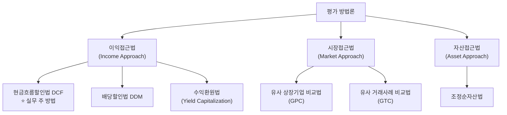
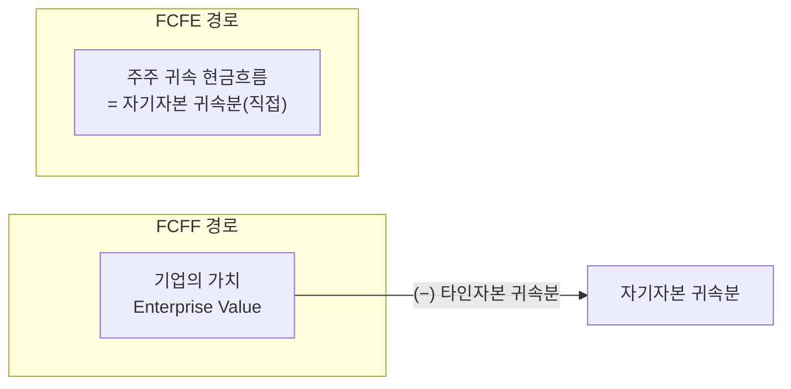
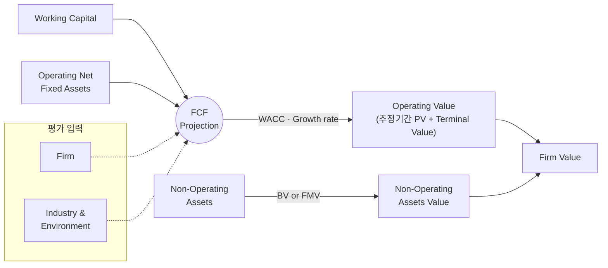
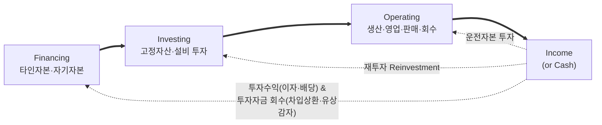
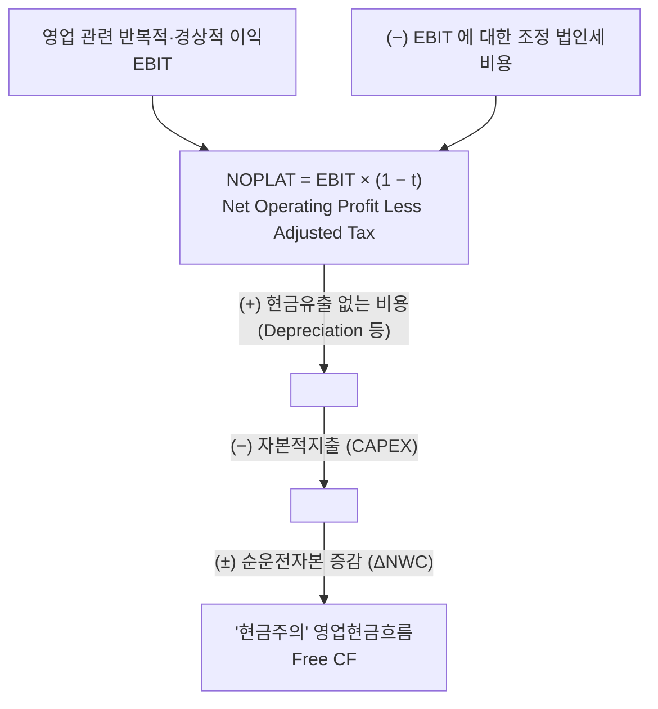
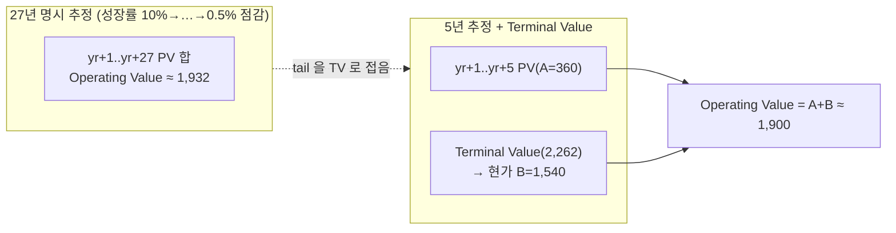

# MSVALUE DCF 교육 정본 — 도식 중심 정리

> 출처: MSVALUE 「기업가치평가 연수 1기 — Business Valuation: 현금흐름할인법(DCF)」
> 교육자료(2024.08, 38p 하드카피). **PPT 장표의 플로우차트·구조도를 Mermaid 로 재현**하여
> 표·불릿으로 흩어지지 않게 정리한 정본. [[모델링_실무_2강4강]](실습 모델링)의 이론 백본.
>
> **용어 주의(사용자 교정)**: 위험프리미엄은 개념상 ERP(Equity Risk Premium) = MRP(Market
> Risk Premium) = E(Rm)−Rf 로 동일하나, **한공회가 발간하는 국내 값의 공식 명칭은
> 시장위험프리미엄(MRP)**이다. 본 문서는 국내 출처를 지목할 때 MRP 로 쓴다.

---

## PART 1. Model Outline

### 1.1 평가 3대 접근법 (Valuation Approach)
공정가치 평가는 3대 접근법 내에서 대상에 적절한 방법을 선택한다. **실무는 이익접근법의 DCF 를
주 방법으로 가장 많이 쓰고, 시장접근법(유사기업/유사거래 비교)과 자산접근법(순자산)을 보완적으로
병행**한다.


> **우리 스코프와의 연결**: 현재 엔진은 이익접근법 DCF 축. 시장접근법(GPC 배수)·자산접근법(NAV)은
> [[밸류에이션_스코프_로드맵]] §1 의 "자본시장법 종합평가" 마일스톤에서 추가 → 3대 접근법 완비.

### 1.2 DCF 모델 종류 — FCFF vs FCFE
| 모델 | 정의 | 할인율 | 용도 |
|---|---|---|---|
| **FCFF**(Free Cash Flow to Firm) | 영업활동 현금흐름 중 이용 제약 없는(차입상환·배당 가능) 잉여 영업현금흐름. 전체 기업가치 측정·사업부문별 합산 가능 | **WACC** | 제조업 등 일반 업종(기본) |
| 부채(IBD) 현금흐름 | 차입금 조달·상환·금융비용 | — | (참고) |
| **FCFE**(Free Cash Flow to Equity) | 영업현금흐름 − 차입 원리금상환 = 주주귀속 현금흐름. 계획 재무구조 하 주주CF 구체 추정 | **Ke** | **금융기관**(자금조달·운영이 사업이라 FCFF 부적합) → FCFE·DDM |

**기업가치 귀속 구조** — 자산사이드가 기업가치, 그 배분(소유주)은 부채·자본사이드에서 결정:

- **FCFF**: 기업가치(EV) 산출 → 타인자본 귀속분 차감 → 자기자본 귀속분.
- **FCFE**: 주주 귀속 현금흐름을 직접 산출 → 그 자체가 자기자본 귀속분.

### 1.3 DCF 모델 체계 — 영업가치 + 비영업자산 ⭐
기업가치(Firm Value)를 **영업가치**(영업자산이 창출할 FCF의 현재가치)와 **비영업자산 가치**(영업과
무관하게 보유 — 개별 평가)로 나눈다. FCF 는 영구 추정 불가 → 추정기간 + 잔존가치(TV)로 분리.


> `Firm Value = Operating Value + Non-Operating Assets Value`.
> **우리 엔진 매핑**: Operating Value = `calc_core.dcf`(PV 합 + TV), Non-Operating = `non_operating_assets`,
> Firm Value − net_debt = Equity. 비영업자산 "개별 평가"가 SOTP·비영업 브리지의 근거.

### 1.4 재무제표 재분석 — Value Chain 과 재투자 루프 ⭐
가치창출 활동의 결과가 재무상태표에 반영된다. **Financing → Investing → Operating → Income 의
순환 + Income 이 다시 Investing 으로 돌아가는 재투자(Reinvestment) 루프**가 핵심.


| Activity | B/S Effect |
|---|---|
| Financing | 조달자본: 금융부채·자기자본 |
| Investing | 영업용 고정자산: 토지·건물·기계장치 |
| Operating | 영업용 운전자본: 매출채권·매입채무·재고자산 |
| Non-Operating | 비영업용 자산: 잉여현금·투자자산 |

**Valuation 개념 재무상태표(재분류)** — 유동성기준 → 사업연관성 기준:

- `Working Capital + Operating Net Fixed Assets = 영업자산(Invested Capital)`
- `차입자본 ❶ − 비영업자산 ❷ = 순차입자본(Net Borrowing)`
- `영업자산 = 순차입자본 + 자기자본`
> **우리 엔진 매핑**: 이 재분류가 NOA/IBD 분류(EV→Equity 브리지)와 운전자본 driver 의 이론 근거.
> [[MnA_실사_가격구조_SPA]] §4 Net Debt & Debt-like 계층이 실무 확장판.

### 1.5 DCF 결과물 — Enterprise Value (예시)
FCFF 스파인의 표준 산출 형태(교육 예시, UNIT: KRW M, WACC 16.6% · 영구성장률 1.0%):

| | Dec-24 | Dec-25 | Dec-26F | Dec-27 | Dec-28 | TV |
|---|--:|--:|--:|--:|--:|--:|
| 매출액 | 20,993 | 29,325 | 42,125 | 57,418 | 57,773 | 58,351 |
| 영업이익 | (2,346) | 2,753 | 5,882 | 13,365 | 13,333 | 13,467 |
| NOPLAT | (2,346) | 2,200 | 4,675 | 10,594 | 10,569 | 10,674 |
| (+)Dep (−)CAPEX (±)ΔNWC | | | | | | |
| **FCFF** | (2,833) | 1,607 | 2,882 | 8,671 | 10,517 | 10,591 |
| Period(mid-year) | 0.50 | 1.50 | 2.50 | 3.50 | 4.50 | |
| PVIF | 0.9262 | 0.7944 | 0.6815 | 0.5845 | 0.5014 | |
| PV of FCFF | (2,624) | 1,277 | 1,964 | 5,068 | 5,274 | |

가치 브리지: 추정기간 PV 합(A=10,959) + 영구현금흐름 PV(B=34,083) = **Operating Value(45,042)**
(+)비영업자산(6,867) = **EV(51,909)** (−)이자부부채(11,679) = **Equity Value(40,230)**.
> **mid-year convention**(Period 0.5·1.5…)이 비올 골든과 동일 — 우리 `dcf.py` 컨벤션 일치 확인.

---

## PART 2. Free Cash Flow (FCFF 산출)

### 2.1 잉여현금흐름 계산 흐름 ⭐
영업이익(EBIT)에서 비현금비용·CAPEX·운전자본을 조정해 "현금주의" 영업현금흐름을 도출:

> **EBIT 주의**(교육 각주): EBIT = Earnings Before Interest & Tax 로 반드시 영업이익은 아니나,
> 이자·세금 외 경상적 영업외손익이 거의 없어 **통상 영업이익과 일치**로 본다. EBIT 법인세도
> 실제 납부액이 아니라 EBIT 에 대한 납부액. → 우리 `dcf._tax_on` 의 EBIT×세율 근거.

### 2.2 EBIT Projection — 매출이 지배변수
가장 중요한 추정변수는 **매출**(영업비용·투자가 매출 연동 → 매출이 EBIT 규모 결정):

- **매출**: 산업 key driver 분석 선행 → 시장규모(GDP·전문기관 수요예측) → 물량(제품 포트폴리오·
  점유율) → 단가(과거추세·전후방 예측) → Top-down/Bottom-up 택일. 과잉 세분화·복잡 모델링 지양.
- **원가·판관비**: 재료비(생산계획·재료비율/매입단가), 노무비(퇴사·신규채용·1인당 인건비),
  간접비(상각비 제외분을 변동비/고정비 구분 — 변동비=매출연동, 고정비=물가상승). NOPLAT 은
  **발생주의** 기준(당기제조원가 아닌 매출원가 측면 분석 — 생산량=판매량 가정 시 안전재고·운전자본
  가정과의 정합 검토). Gross margin·영업이익을 경쟁사 대비 현실성 재검증.

### 2.3 CAPEX & Depreciation — 상각비 절세효과
CAPEX 는 발생 해에 전액 현금유출. 상각비 자체는 현금흐름과 무관하나 **절세효과** 때문에 추정 필요
(세무상 불인정 상각비 — 영업권 등 — 은 제외 주의). **재투자 가정: 상각비만큼 CAPEX 도 재투자**(장기).

상각비 절세효과 예(세율 20%): 상각비 500(원가 400+판관비 100) → EBIT 반영 (500) → **법인세 절감
100** → 상각비 add-up 500 → **상각비 관련 순현금흐름 +100**(= 절세효과만 순증).

### 2.4 순운전자본 변동 — 발생주의→현금주의 & 흑자도산 경고 ⭐
운전자본 변동 반영 이유 = 회계 발생주의를 DCF 현금주의로 조정. 운전자본도 "투자자산".
- 예: 판매 1,000(현금 500·외상 500) → 발생주의 매출 1,000, 현금주의 500. DCF 조정: 매출 1,000 −
  매출채권 증가 500 = CF 500.
- **흑자도산 경고**: 매출 연 20% 성장에도 회전기일 악화(37일→136일)로 운전자본이 매출보다 빨리
  늘면 FCFF 가 마이너스 전환(분식·흑자도산 신호). → 우리 `checks` 확장 후보: 운전자본/매출 비율
  급등 감지.

---

## PART 3. WACC

### 3.1 할인율 개념 — 요구수익률 vs 내부수익률
- **요구수익률**(사전적): 현금흐름/할인율 = 가치. 공정가치평가의 WACC·Ke·Kd.
- **내부수익률(IRR)**(사후적): NPV=0 만드는 할인율.
- `WACC = Ke × E/(D+E) + Kd × (1−t) × D/(D+E)`

### 3.2 자기자본비용 Ke — Modified CAPM
```
Ke = Rf + βL × Risk Premium + (country risk) + (size premium) + (specific risk)
   = Rf + βL × (E(Rm) − Rf) + …
```
| 요소 | 실무 적용 |
|---|---|
| **Rf** 무위험이자율 | Bloomberg **10년 만기 국채이자율**(4대 법인 주로). Rf 가정과 위험프리미엄 가정은 일관성 유지 |
| **Risk Premium** | Bloomberg 국가별(Spot·1·3·5·10년 평균). **국내시장은 한공회 제시 MRP(시장위험프리미엄)** ← 공식 명칭 MRP |
| **β 추정치** | Bloomberg **2년 Weekly 또는 5년 Monthly 조정베타**(4대 법인). **Deloitte Valuation Standard = 60개월 베타**. Capital IQ 관측·조정베타. 평가인 직접 Daily beta(자산평가사·Local 법인 일부). **비상장은 유사상장사 β 기반 대용치**(산업 유사성이 핵심 선정기준). Beta Mean Reversion = **Marshall Blume 조정** |
| **Kd** 타인자본비용 | 신용도 반영 장기 회사채(예: BBB− 만기수익률). after-tax = Kd×(1−t) |
| **자본구조 E/V·D/V** | 유사기업 평균 자본구조·대상 장기계획 |
| **Tax** | 한계법인세율 20.9%(200억 이하)·23.1%(200억 초과) |

> **우리 엔진 매핑**: `wacc.py`(CAPM 빌드업·Hamada·size premium)와 완전 일치. MRP 국내=한공회
> 는 [[베타_Bloomberg_vs_KICPA]]·checks β/MRP 정합의 근거. Deloitte 60개월은 [[deloitte_감사인검토_WACC방법론]].

### 3.3 Hamada — β 언레버/리레버
관측 Levered β → Unlevered β 전환 → 목표 자본구조로 Re-levering. 체계적 위험 β 는 **법인세율에
반비례·부채비율에 비례**(부채비율↑ → Levered β↑).
```
βL = βU + βU × (1−t) × (D/E)        (relever)
βU = βL / [1 + (1−t) × (D/E)]        (unlever)
```
> 부채비율↑ → 저렴한 타인자본 비중↑로 WACC↓ 압력, 동시에 재무레버리지로 Ke↑ → 상쇄.

### 3.4 조정베타(Bloomberg) & Size Premium
- **Bloomberg 조정베타 = 0.67 × Raw Beta + 0.33 × 1.0**(사후베타를 시장평균 1.0 쪽으로 회귀).
- **Size Premium**(Modified CAPM): 소규모 기업일수록 초과수익률/위험 → Duff & Phelps(현 Kroll)
  CSRP Deciles. 예(2023): Mid-Cap 0.62% · Low-Cap 1.21% · Micro-Cap 3.05% · 10-Smallest 4.83%.
> → `wacc.kroll_size_premium` 와 동일 테이블 계보. [[deloitte_감사인검토_WACC방법론]] Kroll deciles.

### 3.5 유사회사 산정
현재·향후 사업 성격 파악(구글링·증권사 리포트) → 전/후방 산업 검토 → KIND·CIQ 스크리닝
(유사성·완전성 확보). → 우리 [[msvalue_리포트예시_클래시스]] §E 4-step·`peer_selection` 과 정합.

---

## PART 4. Terminal Value

### 4.1 영구가치 정의 — 추정기간 tail 의 붕괴 ⭐
영구가치 = 추정기간 이후 영업현금흐름을 추정기간 종료 시점 가치로 일괄 반영. 27년 명시 추정
(Operating Value 1,932)과 5년 추정+TV(Operating Value 1,900)가 **근사적으로 수렴** — 6년차 이후
tail 을 TV 로 접는다.

> 실무는 예측가능성 한계로 **5년 추정** 주. tail 을 TV 로 접어도 결과가 수렴함을 보여주는 논거.

### 4.2 현금흐름 추정기간 — 5년, 그리고 K-IFRS 연결 ⭐
- 이론상 안정성장 도달까지(McKinsey 10~15년), **실무는 5년**. 사유: 5년 이상 산업·경제 정보 부재
  (인위적 확대 = 단순 재계산), 컨설팅 비용 과다, 회사도 5년 이상 중장기계획 미수립.
- ⭐ **참고: K-IFRS 손상검사(사용가치 VIU) 추정기간은 특별한 사유 없는 한 5년 초과 금지
  (제1036호 문단 35)**. → **이 5년 상한이 손상(VIU) 트랙과 DCF 추정기간을 잇는 K-IFRS 연결점**
  ([[밸류에이션_스코프_로드맵]] §1 우선순위 3 — VIU/CGU/K-IFRS).
- 단점: TV 비중 과다 → 영구성장률·할인율 민감도 극대(우리 `checks` TV_WEIGHT_WARN·PGR 게이트).

### 4.3 Normalized Cash Flow — 재조정 ⭐
`TV = FCF(n+1) / (WACC − g)`. **FCF(n+1) 은 단순 추정기간 말 CF×(1+g) 가 아니다** — NOPLAT·CAPEX·
NWC 각각 재조정:
- **유형자산 순투자**: 장기 연평균 개념으로 `CAPEX = 감가상각비`(순투자 0 가정).
- **운전자본 재조정**(정본): 추정기간 말 운전자본 투자액에 (1+g) 곱하면 **틀림**(고성장기 투자규모가
  저성장 영구기에 유지되는 오류). **옳은 방식 = 추정기간 말 매출 × 영구성장률 × 운전자본비율**.
  - 예(영구성장 3%, 운전자본/매출 30%): 틀린 30×1.03=31 → TV 1,452 / 옳은 1,100×3%×30%=10 →
    TV 1,752. **정규화 오류가 TV 를 21% 왜곡**.
> → 우리 개선 B(터미널 정규화, `terminal_reinvestment_rate`)의 이론 근거. 클래시스 검증([[검증_클래시스_DCF]])과 동일 논지.

### 4.4 영구성장률 (g)
- 한국 보수적 관행 1% 미만.
- **반론(정본)**: 명목할인율을 쓰면서 g 를 인플레이션 이하로 두면 **실질현금흐름 감소(마이너스 실질
  성장)** 모순. 최소 인플레이션 수준 또는 성숙 선진국 장기 GDP 성장률 고려가 합리적.
> → [[영구성장률_PGR_적합성]] 의 "한국 0~1% vs 글로벌 2~4%" 논쟁과 동일. checks PGR≤GDP.

---

## 우리 플랫폼 반영 요약
| 교육 정본 | 우리 구현/문서 |
|---|---|
| FCFF 스파인·mid-year·EBIT 세금 | `calc_core.dcf`(비올 골든) |
| BS 재분류(영업/비영업·순차입자본) | NOA/IBD 브리지·[[MnA_실사_가격구조_SPA]] §4 |
| WACC CAPM·Hamada·조정베타·size | `wacc.py`·[[베타_Bloomberg_vs_KICPA]]·[[deloitte_감사인검토_WACC방법론]] |
| 국내 위험프리미엄 = 한공회 **MRP** | checks β/MRP 정합(용어: 국내=MRP) |
| Normalized CF 운전자본 재조정 | 개선 B `terminal_reinvestment_rate`·[[검증_클래시스_DCF]] |
| K-IFRS 1036.35 VIU 5년 상한 | 손상 트랙 연결점([[손상검사_impairment]]·로드맵) |
| 흑자도산(운전자본 급증) | checks 확장 후보(운전자본/매출 급등) |
| 3대 접근법 완비(시장·자산) | 로드맵 "자본시장법 종합평가" 마일스톤 |
